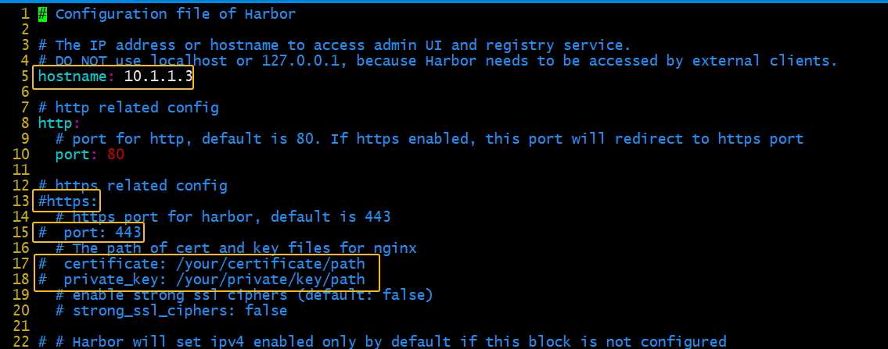
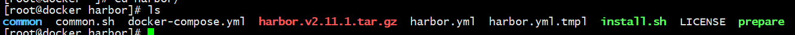
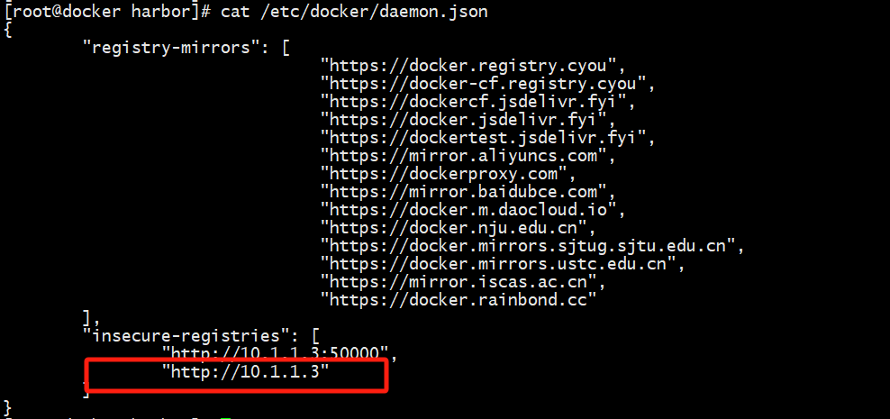
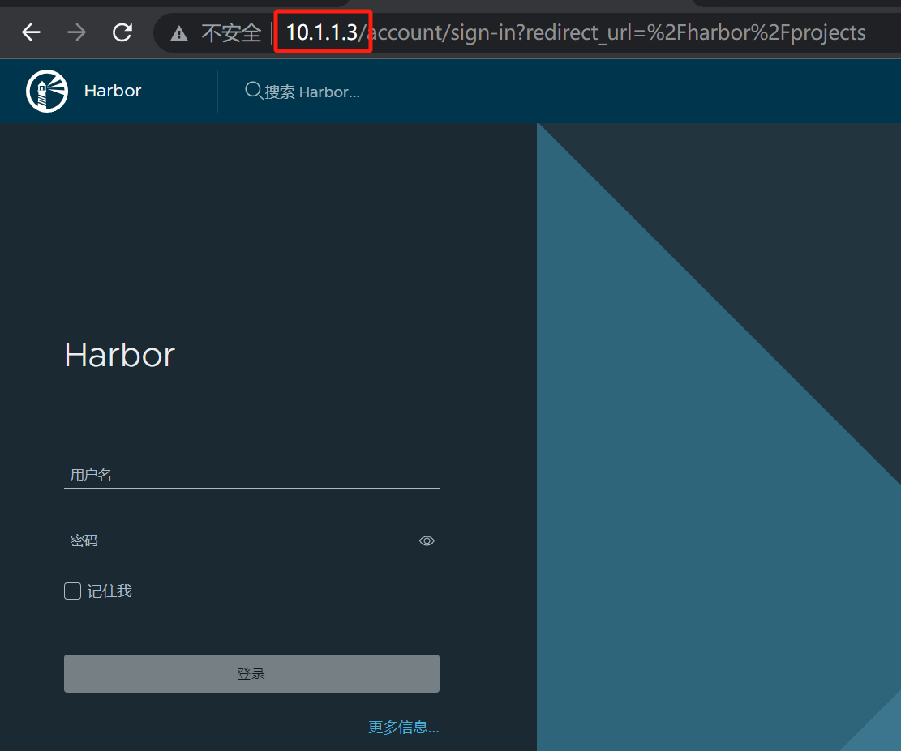
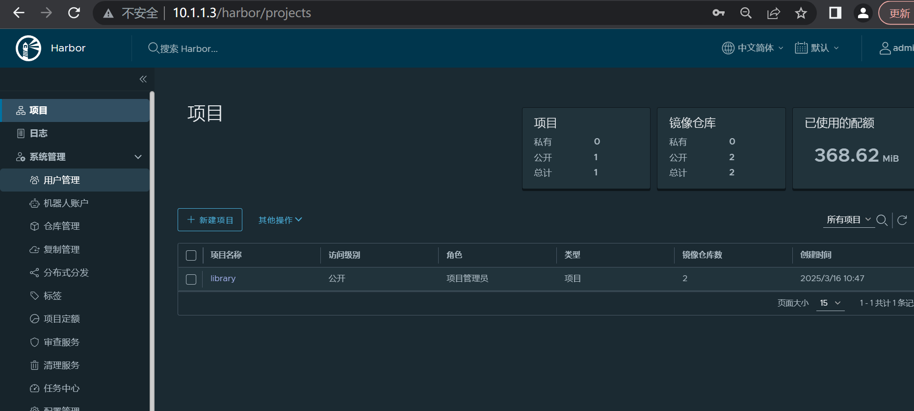
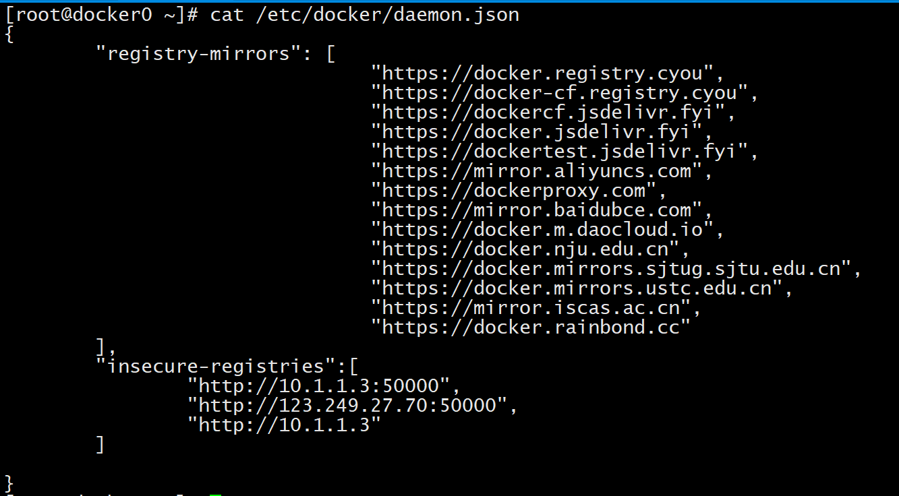

1. 下载应用包

   ```bash
   cd /root/
   wget https://github.com/goharbor/harbor/releases/download/v2.11.1/harbor-offline-installer-v2.11.1.tgz
   ```

2. 解压

   ```bash
   cd /root/
   tar -zxvf harbor-offline-installer-v2.11.1.tgz
   ```

3. 进入目录

   ```bash
   cd /root/harbor/
   ```

4. 复制配置文件

   ```bash
   cp harbor.yml.tmpl harbor.yml
   ```

5. 编辑harbor.yml

6. 预处理

   ```bash
   ./prepare
   ```

   

7. 安装

   ```bash
   ./install.sh
   ```

   

8. 配置安全仓库

   ```bash
    "insecure-registries": ["10.1.1.10"]
   # 重启docker
   systemctl restart docker
   # 查看harbor容器是否启动
   如果没有启动，需要手动启动
   cd ~/harbor
   docker compose up -d
   ```

   

9. 访问可视化页面 账号admin，密码Harbor12345

10. 命令行登陆

    ```bash
    docker login http://10.1.1.3
    使用admin和Harbor12345登陆
    Abcd001002
    ```

    

11. 修改标签

    ```bash
    docker tag python:latest 10.1.1.3/library/python:latest
    ```

    

12. 推送镜像

    ```bash
    docker push 10.1.1.3/library/python:latest
    ```

13. 拉取镜像

    1. 配置安装仓库

    2. 重启docker

       ```bash
       systemctl restall docker
       ```

       

    3. 拉取镜像

       ```bash
       docker pull 10.1.1.3/library/python:latest
       ```

       