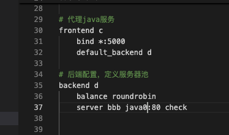

1. 数据访问的流程

   1. 客户端请求web服务，请求宿主机的80端口
   2. 宿主机的80端口映射到haproxy容器的5000端口
   3. haproxy的5000端口代理三个nginx，web0 web1 web0
   4. 客户端获得前端页面
   5. 客户端ajax发送登录请求 bu.yuanyu.zhangmin:32100
   6. 实际上是客户端请求java服务，请求宿主机的32100端口
   7. 32000端口设置映射到haproxy容器的5001端口
   8. haproxy容器中5001端口代理5个tomcat容器的8080端口
   9. mysql负责为5个tomcat容器提供数据服务

2. 步骤

   1. 部署三个基础容器 nginx，tomcat，mysql

      ```yaml
      version: '3'
      services:
      	# 容器名和服务名会自动的映射为相互访问域名，如果名称是一致的，就不需要links选项
      	db:
      		# 镜像
      		image: mysql:5.7.44
      		#容器名
      		container_name: db
      		# 挂载卷
      		volumes:
      			- /root/pes/mysql/data/:/var/lib/mysql/
      		# 对宿主机暴露端口
      		expose:
      			- 3306
      	java0:
      		image: tomcat:latest
      		container_name: java0
      		volumes:
      			- /root/pes/java/src/:/usr/local/tomcat/
      		expose:
      			- 8080
      		# 用于替换容器前台运行的指令
      		command: java -jar Project_ExamSystem-V1.0.0.war
      	web0:
      		image: nginx:latest
      		containner_name: web0
      		volumes:
      			- /root/pes/web/dist/:/usr/share/nginx/html/
      		expose:
      			- 80
      ```

   2. 启动服务

      ```bash
      [root@docker docker-compose-pes-lb2]# docker compose ps
      WARN[0000] /root/docker-compose-pes-lb2/docker-compose.yml: `version` is obsolete 
      NAME      IMAGE           COMMAND                   SERVICE   CREATED              STATUS              PORTS
      db        mysql:5.7.44    "docker-entrypoint.s…"   db        About a minute ago   Up About a minute   3306/tcp, 33060/tcp
      java0     tomcat:latest   "java -jar Project_E…"   java0     About a minute ago   Up About a minute   8080/tcp
      web0      nginx:latest    "/docker-entrypoint.…"   web0      About a minute ago   Up About a minute   80/tcp
      ```

   3. 检查容器是否健康

      1. 前端

         ```bash
         # 获得前端nginx容器的ip
         docker inspect web0|grep IPA
         # 根据ip地址模拟访问
         curl http://<ip>:80
         # 有返回一个html标签页面，说明服务成功启动
         ```

      2. 后端java的检查

         ```bash
         # 查看日志
         docker logs java0
         # 获得tomcat容器的ip
         docker inspect java0|grep IPA
         # 模拟访问
         curl http://<ip>:8080
         # 显示一下内容表示java服务能够访问
         [root@docker docker-compose-pes-lb2]# curl http://172.19.0.4:8080
         {"code":20002,"msg":"账号不存在或密码错误"}
         
         # 再次查看java0日志，如果没有报错，就说明连接数据库是成功的。
         #如果报错，就需要检查mysql
         docker exec -it db mysql -proot
         
         ```

   4. 在docker-compose.yml文件中添加新的服务 haproxy

      ```yaml
        haproxy:
          image: haproxy:latest
          container_name: haproxy
          volumes:
            - ./haproxy.cfg:/usr/local/etc/haproxy/haproxy.cfg
          expose:
            - 5000
          ports:
            - '80:5000'
      ```

      5. 修改配置文件，复制一个haproxy.cfg的蓝本到yml所在的目
      6. 以上的操作，实现当户访问宿主机的80端口的时候，会被映射到haproxy容器的5000端口（docker-compose.yml haproxy服务中的ports设置的），当用户访问到haproxy的5000，haproxy.cfg配置文件决定了5000端口代理的服务组 backend b 下的一组
      7. 将tomcat的8080交给haproxy的代理
      8. 

      