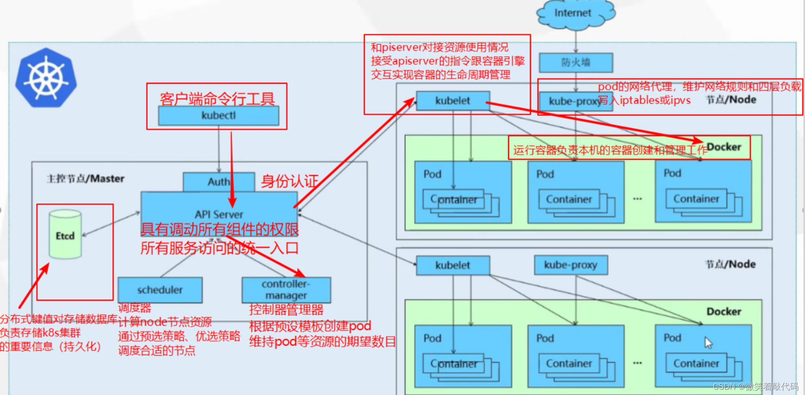
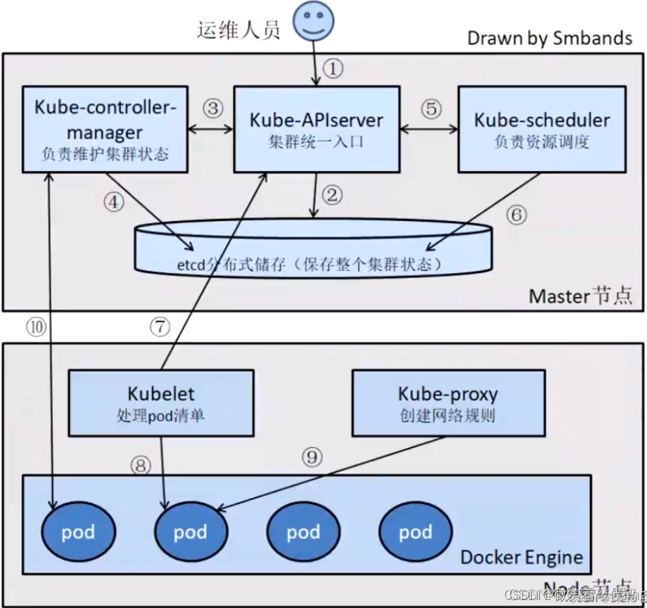

## 一、编排分类

- **单机容器编排:** docker-compose
- **容器集群编排:** docker swarm、mesos+marathon、kubernetes
- **应用编排:** ansible(模块，剧本，角色)

------

## 二、系统管理进化史

### 1. 传统部署时代

早期，各个组织是在物理服务器上运行应用程序。 由于无法限制在物理服务器中运行的应用程序资源使用，因此会导致资源分配问题。 

例如，如果在同一台物理服务器上运行多个应用程序， 则可能会出现一个应用程序占用大部分资源的情况，而导致其他应用程序的性能下降。 

而一种解决方案是将每个应用程序都运行在不同的物理服务器上，但是当某个应用程序资源利用率不高时，剩余资源无法被分配给其他应用程序，而且维护许多物理服务器的成本很高。

### 2. 虚拟化部署时代

而后，虚拟化技术被引入了。虚拟化技术允许在单个物理服务器的 CPU 上运行多台虚拟机(VirtureMachine)。 虚拟化能使应用程序在不同 VM 之间被彼此隔离，且能提供一定程度的安全性， 因为一个应用程序的信息不能被另一应用程序随意访问。

虚拟化技术能够更好地利用物理服务器的资源，并且因为可轻松地添加或更新应用程序，而因此可以具有更高的可扩缩性，以及降低硬件成本等等的好处。通过虚拟化，你可以将一组物理资源呈现为可丢弃的虚拟机集群。

每个 VM 是一台完整的计算机，在虚拟化硬件之上运行所有组件，包括其自己的操作系统，所以由此看来，虚拟机技术占用资源量大，在一台主机上最多运行十几台，效率不高。

### 3. 容器部署时代

容器，衍生于虚拟技术，但具有更宽松的隔离特性，使容器可以在共享操作系统的同时，还能保持其轻量级的特点。而且每个容器都具有自己的文件系统、CPU、内存、进程空间等，且具有最良好的可移植性和平台兼容性。

- **敏捷应用程序的创建和部署：**与使用 VM 镜像相比，提高了容器镜像创建的简便性和效率
- 持续开发、集成和部署：通过快速简单的回滚(由于镜像不可变性)，提供可靠且频繁的容器镜像构建和部署。
- **关注开发与运维的分离：**在构建、发布时创建应用程序容器镜像，而不是在部署时，从而将应用程序与基础架构分离。
- **可观察性：**不可以显示OS 级别的信息和指标，还可以显示应用程序的运行状况和其他指标信。
- **跨开发、测试和生产的环境一致性：**在笔记本计算机上也可以和在云中运行一样的应用程序。
- **跨云和操作系统发行版本的可移植性：**可在 Ubuntu、RHEL、CoreOS、本地、GoogleKubernetes Engine 和其他任何地方运行。
- **以应用程序为中心的管理：**提高抽象级别，从在虚拟硬件上运行 OS 到使用逻辑资源在OS 上运行应用程序。
- **松散耦合、分布式、弹性、解放的微服务：**应用程序被分解成较小的独立部分， 并且可以动态部署和管理-而不是在一台大型单机上整体运行。
- **资源隔离：**可预测的应用程序性能。
- **资源利用：**高效率和高密度。

------

## 三、Kubernetes 简介

Kubernetes 缩写：K8S，k 和 s 之间有八个字符，所以因此得名。

Kubernetes 由 google 的 Brog 系统作为原型，后经 Go 语言延用 Brog 的思路重写，并捐献给 CNCF 基金会开源。

Kubernetes 是一个可移植的、可扩展的开源平台，用于管理容器化的工作负载和服务，可促进声明式配置和自动化。

**官网：**https://kubernetes.io

**Github：**https://github.com/kubernetes/kubernetes

------

## 四、Kubernetes 功能

Kubernetes 的目标是让部署容器化的应用简单并且高效，提供了应用部署，规划，更新，维护的一种机制。

Kubernetes 在 Docker 等容器技术的基础上，为容器化的应用提供部署运行、资源调度、服务发现和动态伸缩等一系列完整功能，提高了大规模容器集群管理的便捷性。

**主要功能：**

1. 使用 Docker 等容器技术对应用程序包装(package)、实例化(instantiate) 、运行(run)。 
2. 以集群的方式运行、管理跨机器的容器，解决 Docker 跨机器容器之间的通讯问题。
3. K8S 的自我修复机制使得容器集群总是运行在用户期望的状态。

------

## 五、Kubernetes 特性

1. **自动装箱**：Kubernetes可以根据所需资源和其他限制条件智能地定位容器，而不会影响可用性。
2. **弹性伸缩：**使用命令、UI 或者基于 CPU 使用情况自动快速扩容和缩容应用程序实例，保证应用业务高峰并发时的高可用性；业务低峰时回收资源，以最小成本运行服务。
3. **自我修复：**在节点故障时重新启动失败的容器，替换和重新部署，保证预期的副本数量；杀死健康检查失败的容器，并且在未准备好之前不会处理客户端请求，确保线上服务不中断。
4. **服务发现和负载均衡：**K8S为多个容器提供⼀个统⼀访问入口（内部IP地址和⼀个DNS名称），并且负载均衡关联的所有容器，使得用户⽆需考虑容器 IP 问题。
5. **自动发布（默认滚动发布模式）和回滚：**K8S采用滚动策略更新应用，⼀个更新⼀个Pod，而不是同时删除所有的Pod，如果更新过程中出现问题，将回滚更改，确保升级不收影响业务。
6. **集中化配置管理和密钥管理：**管理机密数据和应用程序配置，而不需要把敏感数据暴露在镜像里，提高敏感数据安全性，并可以将⼀些常用的配置存储在K8S中，⽅便应用程序使用。
7. **存储编排：**⽀持外挂存储并对外挂存储资源进行编排，挂载外部存储系统，⽆论是来自本地存储，公有云（如：AWS），还是⽹络存储（如：NFS、Glusterfs、Ceph）都作为集群资源的⼀部分使用，极⼤提高存储使用灵活性。
8. **任务批量处理运行：**提供⼀次性任务，定时任务，满⾜批量数据处理和分析的场景。

------

## 六、K8S 解决裸跑 Docker 的痛点

1. 单机使用，无法有效集群。
2. 随着容器数量的上升，管理成本攀升。
3. 没有有效的容灾、自愈机制。
4. 没有预设编排模板，无法实现快速、大规模容器调度。
5. 没有统一的配置管理中心工具。
6. 没有容器生命周期的管理工具。
7. 没有图形化运维管理工具。

------

## 七、Kubernetes 架构

***K8S 属于主从设备模型（Mater-Slave 架构）***，由 Master 节点负责集群的调度、管理和运维（分配活的），Slave 节点是运算工作负载节点（干活的），被称为 Worker Node 节点。

Master 需要占据一个独立服务器运行，因为其是整个集群的“大脑”，一旦宕机或不可用，那么所有控制命令都将失效，可对主节点进行高可用配置。

当 Worker Node 节点宕机时，其上的工作负载会被 Master 自动转移到其他节点上。

### 1. Master 节点组件

#### API Server

***整个集群的控制中枢，提供集群中各个模块之间的数据交换\***，并将集群状态和信息存储到分布式键-值(key-value)存储系统 Etcd 集群中。

同时它也是集群管理、资源配额、提供完备的集群安全机制的入口，为集群各类资源对象提供增删改查以及 watch 的 REST API 接口。

#### Controller-manager

***集群状态管理器，以保证 Pod 或其他资源达到期望值\****。*当集群中某个 Pod 的副本数或其他资源因故障和错误导致无法正常运行，没有达到设定的值时，Controller Manager 会尝试自动修复并使其达到期望状态。

#### Scheduler

***集群 Pod 的调度中心，主要是通过调度算法将 Pod 分配到最佳的 Node 节点\***，它通过APIServer 监听所有 Pod 的状态，一旦发现新的未被调度到任何 Node 节点的Pod(PodSpec.NodeName为空)，就会根据一系列策略选择最佳节点进行调度。

#### Etcd

***用于可靠地存储集群的配置数据，是一种持久性、轻量型、分布式的键-值 (key-value) 数据存储组件\***，作为Kubernetes集群的持久化存储系统。

注：生产环境建议存放到单个的SSD硬盘，并且做好冗余。

### 2. Work Node 节点

#### Kubelet

***负责与 Master 通信协作，管理该节点上的 Pod，对容器进行健康检查及监控，同时负责上报节点和节点上面 Pod 的状态。\***

#### Kube-proxy

***运行在每个 node 节点上，实现 pod 的网络代理，维护网络规则和四层负载均衡规则\***，负责写入规则到 iptables 或 ipvs 实现服务映射访问。

#### Runtime

***负责容器的管理\*** (新版本 K8S 使用的是 Containerd)。

#### CoreDNS

***用于 Kubernetes 集群内部 Service 的解析***，可以让 Pod 把 Service 名称解析成 Service 的 IP 然后通过 Service 的 IP 地址进行连接到对应的应用上。

#### Calico

符合 CNI 标准的一个网络插件，它***负责给每个 Pod 分配一个不会重复的 IP，并且把每个节点当做一各“路由器”\***，这样一个节点的 Pod 就可以通过 IP 地址访问到其他节点的 Pod。

#### Docker

***运行容器，负责本机的容器创建和管理工作。\***

------

## 八、Pod 概念

Pod 是 Kubernetes 中的基本构建块，它代表一个或一组相互关联的容器。Pod 是Kubernetes 的最小部署单元，可以包含一个或多个容器，这些容器共享存储、网络和运行配置。

容器之间可以使用 localhost:port 相互访问，可以使用 volume 等实现数据共享。根据 Docker 的构造，Pod 可被建模为一组具有共享命令空间、卷、IP 地址和 Port 端口的容器。

**Pod 的主要特点包括：**

1. 共享存储：Pod 中的所有容器都可以访问同一个存储卷（Persistent Volume），实现数据共享。
2. 共享网络：Pod 中的所有容器都共享同一个网络命名空间，可以相互通信。
3. 共享运行配置：Pod 中的所有容器都共享相同的运行配置，例如容器的启动参数、环境变量等。

**Pause 容器：**

Pod 的父容器，它主要负责僵尸进程的回收管理，同时通过 Pause 容器可以使同一个 Pod 里面的不同容器进行共享存储、网络、PID、IPC等。

## 九、Kubernetes 工作流程

1. 运维人员使用 kubectl 命令工具向 API Server 发送请求，API Server 接收请求后写入到 Etcd 中。
2. API Server 让 Controller-manager 按照预设模板去创建 Pod。
3. Controller-manager 通过 API Server 读取 Etcd 中用户的预设信息，再通过 API Server 找到 Scheduler，为新创建的 Pod 选择最合适的 Node 工作负载节点。
4. Scheduler 通过 API Server 在 Etcd 找到存储的 Node 节点元信息、剩余资源等，用预选和优选策略选择最优的 Node 节点。
5. Scheduler 确定 Node 节点后，通过 API Server 交给这个 Node 节点上的 Kubelet 进行 Pod 资源的创建。
6. Kubelet 调用容器引擎交互创建 Pod，同时将 Pod 监控信息通过 API Server 存储到 Etcd 中。
7. 当用户访问时，通过 Kube-proxy 负载、转发，访问相应的 Pod。
8. **注：**决定创建 Pod 清单的是 Controller-manager 控制器，Kubelet 和容器引擎只是干活的。

## 十、K8S 创建 Pod 流程

### 1. 详细流程

- 首先 Kubectl 创建一个 Pod，在提交时转化为 json。
- 再经过 auth 认证(鉴权)，然后传递给 API Server 进行处理。
- API Server 将请求信息存储到 Etcd 中。
- Scheduler 和 Controller-manager 会监听 API Server 的请求。
- 在 Scheduler 和 Controller-manager 监听到请求后，Scheduler 会提交给API Server一个list清单 —— 包含的是获取node节点信息。
- 当 API Server 从 Etcd 获取后端 Node 节点信息后，会同时被 Scheduler 监听到，然后 Scheduler 进行优选打分制，最后将评估结果传递给 API Server。
- 而后，API Server 会提交清单给对应节点的 Kubelet（代理）。
- Kubelet 代理通过 K8S 与容器的接口 (例如 containerd) 进行交互，假设是 docker 容器，那么此时 kubelet 就会通过 dockershim 以及 runc 接口与 docker 的守护进程docker-server 进行交互，来创建对应的容器，再生成对应的 Pod。
- Kubelet 同时会借助 Metric Server 收集本节点的所有状态信息，然后提交给 API Server。
- 最后 API Server 将该节点的容器和 Pod 信息存储到 Etcd 中。

### 2. 简化流程

- 用户通过 kubectl 或其他 API 客户端提交 Pod Spec 给 API Server。
- API Server 尝试将 Pod 对象的相关信息存入 etcd 中，待写入操作执行完成，API Server 即会返回确认信息至客户端。
- Controller 通过 API Server 的 Watch 接口发现新的 Pod，将 Pod 加入到任务队列，并启动 Pod Control 机制创建与之对应的 Pod。
- 所有 Controler 正常后，将结果存入 etcd。
- Scheduler 通过 API Server 的 Watch 接口监测发现新的 Pod，经过给主机打分之后，让 Pod 调度到符合要求的 Node 节点，并将结果存入到 etcd 中。
- Kubelet 每隔一段时间向 API Server 通过 Node name 获取自身 Node 上要运行的 Pod 并通过与自身缓存比较，来创建新 Pod。
- Containerd 启动容器。
- 最后 API Server 将本节点的容器和Pod信息存储到etcd。