**定义：**OpenStack最流行的开源云操作系统，可控制整个数据中心的大型计算，网络，存储资源，用户通过Web界面、命令行或API接口配置资源。

**操作系统**：控制软硬件，与客户交流

**云**：资源的集合（计算资源，网络资源，存储资源）

**云操作系统**：管理云中的资源池

Openstack可管理虚拟机、容器、裸金属

**Kubernetes(K8S)**：对容器进行批量的管理和部署

**Ironic**：OpenStack管理金属的模块

------

**Openstack和虚拟化，云计算的关系**

- OpenStack是一个云操作系统，虚拟化OpenStack的底层技术实现手段之一，OpenStack只是构建云计算的关键组件。

 **OpenStack与虚拟化的关系**

​      **OpenStack**

​      ①自身不提供虚拟化技术

​      ②调用多种技术实现多资源的管理

​      ③对外提供统一管理接口

​      **虚拟化**

​      ①环境隔离，资源服用

​      ②降低隔离损耗，提升运行效率

​      ③提供高级虚拟化特性

​      虚拟化是OpenStack底层的技术实现手段之一，但非核心关注，OpenStack可管控多个厂商的虚拟化技术包括（KVM、VMware、XEN、Hyper-V）

  **OpenStack与云的关系**

- Openstack只是构建云计算的关键组件：内核，骨干，框架，总线

------

**OpenStack的设计思想**

​    **开放**

- 开源，并尽可能重用已有开源项目
- 不要“重复发明轮子”

​    **灵活**

- 不使用任何不可代替的私有/商业组件
- 大量使用插件方式进行架构设计

**可扩展**

- 由多个相互独立的项目组成
- 每个项目包含多个独立服务组件
- 无中心架构
- 无状态架构

**OpenStack架构图**

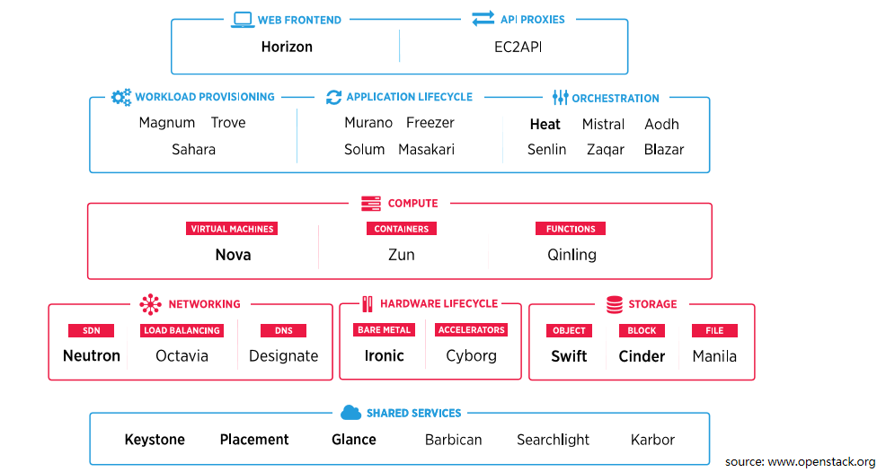

粗字体标识为OpenStack核心服务

**OpenStack的服务分为如下几大类：**

- **计算**
- **存储**
- **网络**
- **共用服务**
- **硬件生命周期管理**
- **编排**
- **工作流**
- **应用程序生命周期**
- **API代理**
- **操作页面**

OpenStack服务组件通过消息队列，（Message Queue）

​      OpenStack组件众多，建议重点关注计算，存储和网络服务组件，其他服务可以在实际工作需要是再进行学习。

------

**认证服务Keystone**

- **认证服务**

​     首次出现在OpenStack的“Essex”版本中

- **简介**

Keystone提供身份验证，服务发现和分布式租户授权。

Keystone支持LDAP，QAuth，OpenID Connect，SAML和SQL

**LDAP**：Lightwei Directory Access Protocol，轻量目录访问协议

**QAuth**：Open Authorization，为用户资源的授权提供了一个安全的、开放而又简易的标注。

**SAML**：Security Assertion Markup Language，安全断言标记语音，是一个基于XML的开源标准数据格式，它再当事之间交换身份验证和授权数据，尤其是身份提供者和服务提供者之间交换。

**操作界面Horizon**

- **操作界面**

​      首次出现在OpenStack的“Essex”版本中

- **简介**

Horizon提供基于Web的控制界面，使云管理和用户能够管理各种OpenStack资源和服务

**镜像服务Glance**

- **镜像服务**

首次出现再OpenStack的“Bexar”版本中

- **简介**

Glance提供发现，注册和检索虚拟机镜像功能

Glance提供的虚拟机实例镜像可以存放在不同地方，例如本地文件系统，对象存储，块存储

**计算服务Nova**

- **计算服务**

首次出现OpensStack的“Austin”版本中

- **简介**

Nova提供大规模、可扩展、按需自主服务的计算资源

Nova支持管理裸机，虚拟机和容器

**块存储服务Cinder**

- **块存储服务**

首次出现在OpenStack的“Folsom”版本中

- **简介**

Cinder提供块存储服务，为虚拟机实例提供持久化存储

Cinder调用不同存储接口驱动，将存储设备转换成块存储池，用户无需了解存储实例部署的位置或设备类型

**对象存储服务Swift**

- **对象存储服务**

首次出现在OpenStack的“Austin”版本中。

- **简介**

Swift提供高度可用，分布式，最终一致的对象存储服务

Swift可以搞笑，安全且廉价的存储大量数据

Swift非常合适存储需要弹性扩展的非结构化数据

**网络服务Neutron**

- **网络服务**

首次出现在OpenStack的“FolSom”版本中

- **简介**

Neutron负责管理虚拟网络组件，专注于为OpenStack提供网络即服务

**编排服务Heat**

- **编排服务**

首次出现在OpenStack的“Havana”版本中。

- **简介**

Heat为云应用程序编排OpenStack基础架构资源

Heat提供OpenStack原生Rest API和CloudFormation兼容的查询API

**创建一个VM需要些什么资源**

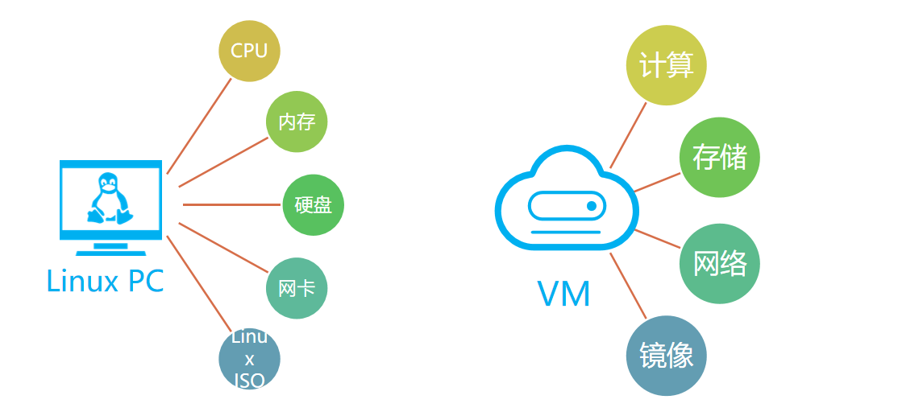

**OpenStack创建VM，服务间交互实例**

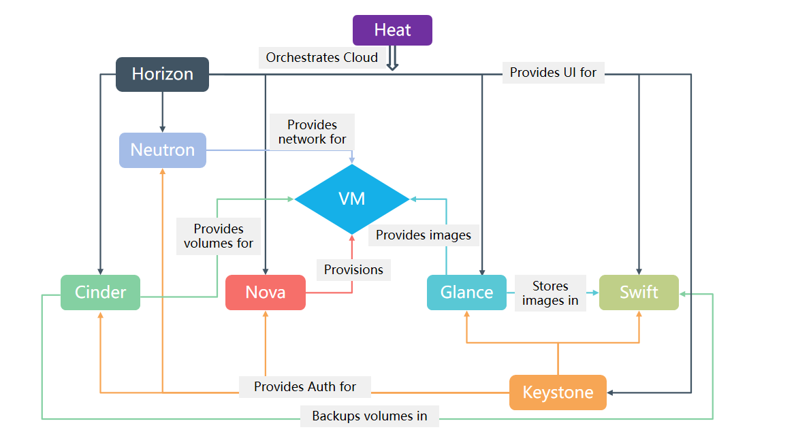

**Openstack的工作核心之一是虚拟机生命周期管理**

**虚拟机实例创建时，各Openstack服务协调工作，完成工作**

- 认证服务keystone（提供身份验证，服务发现和分布式多多租户授权）
- 操作界面Horizon（提供基于Web的控制界面，使云管理员用户能够管理各种OpenStack资源和服务）
- 镜像服务Glance，提供发现、注册和检索虚拟机镜像功能
- 计算服务Nova，提供大数据，可扩展，按需自主服务的计算资源，Nova支持管理虚拟机，虚拟机容量
- 块存储服务Cinder（硬盘，软件，光盘）为虚拟机实例提供持久化存储
- 对象存储Swift（Swift非常适合存储非结构化数据）提供高度可用、分布式、最综一致的对象存储服务

------

**Nova**

- **计算服务**

首次出现在OpenStack的“Austin”版本中

- **简介**

Nova提供大规模、可扩展、按需自主服务的计算资源

Nova支持管理裸机，虚拟机和容器

OpenStack最初几个版本中，计算，存储，网络都由Nova实现，后面逐步拆分出存储和网络，目前Nova专注提供计算服务，依赖keystone的认证服务，Neutron的网络服务，Glance镜像服务。

- **Nova在OpenStack中的位置和作用**

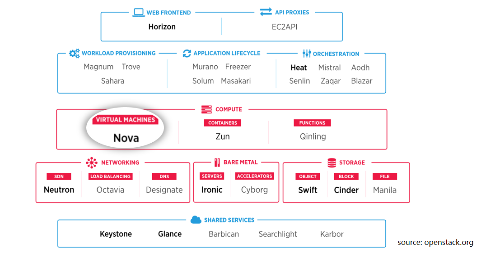

- **Nova是什么？**

OpenStack中提供计算资源服务的项目

- **Nova负责什么？**

1. 虚拟机生命周期管理
2. 其他计算资源生命周期管理

- **Nova不负责什么？**

1. 承载虚拟机的物理主机自身的管理
2. 全面的系统监控状态

- **Nova是OpenStack事实上最核心的项目**

​    ①历史最长：openstack首批两个项目之一

​    ②功能最复杂：代码最大

​    ③大部分集成项目和Nova之间都存在配合关系

​    ④贡献者在社区中的影响力最大

- **Nova架构图**

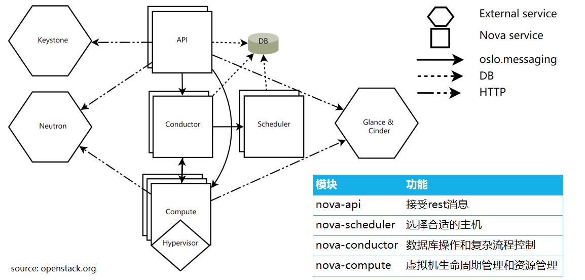

①Nova-api：接收rest消息

②Nova-scheduler：选择合适的主机

③Nova-conductor：数据库操作和复杂流程控制

④Nova-compute：虚拟机生命周期管理和资源管理

- Nova内部服务使用REST调用，Nova和其他OpenStack服务交互时，使用消息队列服务
- REST：通过HTTP协议传输的

- **Nova组件-API**
- **功能**

1. 对外提供REST接口，接受和处理请求
2. 对传入参数进行合法性校验和约束限制
3. 对请求的资源进行配额和预留
4. 资源的创建，更新，删除查询等

- **Nova组件-Conductor**

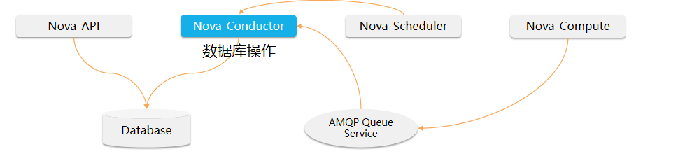

  **功能**

1. 数据库操作，解耦其他组件（Nova-Compute）数据库访问
2. Nova复杂流程控制，如创建，冷迁移，热迁移，虚拟机规格调整，虚拟机重建
3. 其他组件的依赖，如Nova-compute需要Nova-conductor启动成功后才能启动
4. 其他组件的心跳定时写入

  **引入Nova-Conductor的好处**

1. 安全性上考虑，之前每个Nova-compute都是直接访问数据库的，如果由于某种原因，某个计算节点被攻陷了，那攻击者就可以获取访问数据库的全部权限，肆意操作数据库
2. 方便升级。将数据库和nova-compute解耦，如果数据库的模式改变，nova-compute也就不用升级了。
3. 在性能上考虑，之前数据库的访问在nova-compute中直接访问且数据库访问时堵塞性的，由于nova-compute只有一个os线程，所以当一个绿色线程去访问数据库的时候会阻塞其他绿色线程，导致绿色线程无法并发，但是nova-conductor是通过rpc 调用，rpc调用是绿色线程友好的，一个rpc call的执行返回前不会阻塞其他绿色线程的执行。这样就会提高了操作的并发。

 

- **Nova组件-Scheduler**

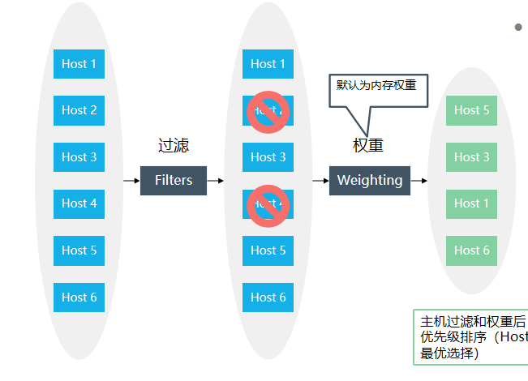

**功能**

1. 筛选和确定将虚拟机实例分配到哪一台物理机上
2. 分配过程主要分为两部，过滤和权重

​      ①通过过滤器选择满足条件的计算节点

​      ②通过权重选择最优的节点

-  **Nova-Scheduler**：确定将虚拟机分配到哪一台物理机，分配过程主要分为两步，过滤和权重；用户创建虚拟机时会提出资源需求，例如CPU、内存、磁盘各需要多少，openstack将这些需求定义在Flavor中，用户只需要指定这些Flavor就可以了。

- **Nova组件-Compute**

功能

- 虚拟机生命周期操作的真正执行者（会调用对应的Hypervisor的Driver）
- 底层对接不同的虚拟化的平台（KVM/VMware/XEN/Ironic等）
- 内置周期性任务，完成资源的刷新，虚拟机状态同步等功能
- 资源管理模块（resource tracker）配合插件机制，完成资源的统计

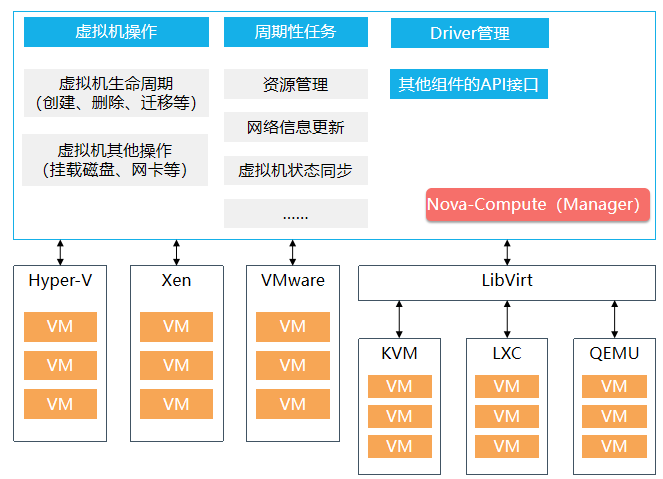

- **Nova-Compute框架**

Manager

Driver

- **对接不同的虚拟化平台**

KVM、VMware、Xen、LXC、QEMU

- **Nova创建虚拟机流程**

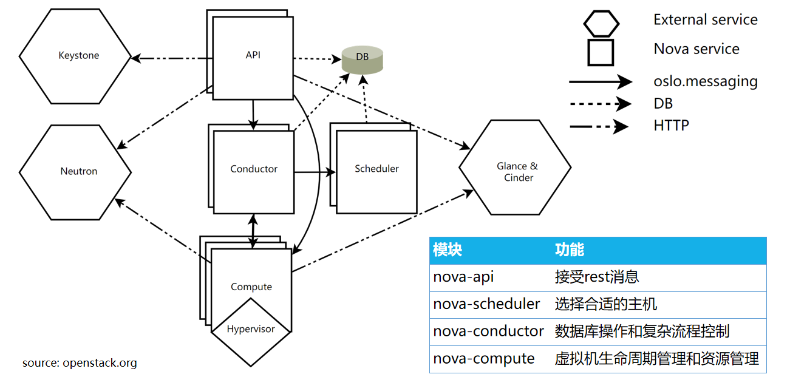

1. 用户通过Dashborad/CLI申请创建虚拟机，并以REST API方式来请求Keystone授权，Keystone鉴定后和送回auth-token(用来通过REST-call向其他组件发送请求)
2. Dashborad或者CLI创建虚拟机请求转换成REST-API形式并发给nova-api
3. nova-api收到请求后向keystone发送请求验证auth-token并获取权限，keystone验证token并发送角色和权限更新的认证报头
4. nova-api联系nova-database，为新的实例创建初始数据库条目（此时虚拟机状态开始变为Buliding）
5. nova-api发送请求给nova-Scheduler，以获得合适安装虚拟机的主机
6. nova-Scheduler从queue中拿到请求
7. nova-scheduler联系nova-database通过过滤与权重来查找最合适的主机，Nova-scheduler在过滤和权重后返回给最适合安装虚拟机的主机ID，Nova-scheduler发送请求给nova-compute，请求创建虚拟机
8. nova-compute从queue中拿到请求，联系nova-conductor，以获取选定主机的信息，如规格（ram，cpu，disk）
9. nova-conductor从queue中拿到请求，联系nova-db，返回选定主机的信息，nova-conductor将信息发送到queue中，nova-compute从queue中得到选定主机的信息
10. nova-compute通过传递auth-token给Glance-api进行REST调用，向glance请求使用镜像服务
11. glance-api与keystone验证auth-token，nova-compute得到镜像元数据
12. nova-compute通过传递auth-token给Neutron-api进行REST调用，以获得网络服务
13. Neutron-api与keystone验证auth-token，nova-compute得到网络信息
14. nova-compute通过传递auth-token给Cinder-api进行REST调用，以获取块存储服务
15. cinder-api与keystone验证auth-token，nova-compute得到块存储信息
16. nova-compute生成驱动数据，驱动hypervisor生成虚拟机，完成虚拟机创建

------

**Cinder**

- **openstack有哪些块存储类型？**

**Ephemeral Storage，临时存储**

- 如果只部署了Nova服务，则默认分配给虚拟机的磁盘是临时的，当虚拟机终止后，存储空间也会被释放
- 默认情况下，临时存储以文件形式放置在计算节点的本地磁盘上。

**Persistent Storage，持久性**

- 持久化存储设备的生命周期独立于任何其它系统设备或资源，存储的数据一直可用，无论虚拟机是否运行
- 当虚拟机终止后，持久性存储上的数据仍然可用。

目前openstack支持三种类型的持久性存储：块存储、对象存储和文件系统存储

- **Openstack持久化存储简介**

**块存储**：操作对象是磁盘，直接挂载到主机，一般用于主机的直接存储空间和数据库应用，DAS和SAN都可以提供块存储------**Cinder**

**对象存储**：操作对象是对象（object）一个对象名称就是一个域名地址，可以直接通过REST API的方式访问对象------**Swift**

**文件存储**：操作对象是文件和文件夹，在存储系统上增加了文件系统，再通过NFS或CIFS协议进行访问-------**Manlia**

- **Cinder**

块存储服务

首次出现在OpenStack的“Folsom”版本中

**简介**

- Cinder提供块存储服务，为虚拟机实例提供持久化存储
- Cinder调用不同存储接口驱动，将存储设备转化成块存储池，用户无需了解存储实际部署的位置或设备类型

- **Cinder在OpenStack中的位置和作用**

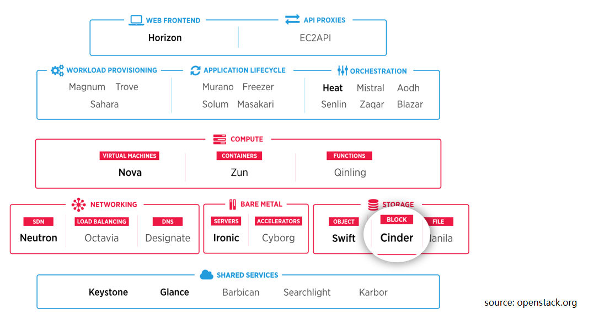

- Cinder的核心功能是对的管理，允许对卷、卷的类型、卷的快照、卷的备份进行处理。它为后端不同的存储设备提供了统一的接口，不同的块设备服务厂商在Cinder中实现其驱动，可以被OpenStack整合管理
- **Cinder架构**

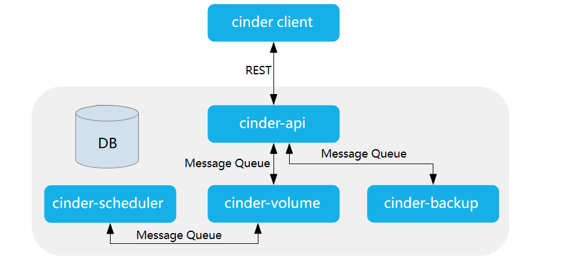

- Cinder-Client：封装Cinder提供的rest接口，以CLI形式供用户使
- Cinder-API：对外提供rest API，对操作需求进行解析，对API进行路由寻找相应的处理方法。包含卷的增删改查（包括从源卷、镜像、快照创建）、快照增删改查、备份、volume type管理、挂载/卸载（Nova调用）等
- Cinder-Scheduler：负责收集backend上报的容量，能力信息，根设定的算法完成卷到指定Cinder-volume的调度
- Cinder-Volume多节点部署，使用不同的配置文件、接入不同的backend设备，各存储厂商插入Driver代码与设备交互完成设备容量和能力信息收集、卷操作
- Cinder-Backup实现将卷的数据备份到其他存储介质（目前Swift/ceph/TSM提供了驱动）
- SQL-DB提供存储卷、快照、service等数据，支持Mysql、PG、MSSQL等SQL数据库
- REST：客户端与服务端交互的一种方式

- **Cinder组件-API**

Cinder API对外提供REST API，对操作需求进行解析，并调用处理方法

- **Cinder组件-scheduler（管理选择那个硬盘）**
- Cinder scheduler负责收集后端上报的容量、能力信息，根据设定的算法完成卷到指定cinder-volume的调度。
- Cinder scheduler通过过滤和称权，筛选出合适的后端

1. 列出所有后端
2. 根据后端的能力进行筛选
3. 根据权重给后端排序
4. 返回最合适的后端

- **Cinder组件-Volume（管理硬盘生成的）**
- Cinder-volume多节点部署，使用不同的配置文件、接入不同的后端设备，由个存储厂商插入Driver代码与设备交互，完成设备容量和能力信息收集、卷操作等。

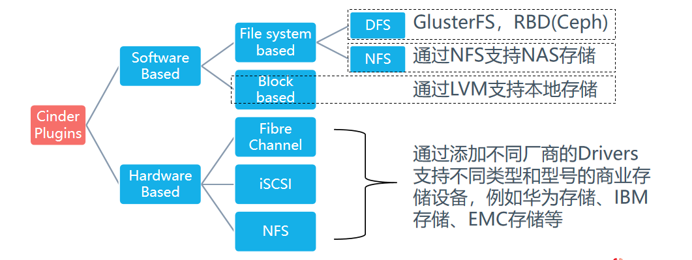

- **Cinder组件-backup**

作用：把数据备份到其他存储上

- **Cinder创建卷流程**

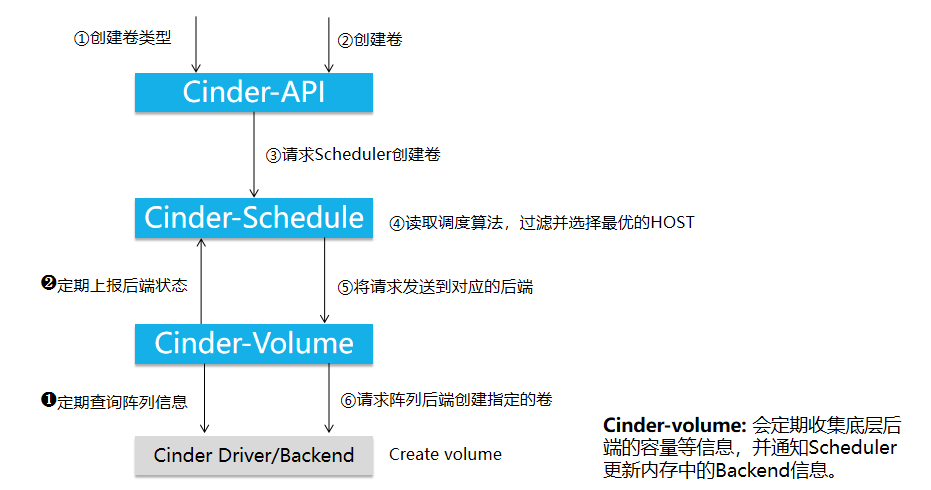

1. 首先Cinder-API收到用户创建卷的请求以及类型
2. Cinder-api向Cinder-Scheduler发送创建卷的请求
3. Cinder-Schedule读取调度算法，过滤并选择最优的HOST
4. Cinder-Schedule将请求发送到对应的后端
5. Cinder-Volume收到请求后，请求阵列后端创建指定的卷

- 创建卷类型的目的是为了筛选不同后端存储，例如SSD、SATA、高性能、低性能等、通过创建不同的自定义卷类型，创建卷时自动筛选出合适的后端存储
- **Cinder挂载卷流程**
- 挂卷流程：挂卷是通过Nova和Cinder的配合最终将远程的卷连接到虚拟机所在的Host节点上，并最终通过虚拟机管理程序映射到内部的虚拟机中。

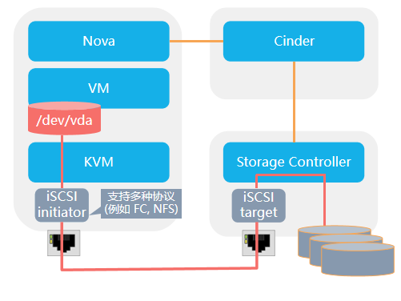

- Nova调用Cinder API创建卷，传递主机信息，如hostname，iSCSI initiator name，FC WWPNs
- Cinder API将该信息传递给Cinder Volume
- Cinder Volume通过创建卷时保存的host信息找到对应的Cinder Driver
- Cinder Driver通知存储允许该主机访问该卷，并返回该存储的连接信息（如iSCSI iqn，protal，FC Target WWPN，NFS path等）
- Nova调用针对不同存储类型进行主机识别磁盘的代码（Cinder提供了brick模块用于参考）实现识别磁盘或者文件设备
- Nova通知Cinder已经进行了挂载
- Nova将主机的设备信息传递给hypervisor来实现虚拟机挂载磁盘