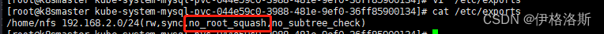
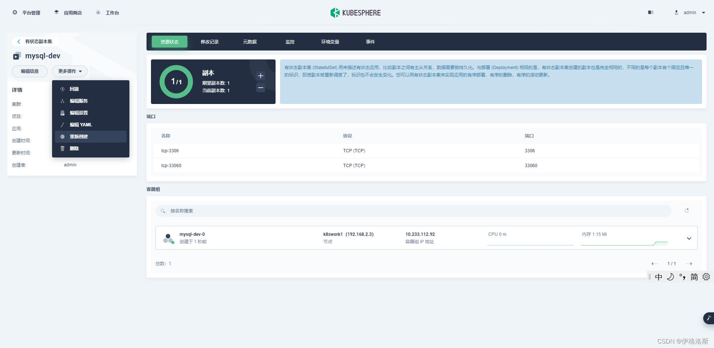

# chown: changing ownership of ‘/var/lib/mysql/‘: Operation not permitted


**问题分析**
因为采用kubesphere部署Mysql，持久存储采用nfs，根据报错提示，没有权限。
**问题排查**
1.检查权限设置是否正确


2.检查nfs设置权限

```
rw                # 客户端对共享的目录可读写
ro                # 客户端对共享的目录只读不可写
sync              # 同步模式，也就是把内存的数据实时写入硬盘，但这样会降低磁盘效率
async             # 非同步模式，也就是每隔一段时间才会把内存的数据写入硬盘，能保证磁盘效率，但当异常宕机/断电时，会丢失内存里的数据
no_root_squash    # 客户端挂载NFS共享目录后，客户端上的root用户不受这些挂载选项的限制，权限很大
root_squash       # 跟no_root_squash相反，客户端上的root用户受到这些挂载选项的限制，被当成普通用户
all_squash        # 客户端上的所有用户在使用NFS共享目录时都被限定为一个普通用户
anonuid           # 上面的几个squash用于把客户端的用户限定为普通用户，而anouid用于限定这个普通用户的uid，这个uid与服务端的/etc/passwd文件相对应，如：anouid=1000                  # 比如我客户端用xiaoming这个用户去创建文件，那么服务端同步这个文件的时候，文件的属主会变成服务端的uid(1000)所对应的用户anongid           # 同上，用于限定这个普通用户的gid

```

在nfs上添加no_root_squash权限，完成后进行重启

```
systemctl  restart  rpcbind 
systemctl  restart  nfs

```

使用上述命令，注意执行顺序。然后重新重新创建容器组即可。
