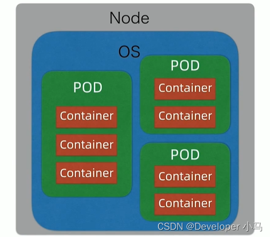
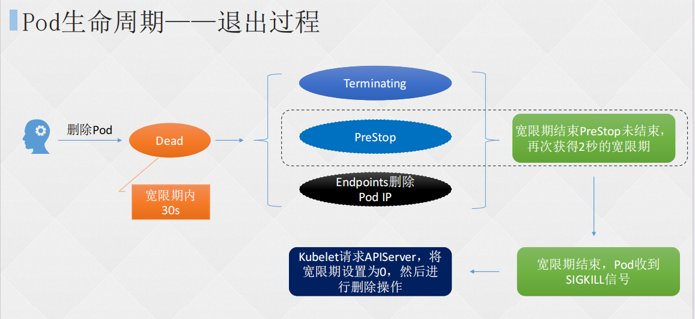

# 一、Pod

Pod 是 kubernetes 基本调度单位。每个 Pod 中可以运行一个或多个容器，共享 Pod 的文件系统、IP 和网络等资源，每个 Pod 只有一个 IP。



## 1. 创建 Pod

声明式文件方式创建 Pod，支持 yaml 和 json

```shell
[root@master ~]# mkdir pod
[root@master ~]# cd pod
[root@master pod]# vim nginx.yaml 
apiVersion: v1		# 必选，API的版本号，可通过kubectl api-resources指令查看
kind: Pod		# 必选，资源的类型
metadata:		# 必选，元数据信息
  labels:		# 可选，标签
    run: nginx		# key=value形式标签
  name: nginx			# 必选，pod名称
spec:		# 必选，用于定义pod的详细信息
  containers:			# 必选，定义使用的容器列表，配置容器
  - name: nginx		# 必选，容器名
    image: nginx:1.20.0		# 必选，容器所用的镜像地址
    ports:		# 可选，容器监听端口
    - containerPort: 80		# 容器端口
```


创建 pod

```shell
[root@master pod]# kubectl create -f ./nginx.yaml 
pod/nginx created
[root@master pod]# kubectl get pod -o wide
NAME    READY   STATUS    RESTARTS   AGE   IP              NODE         NOMINATED NODE   READINESS GATES
nginx   1/1     Running   0          10s   172.16.58.209   k8s-node02   <none>           <none>
```


测试访问

```shell
[root@master pod]# curl 172.16.58.209
<!DOCTYPE html>
<html>
<head>
<title>Welcome to nginx!</title>
<style>
    body {
        width: 35em;
        margin: 0 auto;
        font-family: Tahoma, Verdana, Arial, sans-serif;
    }
</style>
</head>
<body>
<h1>Welcome to nginx!</h1>
<p>If you see this page, the nginx web server is successfully installed and
working. Further configuration is required.</p>

<p>For online documentation and support please refer to
<a href="http://nginx.org/">nginx.org</a>.<br/>
Commercial support is available at
<a href="http://nginx.com/">nginx.com</a>.</p>

<p><em>Thank you for using nginx.</em></p>
</body>
</html>
```


使用 kubectl run 创建 Pod

```shell
[root@master pod]# kubectl run nginx-run --image=nginx:1.22.0
pod/nginx-run created
[root@master pod]# kubectl get pod -o wide 
NAME        READY   STATUS    RESTARTS   AGE   IP              NODE         NOMINATED NODE   READINESS GATES
nginx       1/1     Running   0          12m   172.16.58.209   k8s-node02   <none>           <none>
nginx-run   1/1     Running   0          47s   172.16.58.210   k8s-node02   <none>           <none>
[root@master pod]# curl 172.16.58.210
<!DOCTYPE html>
<html>
<head>
<title>Welcome to nginx!</title>
<style>
html { color-scheme: light dark; }
body { width: 35em; margin: 0 auto;
font-family: Tahoma, Verdana, Arial, sans-serif; }
</style>
</head>
<body>
<h1>Welcome to nginx!</h1>
<p>If you see this page, the nginx web server is successfully installed and
working. Further configuration is required.</p>

<p>For online documentation and support please refer to
<a href="http://nginx.org/">nginx.org</a>.<br/>
Commercial support is available at
<a href="http://nginx.com/">nginx.com</a>.</p>

<p><em>Thank you for using nginx.</em></p>
</body>
</html>
```

## 2. 更改 Pod 的启动命令及参数

```shell
[root@master pod]# kubectl explain pod.spec.containers		# 获取API对象文档，可查看pod.spec.containers字段的类型、描述、可用选项等
KIND:       Pod
VERSION:    v1

FIELD: containers <[]Container>

DESCRIPTION:
    List of containers belonging to the pod. Containers cannot currently be
    added or removed. There must be at least one container in a Pod. Cannot be
    updated.
    A single application container that you want to run within a pod.
.....省略部分内容......
[root@master pod]# vim nginx.yaml 
apiVersion: v1
kind: Pod
metadata:
  labels:
    run: nginx
  name: nginx
spec:
  containers:
  - name: nginx
    image: nginx:1.20.0
    ports:
    - containerPort: 80
    command:		# 添加可覆盖容器启动时的entrypoint的命令
    - sleep
    - "10"
```

- command：覆盖 ENTRYPOINT 的命令
- args：覆盖 CMD 的命令


启动并查看 Pod

```shell
[root@master pod]# kubectl delete -f ./nginx.yaml 
pod "nginx" deleted
[root@master pod]# kubectl create -f ./nginx.yaml 
pod/nginx created
[root@master pod]# kubectl get pod -o wide 
NAME    READY   STATUS    RESTARTS     AGE   IP              NODE         NOMINATED NODE   READINESS GATES
nginx   1/1     Running   1 (2s ago)   13s   172.16.58.211   k8s-node02   <none>           <none>
[root@master pod]# kubectl get pod -o wide 
NAME    READY   STATUS      RESTARTS      AGE   IP              NODE         NOMINATED NODE   READINESS GATES
nginx   0/1     Completed   2 (28s ago)   49s   172.16.58.211   k8s-node02   <none>           <none>
# sleep进程到10秒退出后，会导致没有前台进程，所以容器会退出
```

## 3. Pod 状态及 Pod 故障排查

| **状态**                                                   | **说明**                                                     |
| ---------------------------------------------------------- | ------------------------------------------------------------ |
| Pending (挂起)                                             | Pod 已被 Kubernetes 系统接收，但仍有一个或多个容器未被创建，可以通过 kubectl describe 查看处于 Pending 状态的原因 |
| Running(运行中)                                            | Pod 已经被绑定到一个节点上，并且所有的容器都已经被创建，而且至少有一个是运行状态，或者是正在启动或者重启可以通过 kubectl logs 查看 Pod 的日志 |
| Succeeded (成功)                                           | 所有容器执行成功并终止，并且不会再次重启，可以通过kubectl logs 查看 Pod日志 |
| Failed (失败)                                              | 所有容器都已终止，并且至少有一个容器以失败的方式终止也就是说这个容器要么以非零状态退出，要么被系统终止，可以通过 logs 和 describe 查看 Pod 日志和状态 |
| Unknown (未知)                                             | 通常是由于通信问题造成的无法获得Pod的状态                    |
| ImagePullBackOff (无法拉取镜像)ErrlmagePull (镜像拉取错误) | 镜像拉取失败，一般是由于镜像不存在、网络不通或者需要登录认证引起的，可以使用 describe 命令查看具体原因 |
| CrashLoopBackOff (重启循环)                                | 容器启动失败，可以通过 logs 命令查看具体原因，一般为启动命令不正确，健康检查不通过等 |
| OOMKilled (内存不足)                                       | 容器内存溢出，一般是容器的内存 Limit 设置的过小，或者程序本身有内存溢出，可以通过 logs 查看程序启动日志 |
| Terminating (停止中)                                       | Pod 正在被删除，可以通过 describe 查看状态                   |
| SysctlForbidden (内核参数被禁止)                           | Pod 自定义了内核配置，但 kubelet 没有添加内核配置或配置的内核参数不支持，可以通过 describe 查看具体原因 |
| Completed (已退出)                                         | 容器内部主进程退出，一般计划任务执行结束会显示该状态此时可以通过logs查看容器日志 |
| ContainerCreating (容器添加中)                             | Pod 正在创建，一般为正在下载镜像，或者有配置不当的地方，可以通过 describe查看具体原因 |

**注意:** Pod 的 Phase 字段只有 Pending、Running、Succeeded、Failed、Unknown， 其余的为处于上述状态的原因，可以通过 kubectl get po xxx -o yaml 查看。

## 4. Pod 镜像拉取策略

| **操作方式** | **说明**                                                     |
| ------------ | ------------------------------------------------------------ |
| Always       | 总是拉取，当镜像 tag 为 latest 时，且 imagePullPolicy 未配置，默认为 Always |
| Never        | 不管本地镜像是否存在都不会拉取镜像                           |
| IfNotPresent | 镜像不存在时拉取镜像，如果 tag 为非latest，且 imagePullPolicy 未配置，默认为lfNotPresent |

查看镜像拉取情况

```shell
[root@master pod]# kubectl describe po nginx
Name:             nginx
Namespace:        default
Priority:         0
Service Account:  default
Node:             k8s-node02/192.168.15.33
Start Time:       Tue, 26 Dec 2023 08:55:32 +0800
Labels:           run=nginx
Annotations:      cni.projectcalico.org/containerID: 95efc9bb72f1cd688ecc6a5727738ab3b27c8f606a2e414a9de50ca378df56ec
                  cni.projectcalico.org/podIP: 172.16.58.211/32
                  cni.projectcalico.org/podIPs: 172.16.58.211/32
Status:           Running
IP:               172.16.58.211
IPs:
  IP:  172.16.58.211
Containers:
  nginx:
    Container ID:  containerd://276d4f3b6b83ad90cb8f55641cc25476b4038c3432ecd7f58bbc533cf1a4fdb8
    Image:         nginx:1.20.0
    Image ID:      docker.io/library/nginx@sha256:ea4560b87ff03479670d15df426f7d02e30cb6340dcd3004cdfc048d6a1d54b4
```


更改镜像拉取策略为 IfNotPresent

```shell
[root@master pod]# vim nginx.yaml 

apiVersion: v1
kind: Pod
metadata:
  labels:
    run: nginx
  name: nginx
spec:
  containers:
  - name: nginx
    image: nginx:1.20.0
    ports:
    - containerPort: 80
    imagePullPolicy: IfNotPresent		# 可选，镜像拉取策略
```

## 5. Pod 重启策略

| 操作方式  | 说明                                      |
| --------- | ----------------------------------------- |
| Always    | 默认策略。容器失效时，自动重启该容器      |
| OnFailure | 容器以不为 0 的状态码终止，自动重启该容器 |
| Never     | 无论何种状态，都不会重启                  |

```shell
[root@master pod]# vim nginx.yaml 
apiVersion: v1
kind: Pod
metadata:
  labels:
    run: nginx
  name: nginx
spec:
  containers:
  - name: nginx
    image: nginx:1.20.0
    ports:
    - containerPort: 80
    imagePullPolicy: IfNotPresent
  restartPolicy: OnFailure		# 配置容器重启策略
```

## 6. Pod 探针

| **种类**                   | **说明**                                                     |
| -------------------------- | ------------------------------------------------------------ |
| livenessProbe（存活探针）  | 一直检测pod内部容器的程序是否正常，如果返回状态为sucess就不做操作，如果检测到异常，就会根据重启策略重启pod |
| readinessProbe（就绪探针） | 该探针不会重启pod，但会一直检测pod内部容器的程序是否正常，如果返回状态为sucess就不做操作，如果检测到异常，对应的service就会终止前端分发到该pod的流量，该探针主要针对的是程序启动了，但是否做好接收流量的准备 |
| startupProbe（启动探针）   | 主要用于检测容器的启动过程，例如在容器启动时检查特定的文件或目录是否存在，如果检测失败，kubelet 会杀死容器，之后根据重启策略进行处理，若探测成功，或没有配置 StartupProbe，则状态为成功，之后就不再探测 |

## 7. Pod 探针的实现方式

| **实现方式**    | **说明**                                                     |
| --------------- | ------------------------------------------------------------ |
| ExecAction      | 在容器内执行一个指定的命令，如果命令返回值为 0，则认为容器健康 |
| TCPSocketAction | 通过TCP连接检查容器指定的端口，如果端口开放，则认为容器健康  |
| HTTPGetAction   | 对指定的 URL 进行 Get 请求，如果状态码在 200~400 之间，则认为容器健康 |

## 8. 探针配置

创建没有探针的 Pod 并验证结果

```shell
[root@k8s-master test]# vim nginx-probe.yaml
apiVersion: v1
kind: Pod
metadata:
 labels:
 run: nginx
 name: nginx
spec:
 containers:
 - name: nginx
 image: nginx:1.20.0
 ports:
 - containerPort: 80
 command:
 - sh
 - -c
 - sleep 10; nginx -g "daemon off;"
 imagePullPolicy: IfNotPresent
 restartPolicy: OnFailure
[root@k8s-master test]# kubectl create -f nginx.yaml
pod/nginx created
[root@k8s-master test]# kubectl get po -o wide
NAME 			READY 	STATUS 			RESTARTS 	AGE IP 							NODE 				NO
MINATED 	NODE 		READINESS 	GATES																			<none>
nginx 		1/1 		Running 			0 			2s 	172.16.58.238 	k8s-node02 	<none> 
[root@k8s-master test]# curl 172.16.58.238
curl: (7) Failed to connect to 172.16.58.238 port 80: 拒绝连接
[root@k8s-master test]# curl -I 172.16.58.238
HTTP/1.1 200 OK
Server: nginx/1.20.0
Date: Fri, 08 Sep 2023 02:54:27 GMT
```


配置健康检查

```shell
[root@k8s-master test]# vim nginx.yaml
apiVersion: v1 # 必选，API 的版本号
kind: Pod # 必选，类型 Pod
metadata: # 必选，元数据
 name: nginx # 必选，符合 RFC 1035 规范的 Pod 名称
spec: # 必选，用于定义 Pod 的详细信息
 containers: # 必选，容器列表
 - name: nginx # 必选，符合 RFC 1035 规范的容器名称
   image: nginx:1.15.12 # 必选，容器所用的镜像的地址
   imagePullPolicy: IfNotPresent
   command: # 可选，容器启动执行的命令
   - sh
   - -c
   - sleep 30; nginx -g "daemon off;"
   startupProbe:	# 可选，健康检查。注意三种检查方式同时只能使用一种。
     tcpSocket: # 端口检测方式
       port: 80
     initialDelaySeconds: 10 # 初始化时间
     timeoutSeconds: 2 # 超时时间
     periodSeconds: 20 # 检测间隔
     successThreshold: 1 # 检查成功为 1 次表示就绪
     failureThreshold: 20 # 检测失败 20 次表示未就绪
   readinessProbe: # 可选，健康检查。注意三种检查方式同时只能使用一种。
     httpGet: # 接口检测方式
       path: /index.html # 检查路径
       port: 80
       scheme: HTTP # HTTP or HTTPS
       #httpHeaders: # 可选, 检查的请求头
       #- name: end-user
       #value: Jason 
     initialDelaySeconds: 10 # 初始化时间, 健康检查延迟执行时间
     timeoutSeconds: 2 # 超时时间
     periodSeconds: 5 # 检测间隔
     successThreshold: 1 # 检查成功 1 次表示就绪
     failureThreshold: 2 # 检测失败 2 次表示未就绪
   livenessProbe: # 可选，健康检查。注意三种检查方式同时只能使用一种。
     tcpSocket: # 端口检测方式
       port: 80
     initialDelaySeconds: 10 # 初始化时间
     timeoutSeconds: 2 # 超时时间
     periodSeconds: 5 # 检测间隔
     successThreshold: 1 # 检查成功 1 次表示就绪
     failureThreshold: 2 # 检测失败 2 次表示未就绪
   ports: # 可选，容器需要暴露的端口号列表
   - containerPort: 80 # 端口号
 restartPolicy: Never
```

## 9. postStart 和 preStop

- Pod 从开始创建到终止退出的时间范围称为 Pod 生命周期

### （1）生命周期的重要流程

1. 初始化容器（initContainers）
2. 创建主容器（containers）是必须的操作
3. 容器启动后钩子
4. 启动探测
5. 存活性探测
6. 就绪性探测
7. 容器停止前钩子

### （2）生命周期的重要行为

```plain
1.在启动任何容器之前，先创建pause基础容器，它初始化Pod的环境并为后续加⼊的容器提供共享的名称空间。

2.初始化容器（initcontainer）：
一个pod可以拥有任意数量的init容器。init容器是按照顺序以此执行的，并且仅当最后一个init容器执行完毕才会去启动主容器。

3.生命周期钩子：
pod允许定义两种类型的生命周期钩子，启动后(post-start)钩子和停止前(pre-stop)钩子
这些生命周期钩子是基于每个容器来指定的，和init容器不同的是，init容器是应用到整个pod。而这些钩子是针对容器的，是在容器启动后和停止前执行的。

4.容器探测：
对Pod健康状态诊断。分为三种： Startupprobe、Livenessprobe(存活性探测)， Readinessprobe(就绪性检测)
Startup（启动探测）:探测容器是否正常运行
Liveness(存活性探测)：判断容器是否处于runnning状态，根据重启策略决定是否重启容器
Readiness(就绪性检测)：判断容器是否准备就绪并对外提供服务，将容器设置为不可用，不接受service转发的请求

三种探针用于Pod检测：
ExecAction：在容器中执行一个命令，并根据返回的状态码进行诊断，只有返回0为成功
TCPSocketAction：通过与容器的某TCP端口尝试建立连接
HTTPGetAction：通过向容器IP地址的某指定端口的path发起HTTP GET请求
```

### （3）pod 生命周期——启动过程


### （4）pod 生命周期——退出过程



### （5）配置生命周期行为

```shell
[root@k8s-master test]# vim nginx-ps.yaml
apiVersion: v1 # 必选，API 的版本号
kind: Pod # 必选，类型 Pod
metadata: # 必选，元数据
 name: nginx # 必选，符合 RFC 1035 规范的 Pod 名称
spec: # 必选，用于定义 Pod 的详细信息
 containers: # 必选，容器列表
 - name: nginx # 必选，符合 RFC 1035 规范的容器名称
   image: nginx:1.15.12 # 必选，容器所用的镜像的地址
   imagePullPolicy: IfNotPresent
   lifecycle:
     postStart: # 容器创建完成后执行的指令, 可以是 exec httpGet TCPSocket
       exec:
         command:
         - sh
         - -c
         - 'mkdir /data/'
     preStop: # 容器删除前执行的命令
       exec:
         command:
         - sh
         - -c
         - pkill nginx ; sleep 30 # 如果程序使用spring cloud微服务框架，可以在下架某pod服务A前，将pkill nginx替换为请求Eureka某个端口（127.0.0.1:8080/shutdown-后台开发），通知Eureka A服务即将下架，并让其在下架pod前通知其他pod内的服务更新pod PID注册表，防止A服务pod PID被删除后，B服务注册表因未更新继续访问A服务导致的请求失败。注册表默认更新时间为30S。
   ports: # 可选，容器需要暴露的端口号列表
   - containerPort: 80 # 端口号
 restartPolicy: Never
```

## 10. gRPC 健康检查

```shell
[root@k8s-master test]# vim etcd-grpc.yaml
apiVersion: v1
kind: Pod
metadata:
 name: etcd-with-grpc
spec:
 containers:
 - name: etcd
   image: registry.cn-hangzhou.aliyuncs.com/google_containers/etcd:3.5.1-0
   command: [ "/usr/local/bin/etcd", "--data-dir", "/var/lib/etcd", "--
listen-client-urls", "http://0.0.0.0:2379", "--advertise-client-urls", 
"http://127.0.0.1:2379", "--log-level", "debug"]
   ports:
   - containerPort: 2379
   livenessProbe:
     grpc:
       port: 2379
     initialDelaySeconds: 10
```