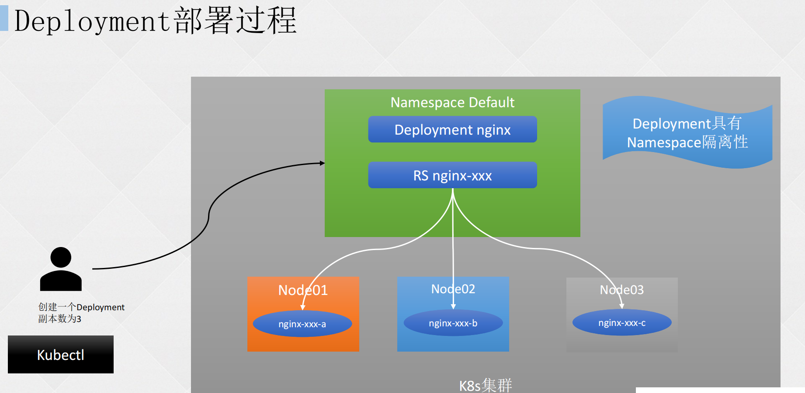
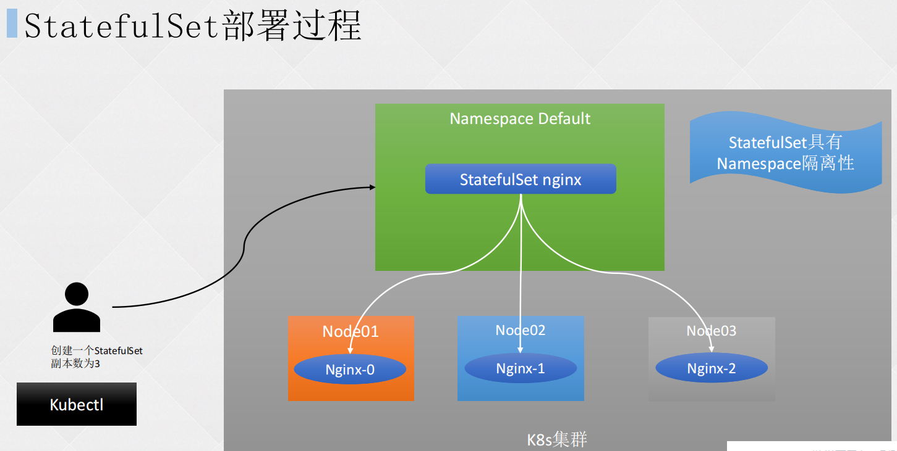
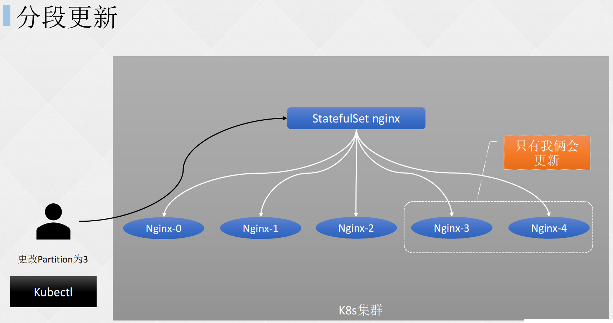
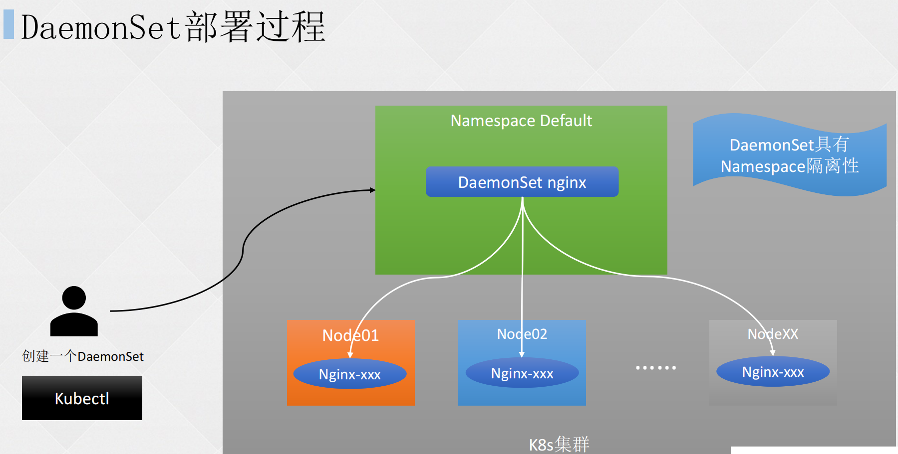

# 一、RC 和 RS

## 1. Replication Controller

Replication Controller，简称 RC，复制控制器，可确保 Pod 副本数达到期望值，也就是 RC 可确保一个 Pod 总是可用，或一组 Pod 的数量永远处于一个定值。

如果存在的 Pod 大于设定的期望值，RC 会终止额外的 Pod。反之，当 Pod 数量小于期望值时，RC 将启动更多的 Pod 来保证达到该期望值。

与手动创建 Pod 不同，使用 RC 控制的 Pod，在失败、删除或终止时会自动替换为正常运行的 Pod，因此，为达到高可用的效果，即使应用程序只需要一个 Pod，也应该使用 RC 或其他控制器的方式管理。

RC 类	，监视多个节点上的多个 Pod。

### （1）定义 Replication Controller

```shell
[root@master pod]# vim rc-nginx.yaml 

apiVersion: v1
kind: ReplicationController
metadata: # 元数据
  name: nginx # rc名称
spec: # 定义资源信息
  replicas: 3 # 定义副本数量
  selector: # 定义资源标签
    app: nginx
  template: # 定义pod信息
    metadata:
      name: nginx # pod名称
      labels:
        app: nginx # 定义pod标签
    spec:
      containers:
      - name: nginx
        image: nginx:1.20.0
        ports:
        - containerPort: 80
[root@master pod]# kubectl create -f rc-nginx.yaml 
replicationcontroller/nginx created
```

### （2）测试 Pod 数量控制

```shell
[root@master pod]# kubectl get po
NAME          READY   STATUS    RESTARTS   AGE
nginx-gsnsq   1/1     Running   0          6s
nginx-nldhh   1/1     Running   0          6s
nginx-t2nv9   1/1     Running   0          6s
[root@master pod]# kubectl delete pod/nginx-gsnsq 	# 删除pod其中一个容器
pod "nginx-gsnsq" deleted
[root@master pod]# kubectl get po		# 发现又新启动了一个容器
NAME          READY   STATUS    RESTARTS   AGE
nginx-nldhh   1/1     Running   0          5m15s
nginx-t2nv9   1/1     Running   0          5m15s
nginx-vqdr7   1/1     Running   0          8s		# 从age时间可以看出，该容器为新启的
[root@master pod]# kubectl edit rc nginx 	# 直接对rc控制的pod集作修改

# Please edit the object below. Lines beginning with a '#' will be ignored,
# and an empty file will abort the edit. If an error occurs while saving this file will be
# reopened with the relevant failures.
#
apiVersion: v1
kind: ReplicationController
metadata:
  creationTimestamp: "2023-12-27T12:47:17Z"
  generation: 1
  labels:
    app: nginx
  name: nginx
  namespace: default
  resourceVersion: "302993"
  uid: 4c84d893-6f17-4d86-93e6-6df97c55513a
spec:
  replicas: 4		# 修改数量
[root@master pod]# kubectl get pod
NAME          READY   STATUS    RESTARTS   AGE
nginx-b6bx2   1/1     Running   0          5s		# 因为修改了复制集的数量，所以又新启动了一个同类容器
nginx-nldhh   1/1     Running   0          9m37s
nginx-t2nv9   1/1     Running   0          9m37s
nginx-vqdr7   1/1     Running   0          4m30s
```

## 2. ReplicaSet

ReplicaSet，简称 RS，在 Kubernetes v1.2 版本，由旧的 Replication Controller 升级而来。与 RC 的主要区别在于，RS 支持基于集合的 Label Selector (标签选择器) 功能。

RS 主要作用于 Deployment 协调创建、删除和更新 Pod，在实际应用中，虽然 ReplicaSet 可以单独使用，但一般建议使用 Deployment 来自动管理 ReplicaSet，除非自定义的 Pod 不需要更新或有其他编排等。

RS 比 RC 具有更强大的功能及灵活性，所以如果只有这两种选择，建议选择 RS。

定义一个 ReplicaSet 的示例：

```shell
[root@master pod]# vim rs-nginx.yaml 

apiVersion: apps/v1
kind: ReplicaSet
metadata: # 元数据
  name: nginx # rs名称
spec: # 定义资源信息
  replicas: 3 # 定义副本数量
  selector: # 定义资源标签
    matchLabels:
      tier: nginx
    matchExpressions:
    - {key: tier, operator: In, values: [nginx,busybox]}
# 更高级的标签匹配形式，使用In操作符来匹配“tier”标签的值是否在给定的值列表中。具体来说，它正在查找“tier”标签的值为“nginx”的资源
# matchLabels和matchExpressions可以通用，也可以选一中方式用
  template: # 定义pod信息
    metadata:
      name: nginx # pod名称
      labels:		# 定义pod标签
        app: guestbook 		# 标签1
        tier: nginx				# 标签2
    spec:
      containers:
      - name: nginx
        image: nginx:1.20.0
        ports:
        - containerPort: 80
[root@master pod]# kubectl create -f rs-nginx.yaml 
replicaset.apps/nginx created
[root@master pod]# kubectl get pod
NAME          READY   STATUS    RESTARTS   AGE
nginx-df9hj   1/1     Running   0          40s
nginx-ws7gm   1/1     Running   0          40s
nginx-xsqnt   1/1     Running   0          40s
```

# 二、无状态和有状态应用特性

## 1. 无状态应用

无状态应用：不将数据或应用状态存储到集群或永久性存储空间的应用。

常见的无状态应用包括 Web 服务器、负载均衡器、静态文件服务器等。

以 web 服务器为例：客户端的每次请求必须具备自描述信息，通过这些信息识别客户端身份，服务端不会保存任何客户端请求者信息。

**无状态应用特点：**

- **易于扩展：**由于无状态应用不保存请求状态，因此可以轻松地将它们部署在多个服务器上，从而实现水平扩展。
- **高可用性：**由于无状态应用的每个请求都是独立的，因此即使某个请求失败，也不会影响其他请求的处理。这有助于提高应用的可用性。
- **安全性：**无状态应用通常不保存敏感数据，因此不太可能泄露敏感信息。
- **可替代性：**由于无状态应用不保存请求状态，因此不同的服务器可以处理相同的请求，这意味着任何一个服务器都可以替代其他服务器来处理请求。

## 2. 有状态应用

有状态应用：应用程序的处理需要依赖特定的状态或数据存储。

“有状态应用”的例子有很多，比如 Redis、MySQL 这样的数据库，它们的“状态”就是在内存或者磁盘上产生的数据，是应用的核心价值所在，如果不能够把这些数据及时保存再恢复，那绝对会是灾难性的后果。

**有状态应用特点：**

- **依赖状态：**应用程序的处理依赖于特定的状态信息。
- **数据持久化：**有状态应用通常需要将状态数据持久化存储，以便后续请求可以访问和使用。
- **有序性：**由于有状态应用处理请求时依赖先前的状态，因此请求之间的顺序可能很重要。

# 三、Deployment 无状态应用

在 Kubernetes 中，Deployment 是最常用的 Pod 控制器，一般用于部署企业内部的无状态服务(微服务居多)，可利用 Deployment 的高级功能做到无缝迁移、自动扩缩容、自动容灾、一键回滚等功能。



## 1. 创建 Deployment

```shell
[root@master pod]# kubectl create deploy nginx --image=nginx:1.24.0 --replicas=4 -o yaml --dry-run=client > nginx-dp.yaml
# 命令拆分
# kubectl：k8s命令工具
# create：新建一个k8s资源
# deploy：该资源类型为deployment
# nginx：该deploymet资源名为nginx
# --image=nginx:1.24.0：拉取本地或网络上的nginx1.24.0版本的镜像
# --replicas=4：创建的pod数量
# -o yaml：输出为yaml格式
# --dry-run=client：不真正创建资源，仅预览该deployment资源的配置信息
# > nginx-dp.yaml：预览的配置信息输出到nginx-dp.yaml文件内

[root@master pod]# vim nginx-dp.yaml 		# 使用kubectl命令工具生成的deployment资源配置文件
apiVersion: apps/v1		# API版本，只能使用这个
kind: Deployment		# 资源类型：deployment
metadata:		# 元数据信息
  creationTimestamp: null		# 时间注解（没用）
  labels:		# 标签
    app: nginx
  name: nginx		# 名称
spec:			# deployment的配置信息
  replicas: 4		# 创建pod的数量
  selector:		# 标签选择器，与template的label对应，apiVersion为apps/v1时必须指定该字段
    matchLabels:		# 匹配标签
      app: nginx		# 匹配这个标签
  strategy: {}			# pod的更新策略
  template:			# 定义pod资源配置
    metadata:		# 元信息
      creationTimestamp: null
      labels:		# pod标签
        app: nginx
    spec:		# 配置容器信息
      containers:
      - image: nginx:1.24.0
        name: nginx
        resources: {}
status: {}
```

## 2. 修改生成的 Deploy 文件

```shell
[root@master pod]# vim nginx-dp.yaml 
# 修改成如下内容
apiVersion: apps/v1
kind: Deployment
metadata:
  name: nginx
  labels:
    app: nginx
spec:
  replicas: 4
  selector:
    matchLabels:
      app: nginx
  template:
    metadata:
      labels:
        app: nginx
    spec:
      containers:
      - image: nginx:1.24.0
        name: nginx
        ports:
        - containerPort: 80
[root@master pod]# kubectl create -f nginx-dp.yaml 
deployment.apps/nginx created
[root@master pod]# kubectl get deployments.apps 	# 查看默认命名空间下deployment所有资源
  NAME    READY    UP-TO-DATE   AVAILABLE    AGE
# 名称		准备状态  期望副本数   可使用副本数  运行时间
  nginx   4/4      4            4            7s
[root@master pod]# kubectl get pod		# 查看默认命名空间下的所有pods
NAME                     READY   STATUS    RESTARTS   AGE
nginx-595dff4799-ct4mp   1/1     Running   0          11s
nginx-595dff4799-fmm6q   1/1     Running   0          11s
nginx-595dff4799-kjjdr   1/1     Running   0          11s
nginx-595dff4799-vcplf   1/1     Running   0          11s
[root@master pod]# kubectl rollout status deployment nginx 		# 查看整个deployment创建状态
deployment "nginx" successfully rolled out
[root@master pod]# kubectl get rs -l app=nginx		# 查看deployment对应的replicaSet，-l指定标签
NAME               DESIRED   CURRENT   READY   AGE
nginx-595dff4799   4         4         4       3m45s
```

## 3. 测试副本数量控制机制

删除一个 deployment 的 pod

```shell
[root@master pod]# kubectl get pod
NAME                     READY   STATUS    RESTARTS   AGE
nginx-595dff4799-ct4mp   1/1     Running   0          6m47s
nginx-595dff4799-fmm6q   1/1     Running   0          6m47s
nginx-595dff4799-kjjdr   1/1     Running   0          6m47s
nginx-595dff4799-vcplf   1/1     Running   0          6m47s
[root@master pod]# kubectl delete po nginx-595dff4799-ct4mp 
pod "nginx-595dff4799-ct4mp" deleted
```


再查看 pod 资源列表

```shell
[root@master pod]# kubectl get po
NAME                     READY   STATUS    RESTARTS   AGE
nginx-595dff4799-fmm6q   1/1     Running   0          7m54s
nginx-595dff4799-kjjdr   1/1     Running   0          7m54s
nginx-595dff4799-t98fl   1/1     Running   0          58s			# 为保持之前定义的数量4，所以deployment会再次新建一个pod
nginx-595dff4799-vcplf   1/1     Running   0          7m54s
```

## 4. 更新 Deployment

更新当前 Deployment 的 Nginx Pod 的底层镜像模板，并使用 --record 记录当前更改的参数，方便后期回滚更新。

也可使用 “kubectl edit deployments.apps nginx”命令对 deployment 资源编辑再更新，后面的 nginx 为 deployment 资源名。

```shell
[root@master pod]# kubectl set image deployment nginx nginx=nginx:1.25.0 --record
Flag --record has been deprecated, --record will be removed in the future
deployment.apps/nginx image updated
[root@master pod]# kubectl get pod
NAME                     READY   STATUS              RESTARTS   AGE
nginx-595dff4799-fmm6q   1/1     Running             0          13m
nginx-595dff4799-kjjdr   1/1     Running             0          13m
nginx-595dff4799-vcplf   1/1     Running             0          13m
nginx-6d797fb658-cwhb8   0/1     ContainerCreating   0          32s
nginx-6d797fb658-hfk8x   0/1     ContainerCreating   0          32s
# 可以看到之前的nginx-595dff4799的pod正渐渐退出，新nginx慢慢产生
[root@master pod]# kubectl get pod
NAME                     READY   STATUS    RESTARTS   AGE
nginx-6d797fb658-cwhb8   1/1     Running   0          2m
nginx-6d797fb658-hfk8x   1/1     Running   0          2m
nginx-6d797fb658-mhcpt   1/1     Running   0          86s
nginx-6d797fb658-tscdh   1/1     Running   0          85s
# 完成后将保持4个pod数量
[root@master pod]# kubectl get rs
NAME               DESIRED   CURRENT   READY   AGE
nginx-595dff4799   0         0         0       17m
nginx-6d797fb658   4         4         4       4m31s
# 查看replicaSet资源列表，之前的rs控制器nginx-595dff4799下的pod已经清空了，剩的是新生成的rs资源
```

**注意:** 当且仅当 Deployment 的 Pod 模板 (即.spec.template) 更改时，才会触发，Deployment更新，例如更改内存、CPU 配置或者容器的 image。

## 5. 回滚 Deployment

查看更新deployment更新历史

- REVISION：版本
- CHANGE-CAUSE：改变操作
- 1 版本为之前的 1.24.0 版本的 nginx，2 版本是升级后的 nginx1.25.0

```shell
[root@master pod]# kubectl rollout history deployment nginx
deployment.apps/nginx 
REVISION  CHANGE-CAUSE
1         <none>
2         kubectl set image deployment nginx nginx=nginx:1.25.0 --record=true
[root@master pod]# kubectl rollout history deployment nginx --revision=1
# 查看历史版本的信息
deployment.apps/nginx with revision #1		# 版本1
Pod Template:
  Labels:	app=nginx
	pod-template-hash=595dff4799
  Containers:
   nginx:
    Image:	nginx:1.24.0
    Port:	80/TCP
    Host Port:	0/TCP
    Environment:	<none>
    Mounts:	<none>
  Volumes:	<none>
[root@master pod]# kubectl rollout history deployment nginx --revision=2
deployment.apps/nginx with revision #2		# 版本2
Pod Template:
  Labels:	app=nginx
	pod-template-hash=6d797fb658
  Annotations:	kubernetes.io/change-cause: kubectl set image deployment nginx nginx=nginx:1.25.0 --record=true
  Containers:
   nginx:
    Image:	nginx:1.25.0
    Port:	80/TCP
    Host Port:	0/TCP
    Environment:	<none>
    Mounts:	<none>
  Volumes:	<none>
```


回滚到 nginx1.24.0 版本

```shell
[root@master pod]# kubectl rollout undo deployment nginx 
deployment.apps/nginx rolled back
[root@master pod]# kubectl get po
NAME                     READY   STATUS    RESTARTS   AGE
nginx-595dff4799-ttz4k   1/1     Running   0          3s
nginx-595dff4799-v5ph2   1/1     Running   0          4s
nginx-595dff4799-wbpjt   1/1     Running   0          5s
nginx-595dff4799-xt7cn   1/1     Running   0          3s
# nginx又回到了595dff4799
[root@master pod]# kubectl describe deployments.apps nginx 
Name:                   nginx
Namespace:              default
CreationTimestamp:      Tue, 02 Jan 2024 21:43:00 +0800
Labels:                 app=nginx
Annotations:            deployment.kubernetes.io/revision: 3
Selector:               app=nginx
Replicas:               4 desired | 4 updated | 4 total | 4 available | 0 unavailable
StrategyType:           RollingUpdate
MinReadySeconds:        0
RollingUpdateStrategy:  25% max unavailable, 25% max surge
Pod Template:
  Labels:  app=nginx
  Containers:
   nginx:
    Image:        nginx:1.24.0		# 版本已回滚
[root@master pod]# kubectl rollout history deployment nginx 
deployment.apps/nginx 
REVISION  CHANGE-CAUSE
2         kubectl set image deployment nginx nginx=nginx:1.25.0 --record=true
3         <none>
```


若需要回滚到指定版本，使用--to-revision 参数

```shell
[root@master pod]# kubectl set image deployment nginx nginx=nginx:1.23.0 --record
Flag --record has been deprecated, --record will be removed in the future
deployment.apps/nginx image updated
[root@master pod]# kubectl set image deployment nginx nginx=nginx:1.21.0 --record
Flag --record has been deprecated, --record will be removed in the future
deployment.apps/nginx image updated
# 先更新几个版本，方便测试

[root@master pod]# kubectl rollout history deployment nginx 
deployment.apps/nginx 
REVISION  CHANGE-CAUSE
2         kubectl set image deployment nginx nginx=nginx:1.25.0 --record=true
3         <none>
4         kubectl set image deployment nginx nginx=nginx:1.23.0 --record=true
5         kubectl set image deployment nginx nginx=nginx:1.21.0 --record=true

[root@master pod]# kubectl describe deployments.apps nginx 
Name:                   nginx
Namespace:              default
CreationTimestamp:      Tue, 02 Jan 2024 21:43:00 +0800
Labels:                 app=nginx
Annotations:            deployment.kubernetes.io/revision: 5
                        kubernetes.io/change-cause: kubectl set image deployment nginx nginx=nginx:1.21.0 --record=true
Selector:               app=nginx
Replicas:               4 desired | 4 updated | 4 total | 4 available | 0 unavailable
StrategyType:           RollingUpdate
MinReadySeconds:        0
RollingUpdateStrategy:  25% max unavailable, 25% max surge
Pod Template:
  Labels:  app=nginx
  Containers:
   nginx:
    Image:        nginx:1.21.0		
# 现在是1.21.0版本的

[root@master pod]# kubectl rollout undo deployment nginx 		
deployment.apps/nginx rolled back
# 先直接回滚到上个版本

[root@master pod]# kubectl describe deployments.apps nginx 
Name:                   nginx
Namespace:              default
CreationTimestamp:      Tue, 02 Jan 2024 21:43:00 +0800
Labels:                 app=nginx
Annotations:            deployment.kubernetes.io/revision: 6
                        kubernetes.io/change-cause: kubectl set image deployment nginx nginx=nginx:1.23.0 --record=true
Selector:               app=nginx
Replicas:               4 desired | 4 updated | 4 total | 4 available | 0 unavailable
StrategyType:           RollingUpdate
MinReadySeconds:        0
RollingUpdateStrategy:  25% max unavailable, 25% max surge
Pod Template:
  Labels:  app=nginx
  Containers:
   nginx:
    Image:        nginx:1.23.0		
# 上个版本为1.23.0，回滚成功

[root@master pod]# kubectl rollout history deployment nginx 
deployment.apps/nginx 
REVISION  CHANGE-CAUSE
2         kubectl set image deployment nginx nginx=nginx:1.25.0 --record=true
3         <none>
5         kubectl set image deployment nginx nginx=nginx:1.21.0 --record=true
6         kubectl set image deployment nginx nginx=nginx:1.23.0 --record=true
# 历史版本记录也不一样了
# 此时再指定--to-revision参数进行指定版本回滚

[root@master pod]# kubectl rollout undo deployment nginx --to-revision=2
deployment.apps/nginx rolled back
# 指定1.25.0版本的回滚，也就是版本2

[root@master pod]# kubectl describe deployments.apps nginx 
Name:                   nginx
Namespace:              default
CreationTimestamp:      Tue, 02 Jan 2024 21:43:00 +0800
Labels:                 app=nginx
Annotations:            deployment.kubernetes.io/revision: 7
                        kubernetes.io/change-cause: kubectl set image deployment nginx nginx=nginx:1.25.0 --record=true
Selector:               app=nginx
Replicas:               4 desired | 4 updated | 4 total | 4 available | 0 unavailable
StrategyType:           RollingUpdate
MinReadySeconds:        0
RollingUpdateStrategy:  25% max unavailable, 25% max surge
Pod Template:
  Labels:  app=nginx
  Containers:
   nginx:
    Image:        nginx:1.25.0
# 指定版本回滚成功，nginx已回到1.25.0
```

## 6. 扩容 Deployment

命令行扩容

```shell
[root@master ~]# kubectl get po
NAME                     READY   STATUS    RESTARTS      AGE
nginx-6d797fb658-7dqd2   1/1     Running   1 (26m ago)   10h
nginx-6d797fb658-md9k4   1/1     Running   1 (26m ago)   10h
nginx-6d797fb658-xsgmx   1/1     Running   1 (26m ago)   10h
nginx-6d797fb658-xx7kq   1/1     Running   1 (26m ago)   10h
[root@master ~]# kubectl scale deployment nginx --replicas=6
deployment.apps/nginx scaled
[root@master ~]# kubectl get po
NAME                     READY   STATUS    RESTARTS      AGE
nginx-6d797fb658-7dqd2   1/1     Running   1 (27m ago)   10h
nginx-6d797fb658-c4dxs   1/1     Running   0             3s
nginx-6d797fb658-md9k4   1/1     Running   1 (27m ago)   10h
nginx-6d797fb658-mdljl   1/1     Running   0             3s
nginx-6d797fb658-xsgmx   1/1     Running   1 (27m ago)   10h
nginx-6d797fb658-xx7kq   1/1     Running   1 (27m ago)   10h
```


kubectl edit 调整副本数量，增加到 7 个

```shell
[root@master ~]# kubectl edit deployments.apps nginx 

# Please edit the object below. Lines beginning with a '#' will be ignored,
# and an empty file will abort the edit. If an error occurs while saving this file will be
# reopened with the relevant failures.
#
apiVersion: apps/v1
kind: Deployment
metadata:
  annotations:
    deployment.kubernetes.io/revision: "7"
    kubernetes.io/change-cause: kubectl set image deployment nginx nginx=nginx:1.25.0
      --record=true
  creationTimestamp: "2024-01-02T13:43:00Z"
  generation: 8
  labels:
    app: nginx
  name: nginx
  namespace: default
  resourceVersion: "368643"
  uid: 823e7d59-e544-41b6-8d92-06f02c6157d2
spec:
  progressDeadlineSeconds: 600
  replicas: 7			# 修改副本数
```

## 7. 暂停和恢复 Deployment 更新

**暂停更新命令**

```shell
[root@master ~]# kubectl rollout pause deployment nginx 
deployment.apps/nginx paused
```


**手动多处更新，不会被记录**

```shell
[root@master ~]# kubectl set image deploy nginx nginx=nginx:1.19.0
deployment.apps/nginx image updated
[root@master ~]# kubectl set resources deploy nginx -c=nginx --limits=cpu=200m,memory=256Mi
deployment.apps/nginx resource requirements updated
```


**查看记录，没有新记录，都是之前的更新记录**

```shell
[root@master ~]# kubectl rollout history deployment nginx 
deployment.apps/nginx 
REVISION  CHANGE-CAUSE
3         <none>
5         kubectl set image deployment nginx nginx=nginx:1.21.0 --record=true
6         kubectl set image deployment nginx nginx=nginx:1.23.0 --record=true
7         kubectl set image deployment nginx nginx=nginx:1.25.0 --record=true
```


**多处更新结束后，恢复 deployment 更新**

```shell
[root@master ~]# kubectl rollout resume deployment nginx 
deployment.apps/nginx resumed
```


**查看 deployment 描述信息，更新完成**

```shell
[root@master ~]# kubectl describe deployments.apps nginx 
Name:                   nginx
Namespace:              default
CreationTimestamp:      Tue, 02 Jan 2024 21:43:00 +0800
Labels:                 app=nginx
Annotations:            deployment.kubernetes.io/revision: 8
                        kubernetes.io/change-cause: kubectl set image deployment nginx nginx=nginx:1.25.0 --record=true
Selector:               app=nginx
Replicas:               4 desired | 2 updated | 5 total | 3 available | 2 unavailable
StrategyType:           RollingUpdate
MinReadySeconds:        0
RollingUpdateStrategy:  25% max unavailable, 25% max surge
Pod Template:
  Labels:  app=nginx
  Containers:
   nginx:
    Image:      nginx:1.19.0
    Port:       80/TCP
    Host Port:  0/TCP
    Limits:
      cpu:        200m
      memory:     256Mi
    Environment:  <none>
    Mounts:       <none>
  Volumes:        <none>
```

## 8. 更新 Deployment 注意事项

**历史版本清理策略**

在默认情况下，revision 保留 10 个旧的 ReplicaSet，其余的将在后台进行垃圾回收，可以在 yaml 文件内 .spec.revisionHistoryLimit 设置保留 ReplicaSet，当设置为 0 时不保留历史记录。

**更新策略**

**yaml 文件内修改配置：**

1. .spec.strategy.type==Recreate，表示重建，先删掉旧的 Pod 再创建新的 Pod
2. .specstrategy.type==RollingUpdate，表示滚动更新，可以指定maxUnavailable和maxSurge 来控制滚动更新过程
3. .spec.strategy.rollingUpdate.maxUnavailable，指定在回滚更新时最大不可用的Pod数量，可选字段，默认为25%，可以设置为数字或百分比，如果 maxSurge 为 0，则该值不能为 0
4. .spec.strategy.rollingUpdatemaxSurge 可以超过期望值的最大 Pod 数，可选字段，默认为 25%，p 以设置成数字或百分比，如果 maxUnavailable为 0，则该值不能为 0。

**Ready 策略**

.spec.minReadySeconds 是可选参数，指定新创建的 Pod 应该在没有任何容器崩溃的情况下视Ready (就绪)状态的最小秒数，默认为 0，即一旦被创建就视为可用，通常和容器探针连用。

# 四、StatefulSet 有状态应用

## 1. StatefulSet 概念

StatefulSet 是 k8s 中的一个控制器资源对象，用于管理有状态应用的部署和运行。

**特点如下：**

- **稳定的网络标识：**StatefulSet 管理的 Pod 实例都有一个唯一的网络标识符（通常为 DNS 名称），用于在有状态应用中进行唯一标识和访问。
- **有序部署和扩展：**StatefulSet 在部署和扩展 Pod 实例时，会按照序号的顺序逐个创建和启动，确保有状态应用的有序初始化和配置。
- **稳定的持久化存储：**StatefulSet 具备与 Pod 实例关联的持久化存储卷 (Persistent Volume)的能力，确保每个实例可以访问和使用相应的持久化数据。
- **有状态应用的有序终止：**在进行有状态应用的缩容或删除时，StatefulSet 会按照序号的逆序进行有序的终止操作，以确保数据的完整性和有状态应用的正常关闭。



## 2. Headless Service

Headless Services 是一种特殊的 Service，其 spec:clusterIP 表示为 None，这样在实际运行时就不会被分配 ClusterIP，使用 Endpoint 在 Pod 之间互相通信。Headless Service 也被称为无头服务。


**Headless Service和普通Service的区别：**

Headless 不分配 ClusterIP。

Headless service 可以通过解析 Service 的 DNS，返回所有Pod的地址和DNS (statefulSet部署的Pod才有DNS)。

普通的 Service，只能通过解析 Service 的 DNS 返回 Service 的 ClusterIP。


**StatefulSet 和 Deployment 控制器的区别：**

StatefulSet 下的 Pod 有 DNS 地址,通过解析 Pod 的 DNS 可以返回 Pod 的 IP。
       Deployment 下的 Pod 没有 DNS。


**Headless 一般格式为：**

statefulSetName-{0..N-1}.serviceName.namespace.svc.cluster.local

- serviceName：Headless Service 的名字，创建 StatefulSet 时，必须指定 Headless Service 名称
- 0..N-1：Pod 所在的序号，从 0 开始到 N-1
- statefulSetName：StatefulSet 的名字;
- namespace：服务所在的命名空间
- .cluster.local：Cluster Domain (集群域)

**注：**Headless Service 需提前创建

## 3. 创建 StatefulSet 资源文件

```shell
[root@master pod]# vim redis-sts.yaml
apiVersion: v1
kind: Service			# 定义的是statefulSet的headless service（无头服务）
metadata:
  name: redis			# 定义redis的headless service
  labels:
    app: redis
spec:
  ports:
  - port: 27017
    name: redis-db
  clusterIP: None
  selector:
    app: nginx
---
apiVersion: apps/v1		# api版本
kind: StatefulSet			# 资源类型
metadata:
  name: redis-db
spec:
  selector:
    matchLabels:
      app: redis		# 必须匹配 spec.template.metadata.labels
  serviceName: "redis"
  replicas: 3
  minReadySeconds: 10		# 于指定在进⾏滚动更新或⾸次创建 Pod 时，Pod 实例需要等待准备就绪的最⼩时间（以秒为单位）默认0
  template:
    metadata:
      labels:
        app: redis		# 必须匹配 spec.selector.matchLabels
    spec:
      terminationGracePeriodSeconds: 10		# pod接到终⽌信号后，多等待10秒
      containers:
      - name: redis
        image: redis:latest
        ports:
        - containerPort: 27017
          name: redis-db
[root@master pod]# kubectl create -f redis-sts.yaml 
service/redis created
statefulset.apps/redis-db created
```

## 4. 查看 StatefulSet

```shell
[root@master pod]# kubectl get svc		# 查看默认命名空间内的服务
NAME         TYPE        CLUSTER-IP   EXTERNAL-IP   PORT(S)     AGE
kubernetes   ClusterIP   10.96.0.1    <none>        443/TCP     12d
redis        ClusterIP   None         <none>        27017/TCP   42s
[root@master pod]# kubectl get sts		# 查看默认命名空间下的statefulSet控制器
NAME       READY   AGE
redis-db   3/3     111s
[root@master pod]# kubectl get pod		# statefulset控制的pod，数量为定义好的3，并且与deployment不用的是，statefulset是按照序号顺序标识并控制pod启停的
NAME         READY   STATUS    RESTARTS   AGE
redis-db-0   1/1     Running   0          104s
redis-db-1   1/1     Running   0          84s
redis-db-2   1/1     Running   0          4s
```

## 5. StatefulSet 创建 Pod 流程

1. 对于具有 N 个副本的 StatefulSet，将按顺序从 0 到 N-1 开始创建 Pod。
2. 当删除 Pod 时，将按照 N-1 到 0 的逆序终止并删除。
3. 在缩容 Pod 之前，必须保证当前的 Pod 是 Running 或 Ready 状态。
4. 在终止 Pod 之前，它所有的继任者必须是完全关闭状态。
5. 如果前一个 Pod 状态不处于 Running 或 Ready，那么下一任 Pod 不会被创建，并且即使在特殊情况下第二个 Pod 创建成功，而第三个 Pod 也不会被创建。

## 6. StatefulSet 扩容

将 StatefulSet 的副本增加到 5 个，与 deployment 扩容方式相同，都是利用 rs 控制器扩容

```shell
[root@master pod]# kubectl get po
NAME         READY   STATUS    RESTARTS   AGE
redis-db-0   1/1     Running   0          3h3m
redis-db-1   1/1     Running   0          3h3m
redis-db-2   1/1     Running   0          3h3m
[root@master pod]# kubectl scale sts redis-db --replicas=5
statefulset.apps/redis-db scaled
[root@master pod]# kubectl get po
NAME         READY   STATUS              RESTARTS   AGE
redis-db-0   1/1     Running             0          3h3m
redis-db-1   1/1     Running             0          3h3m
redis-db-2   1/1     Running             0          3h4m
redis-db-3   0/1     ContainerCreating   0          2s
[root@k8s-master test]# kubectl get pods -w -l app=nginx
# 也可使用动态查看扩容情况命令
```

## 7. StatefulSet 缩容

先输入以下命令

```shell
[root@master pod]# kubectl get pod -w -l app=redis
NAME         READY   STATUS    RESTARTS   AGE
redis-db-0   1/1     Running   0          5h52m
redis-db-1   1/1     Running   0          5h53m
redis-db-2   1/1     Running   0          5h53m
redis-db-3   1/1     Running   0          169m
redis-db-4   1/1     Running   0          169m
```


再开一个终端输入以下缩容命令

```shell
[root@master pod]# kubectl patch sts redis-db -p '{"spec":{"replicas":3}}'
statefulset.apps/redis-db patched
```


回到第一个终端查看缩容情况

```shell
[root@master pod]# kubectl get pod -w -l app=redis
NAME         READY   STATUS    RESTARTS   AGE
redis-db-0   1/1     Running   0          5h52m
redis-db-1   1/1     Running   0          5h53m
redis-db-2   1/1     Running   0          5h53m
redis-db-3   1/1     Running   0          169m
redis-db-4   1/1     Running   0          169m
redis-db-4   1/1     Terminating   0          169m
redis-db-4   1/1     Terminating   0          169m
redis-db-4   0/1     Terminating   0          169m
redis-db-4   0/1     Terminating   0          169m
redis-db-4   0/1     Terminating   0          169m
redis-db-4   0/1     Terminating   0          169m
redis-db-3   1/1     Terminating   0          170m
redis-db-3   1/1     Terminating   0          170m
redis-db-3   0/1     Terminating   0          170m
redis-db-3   0/1     Terminating   0          170m
redis-db-3   0/1     Terminating   0          170m
redis-db-3   0/1     Terminating   0          170m
# 从序号4的pod先开始删除，再删除第三个，所以不论是扩缩容StatefulSet都是有序的
```

## 8. StatefulSet 更新策略

### （1）On Delete 策略

OnDelete 更新策略实现了传统 (1.7 版本之前)的行为，它也是默认的更新策略。当我们选择这个更新策略并修改 StatefulSet 的 spec.template 字段时，StatefulSet 控制器不会自动更新 Pod，必须手动删除 Pod 才能使控制器创建新的 Pod。

### （2）RollingUpdate 策略

RollingUpdate (滚动更新)更新策略会自动更新一个 StatefulSet 中所有的 Pod，采用与序号索引相反的顺序进行滚动更新。

**改变容器的镜像触发滚动更新：**

```shell
[root@master pod]# kubectl set image sts redis-db redis=redis:7.0.14
statefulset.apps/redis-db image updated
[root@master pod]# kubectl get po
NAME                    READY   STATUS              RESTARTS   AGE
nginx-5ffc99ccd-852km   1/1     Running             0          96m
nginx-5ffc99ccd-rvrdl   1/1     Running             0          96m
nginx-5ffc99ccd-tqqz7   1/1     Running             0          96m
redis-db-0              1/1     Running             0          6h1m
redis-db-1              1/1     Running             0          6h1m
redis-db-2              0/1     ContainerCreating   0          27s
# 从redis-db序号2的pod开始更新
[root@master pod]# kubectl rollout status sts/redis-db 
Waiting for partitioned roll out to finish: 2 out of 3 new pods have been updated...
Waiting for 1 pods to be ready...
Waiting for 1 pods to be ready...
Waiting for 1 pods to be ready...
partitioned roll out complete: 3 new pods have been updated...
# 查看滚动更新的动态
```


**使用循环语句查看 pod 更新后的镜像：**

```shell
[root@master pod]# for p in 0 1 2; do kubectl get po redis-db-$p --template '{{range $i,$c := .spec.containers}}{{$c.image}}{{end}}'; echo; done
redis:7.0.14
redis:7.0.14
redis:7.0.14
```

## 9. 分段更新



**修改更新策略：**

```shell
[root@master pod]# vim redis-sts.yaml
apiVersion: v1
kind: Service
metadata:
  name: redis
  labels:
    app: redis
spec:
  ports:
  - port: 27017
    name: redis-db
  clusterIP: None
  selector:
    app: redis
---
apiVersion: apps/v1
kind: StatefulSet
metadata:
  name: redis-db
spec:
  updateStrategy:		# 更新策略模块
    rollingUpdate:
      partition: 3	# 分段更新参数，序号大于或等于3的副本
    type: RollingUpdate		# 更新策略类型
  selector:
    matchLabels:
      app: redis
  serviceName: "redis"
  replicas: 5			# 修改为5
......省略部分内容......
[root@master pod]# kubectl replace -f redis-sts.yaml 
service/redis replaced
statefulset.apps/redis-db replaced
# 热更新statefulSet
[root@master pod]# kubectl get po -l app=redis -o yaml | grep image
# 镜像版本不统一
    - image: redis:7.0.14
      image: docker.io/library/redis:7.0.14
    - image: redis:7.0.14
      image: docker.io/library/redis:7.0.14
    - image: redis:7.0.14
      image: docker.io/library/redis:7.0.14
    - image: redis:latest
      image: docker.io/library/redis:latest
    - image: redis:latest
    - image: redis:latest

[root@master pod]# kubectl delete -f redis-sts.yaml 
service "redis" deleted
statefulset.apps "redis-db" deleted
[root@master pod]# kubectl create -f redis-sts.yaml 
service/redis created
statefulset.apps/redis-db created
[root@master pod]# kubectl get po -l app=redis -o yaml | grep image:
    - image: redis:latest
      image: docker.io/library/redis:latest
# 重新创建后，版本统一了
```


**修改镜像查看是否进行的是分段更新**

```shell
[root@master pod]# kubectl set image sts redis-db redis=redis:7.0.14
statefulset.apps/redis-db image updated
[root@master pod]# for p in 0 1 2 3 4; do kubectl get po redis-db-$p --template '{{range $i,$c := .spec.containers}}{{$c.image}}{{end}}'; echo; done
redis:latest
redis:latest
redis:latest
redis:7.0.14
redis:7.0.14
# 序号⼤于等于3的pod已经更新了
```

## 10. 删除 StatefulSet

删除 StatefulSet 有两种方式，级联删除和非级联删除。

**级联删除：**StatefulSet 和 Pod 都会被删除。

**非级联删除：**Pod 不会被删除。

### （1）非级联删除

使用 kubectl delete sts xxx --cascade=false 命令，为非级联删除，不会删除 Pod

```shell
[root@master pod]# kubectl delete sts redis-db --cascade=false
warning: --cascade=false is deprecated (boolean value) and can be replaced with --cascade=orphan.
statefulset.apps "redis-db" deleted
[root@master pod]# kubectl get pod		# 管理的Pod未删除
NAME         READY   STATUS    RESTARTS   AGE
redis-db-0   1/1     Running   0          3h11m
redis-db-1   1/1     Running   0          3h11m
redis-db-2   1/1     Running   0          3h10m
redis-db-3   1/1     Running   0          3h9m
redis-db-4   1/1     Running   0          3h9m
[root@master pod]# kubectl get sts		# statefulSet已删除
No resources found in default namespace.
[root@master pod]# kubectl delete pod/redis-db-1
pod "redis-db-1" deleted
[root@master pod]# kubectl get pod
NAME         READY   STATUS    RESTARTS   AGE
redis-db-0   1/1     Running   0          3h13m
redis-db-2   1/1     Running   0          3h12m
redis-db-3   1/1     Running   0          3h11m
redis-db-4   1/1     Running   0          3h11m
# 此时的Pod不受replicas的数量限制，并且不会被重建
```

### （2）级联删除

```shell
[root@master pod]# for i in 0 2 3 4;do kubectl delete pod/redis-db-$i;done
pod "redis-db-0" deleted
pod "redis-db-2" deleted
pod "redis-db-3" deleted
pod "redis-db-4" deleted
# 先用for循环语句删除剩余的pod
[root@master pod]# kubectl create -f redis-sts.yaml		# 再重新创建sts资源
service/redis created
statefulset.apps/redis-db created
[root@master pod]# kubectl delete sts redis-db 		# 级联删除
statefulset.apps "redis-db" deleted
[root@master pod]# kubectl get svc		# 但此时不会删除service
NAME         TYPE        CLUSTER-IP   EXTERNAL-IP   PORT(S)     AGE
kubernetes   ClusterIP   10.96.0.1    <none>        443/TCP     13d
redis        ClusterIP   None         <none>        27017/TCP   76s
[root@master pod]# kubectl delete -f redis-sts.yaml 	# 删除sts的全部资源，包括service
service "redis" deleted
Error from server (NotFound): error when deleting "redis-sts.yaml": statefulsets.apps "redis-db" not found
# 报错信息不用管，那是因为刚才删了sts和pod资源然后k8s找不到，才会报错
```

# 五、守护进程集 DaemonSet

## 1. DaemonSet 概念

DaemonSet 是 Kubernetes 中的一个重要概念，它是一种特殊的控制器，用于在集群中的每个节点上运行一个 Pod 副本。

DaemonSet 可以确保在集群的每个节点上都有相关的 Pod 运行，这对于一些需要每个节点都运行的应用非常有用，例如日志收集、资源监控等。

当有新节点加入集群时，DaemonSet 会自动为新节点创建一个 Pod，而当某个节点从集群中移除时，DaemonSet 会自动回收该节点上的 Pod。此外，DaemonSet 还可以通过节点选择器和标签来指定仅在部分具有特定特征的节点上运行指定的 Pod。



## 2. 定义 DaemonSet

```shell
[root@master pod]# vim nginx-ds.yaml 
apiVersion: apps/v1		# api版本
kind: DaemonSet				# 资源类型：DaemonSet
metadata:		# 元信息
  labels:		# 标签
    app: nginx		# 定义的标签，可以是自定义，但要与下面的标签匹配
  name: nginx		# 该DaemonSet资源名
spec:			# 定义的副本资源配置
  selector:		# 标签选择器
    matchLabels:		# 匹配标签
      app: nginx		# 与上面的标签相同
  template:		# 定义pod
    metadata:	# 元信息
      labels:	# 标签
        app: nginx		# 定义的标签，与上面标签相同
    spec:		# 定义pod的配置
      containers:		# 容器
      - image: nginx:1.20.0		# 使用的镜像
        imagePullPolicy: IfNotPresent		# 镜像拉取策略：镜像不存在时拉取镜像，如果 tag 为非latest，且 imagePullPolicy 未配置，默认为lfNotPresent
        name: nginx		# 容器名
[root@master pod]# kubectl create -f nginx-ds.yaml 
daemonset.apps/nginx created
[root@master pod]# kubectl get po -o wide 		# 通过使用DaemonSet，使每个node节点都建立了一个pod
NAME          READY   STATUS    RESTARTS   AGE   IP              NODE         NOMINATED NODE   READINESS GATES
nginx-dszs2   1/1     Running   0          17s   172.16.58.245   k8s-node02   <none>           <none>
nginx-h8pmr   1/1     Running   0          17s   172.16.85.221   k8s-node01   <none>           <none>
```

## 3. 通过标签指定节点部署

```shell
[root@master pod]# kubectl label node k8s-node01 type=node01
node/k8s-node01 labeled
[root@master pod]# vim nginx-ds.yaml
apiVersion: apps/v1
kind: DaemonSet
metadata:
  labels:
    app: nginx
  name: nginx
spec:
  selector:
    matchLabels:
      app: nginx
  template:
    metadata:
      labels:
        app: nginx
    spec:
      nodeSelector: 		# 添加node标签选择器
        type: node01		# 选择自定义的标签或node自带标签
      containers:
      - image: nginx:1.20.0
        imagePullPolicy: IfNotPresent
        name: nginx
[root@master pod]# kubectl replace -f nginx-ds.yaml 
daemonset.apps/nginx replaced
[root@master pod]# kubectl get po -o wide 		# 只在拥有type=node01标签的节点上建立pod
NAME          READY   STATUS    RESTARTS   AGE   IP              NODE         NOMINATED NODE   READINESS GATES
nginx-nddvr   1/1     Running   0          9s    172.16.85.219   k8s-node01   <none>           <none>
```

## 4. 更新和回滚 DaemonSet

如果添加了新节点或修改了节点标签 (Label)，DaemonSet 将立刻向新匹配上的节点添加 Pod 同时删除不能匹配的节点上的 Pod。

DaemonSet 滚动更新可参考：https://kubernetes.io/zh-cn/docs/concepts/workloads/controllers/daemonset/

DaemonSet 更新策略和 StatefulSet 类似，也有 OnDelete 和 RollingUpdate 两种方式。（若需要更新请查看 Deployment 更新方式，将资源类型和名称替换即可）

# 六、自动扩缩容 HPA

## 1. HPA 概念

Horizontal Pod Autoscaler（HPA）是Kubernetes中的一个功能，可以根据观察到的CPU 利用率或其他应用程序提供的指标自动伸缩副本数量。

HPA 监视指定的资源（通常是 Deployment ）。

- 当负载增加时，HPA 可自动增加 Pod 副本数量以满足需求。
- 当负载减小时，HPA 可自动缩减 Pod 副本数量以节省资源。

**HPA 接口类型：**

- HPAv1 为稳定版自动水平伸缩，只支持CPU指标
- V2 为 beta 版本，分为 v2beta1 (支持CPU、内存和自定义指标)
- v2beta2 (支持CPU、内存、自定义指标 Custom 和额外指标 ExternalMetrics)

```shell
[root@master pod]# kubectl get apiservices | grep autosca
v1.autoscaling                         Local                        True        13d
v2.autoscaling                         Local                        True        13d
```

## 2. HPA 实战

**注：**

- 必须安装 metrics-server 或其他自定义 metrics-server
- 必须配置 requests 参数
- 不能扩容无法缩放的对象，比如 DaemonSet

```shell
[root@master pod]# kubectl create deployment hpa-nginx --image=nginx:1.22.0 --dry-run=client -o yaml > hpa-nginx.yaml
[root@master pod]# vim hpa-nginx.yaml 

apiVersion: apps/v1
kind: Deployment
metadata:
  creationTimestamp: null
  labels:
    app: hpa-nginx
  name: hpa-nginx
spec:
  replicas: 1
  selector:
    matchLabels:
      app: hpa-nginx
  strategy: {}
  template:
    metadata:
      creationTimestamp: null
      labels:
        app: hpa-nginx
    spec:
      containers:
      - image: nginx:1.22.0
        name: nginx
        resources: 
          requests:			# 配置requests参数
            cpu: 10m		# 指定cpu指标为10m
status: {}
[root@master pod]# kubectl create -f hpa-nginx.yaml 
deployment.apps/hpa-nginx created
[root@master pod]# kubectl get po -o wide 
NAME                        READY   STATUS    RESTARTS   AGE   IP              NODE         NOMINATED NODE   READINESS GATES
hpa-nginx-cf85b4dc9-jxp5j   1/1     Running   0          8s    172.16.58.246   k8s-node02   <none>           <none>
[root@master pod]# curl 172.16.58.246
......省略部分内容......
```


**映射端口**

```shell
[root@master pod]# kubectl expose deployment hpa-nginx --port=80
service/hpa-nginx exposed
[root@master pod]# kubectl get svc
NAME         TYPE        CLUSTER-IP      EXTERNAL-IP   PORT(S)   AGE
hpa-nginx    ClusterIP   10.96.118.233   <none>        80/TCP    6s
kubernetes   ClusterIP   10.96.0.1       <none>        443/TCP   13d
[root@master pod]# curl 10.96.118.233
......省略部分内容......
[root@master pod]# kubectl top po
NAME                        CPU(cores)   MEMORY(bytes)   
hpa-nginx-cf85b4dc9-jxp5j   1m           7Mi          
```


**设定自动扩缩容参数**

```shell
[root@master pod]# kubectl autoscale deployment hpa-nginx --cpu-percent=10 --min=1 --max=10
horizontalpodautoscaler.autoscaling/hpa-nginx autoscaled
```


**另开一个终端**

```shell
[root@master pod]# while true; do wget -q -O- http://10.96.118.233 > /dev/null; done
# while循环指令，无限循环地向10.96.63.70发送http请求，这里是压力测试
```


**查看 hpa 数据**

```shell
[root@master pod]# kubectl get hpa		# 查看到cpu占用率已达	到100%
NAME        REFERENCE              TARGETS    MINPODS   MAXPODS   REPLICAS   AGE
hpa-nginx   Deployment/hpa-nginx   100%/10%   1         10        1          3m2s
[root@master pod]# kubectl get po		# HPA自动扩容以缓解node压力
NAME                        READY   STATUS              RESTARTS   AGE
hpa-nginx-cf85b4dc9-5msfh   0/1     ContainerCreating   0          8s
hpa-nginx-cf85b4dc9-gnk8w   1/1     Running             0          8s
hpa-nginx-cf85b4dc9-jxp5j   1/1     Running             0          6m3s
hpa-nginx-cf85b4dc9-sn9gf   0/1     ContainerCreating   0          8s
```


**再等一会查看**

```shell
[root@master pod]# kubectl get hpa
NAME        REFERENCE              TARGETS   MINPODS   MAXPODS   REPLICAS   AGE
hpa-nginx   Deployment/hpa-nginx   47%/10%   1         10        10         4m30s
[root@master pod]# kubectl get po		# 因为pod创建了许多，所以整个集群的压力被分担了，使用率从100%掉到了47%
NAME                        READY   STATUS    RESTARTS   AGE
hpa-nginx-cf85b4dc9-5msfh   1/1     Running   0          90s
hpa-nginx-cf85b4dc9-bzj4j   1/1     Running   0          60s
hpa-nginx-cf85b4dc9-d924h   1/1     Running   0          60s
hpa-nginx-cf85b4dc9-gnk8w   1/1     Running   0          90s
hpa-nginx-cf85b4dc9-jxp5j   1/1     Running   0          7m25s
hpa-nginx-cf85b4dc9-lc9xw   1/1     Running   0          75s
hpa-nginx-cf85b4dc9-r7zgs   1/1     Running   0          75s
hpa-nginx-cf85b4dc9-sn9gf   1/1     Running   0          90s
hpa-nginx-cf85b4dc9-vz28n   1/1     Running   0          75s
hpa-nginx-cf85b4dc9-xgwb5   1/1     Running   0          75s
```


**停掉访问**

```shell
[root@master pod]# while true; do wget -q -O- http://10.96.118.233 > /dev/null; done
^C
# Ctrl+C即可停止命令
```


**Pod 缩容时间略长**

```shell
[root@master pod]# kubectl get hpa
NAME        REFERENCE              TARGETS   MINPODS   MAXPODS   REPLICAS   AGE
hpa-nginx   Deployment/hpa-nginx   1%/10%    1         10        10         6m20s
[root@master pod]# kubectl get po
NAME                        READY   STATUS    RESTARTS   AGE
hpa-nginx-cf85b4dc9-jxp5j   1/1     Running   0          14m
```