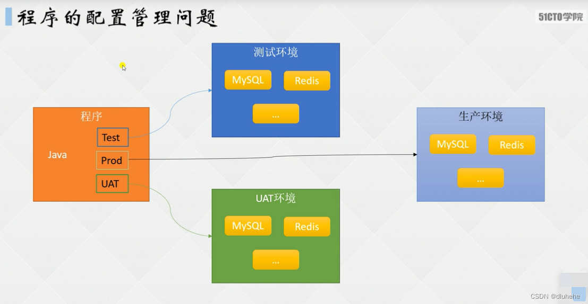
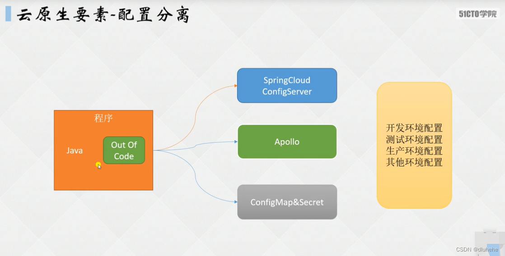
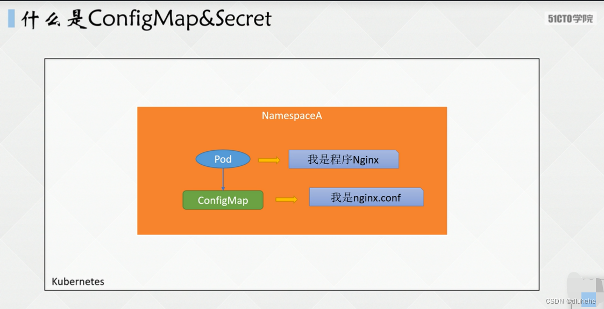
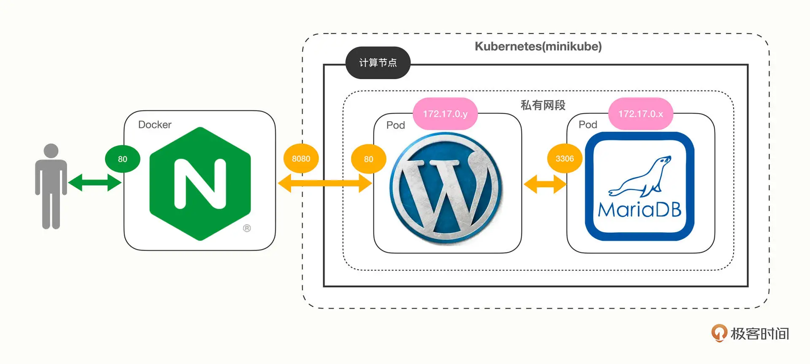
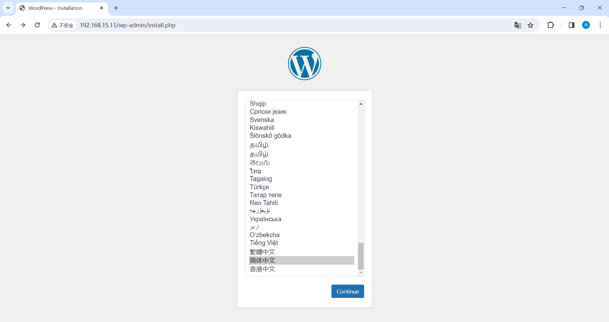

#  一、云原生要素——配置分离





- ConfigMap：存储明文配置
- Secret：存储密文、敏感配置、用户重要信息和密码等。

配置更新直接同步容器，热加载，无需重启pod或者容器;镜像和配置分离，可单独修改发布



# 二、ConfigMap

## 1. 概念

ConfigMap 是 K8S 中的资源对象，用于保存非机密性配置，数据可以是键值对（key=value）形式，也可通过文件形式保存。

**特点：**

- ConfigMap 是 k8s 中的资源，相当于配置文件，可以有一个或者多个 ConfigMap
- ConfigMap 可以做成 Volume，k8s pod 启动之后，通过 volume 形式映射到容器内部指定目录。
- 容器中应用程序按照原有方式读取容器特定目录上的配置文件。
- 在容器看来，配置文件就像是打包在容器内部特定目录，整个过程对应用没有任何侵入。

## 2. ConfigMap 应用场景

```
haproxy -f /usr/local/etc/haproxy/haproxy.cfg
```

ConfigMap 可以将配置信息和 Docker 镜像解耦，以便于实现镜像的可移植性和可复用性，ConfigMap 是一系列配置信息的集合，可直接注入到 Pod 以提供容器使用。

ConfigMap 注入方式有两种：

- 将 ConfigMap 作为存储卷。
- 将 ConfigMap 通过 env 中 ConfigMapKeyRef 注入到容器中。

## 3. ConfigMap 的局限性

ConfigMap 在设计上不是用来保存大量数据的，在 ConfigMap 中保存的配置信息不可超过 1MB，如果需要保存超过该尺寸限制的数据，可使用挂载存储卷或使用独立的数据库和文件服务。

## 4. 命令行创建 ConfigMap

```shell
[root@master pod]# kubectl create configmap nginx-conf --from-literal=nginx_port=90 --from-literal=server_name=yh-nginx
configmap/nginx-conf created
# kubectl:k8s命令行工具
# create configmap：新建configmap类型的资源
# nginx-conf：该configmap资源名称
# --from-literal：从命令行提取信息，等号后面为需要添加的配置信息，一个from一行信息
[root@master pod]# kubectl get cm nginx-conf -o yaml
apiVersion: v1
data:
  nginx_port: "90"		# 添加的自定义配置信息，key为nginx_port，value为90
  server_name: yh-nginx
kind: ConfigMap
metadata:
  creationTimestamp: "2024-01-05T12:29:00Z"
  name: nginx-conf
  namespace: default
  resourceVersion: "566557"
  uid: 4c76a550-b8f1-4b9c-b973-c04284b16f1b
```

## 5. 基于目录创建 ConfigMap

ConfigMap 支持在同一目录下创建多个 ConfigMap，但只支持目录下的普通文件，其他形式的文件不支持，如：子目录、符号链接、设备、管道文件等。

```shell
[root@master pod]# mkdir conf
[root@master pod]# cd conf/
[root@master conf]# vim tomcat.conf
Hostname=tomcat_server
Port=8080
[root@master conf]# vim nginx.conf
Server=123.123.123.123
Port=80
[root@master conf]# pwd
/root/pod/conf
[root@master conf]# kubectl create cm ng-tm-conf --from-file=/root/pod/conf
configmap/ng-tm-conf created
[root@master conf]# kubectl get cm ng-tm-conf -o yaml
apiVersion: v1
data:
  nginx.conf: |			# 直接引用文件名作为key，文件内容作为value
    Server=123.123.123.123
    Port=80
  tomcat.conf: |		# 此时的key键为nginx.conf和tomcat.conf，value为管道符下面的段落
    Hostname=tomcat_server
    Port=8080
kind: ConfigMap
metadata:
  creationTimestamp: "2024-01-05T12:40:34Z"
  name: ng-tm-conf
  namespace: default
  resourceVersion: "567694"
  uid: e3d8c22d-21a2-4fd2-98e1-42fba581f0be
```

## 6. 基于文件创建 ConfigMap

使用单个文件创建 ConfigMap 时，在--from-file= 后需要定义 key，若不定义则 key 默认为文件名。

```shell
[root@master conf]# vim nginx.conf 

    server {
        listen       80;
        server_name  localhost;
        charset UTF-8;
        location / {
            root   html;
            index  index.html index.htm;
        }
    }
[root@master conf]# kubectl create cm nginx-conf --from-file=www=/root/pod/conf/nginx.conf 
configmap/nginx-conf created
[root@master conf]# kubectl get cm nginx-conf -o yaml
apiVersion: v1
data:
  www: |2
        server {
            listen       80;
            server_name  localhost;
            charset UTF-8;
            location / {
                root   html;
                index  index.html index.htm;
            }
kind: ConfigMap
metadata:
  creationTimestamp: "2024-01-05T12:46:38Z"
  name: nginx-conf
  namespace: default
  resourceVersion: "568291"
  uid: 6a89eaf0-d5b7-4987-a179-98232b9a4e7b
```

## 7. 基于 YAML 创建 ConfigMap

看到一个管道符“|”就是一个键值对，可以建立多个配置信息，后期可以直接引用 key 来使用定义好的配置

```shell
[root@master conf]# vim mysql-conf.yaml

apiVersion: v1
kind: ConfigMap
metadata:
  name: mysql
  labels:
    conf: mysql
data:
  master.cnf: |
          [mysqld]
          log-bin
          log_bin_trust_function_creators=1
          lower_case_table_names=1
  slave.cnf: |
          [mysqld]
          relay-log
          super-read-only
          log_bin_trust_function_creators=1
[root@master conf]# kubectl create -f mysql-conf.yaml 
configmap/mysql created
[root@master conf]# kubectl get cm mysql -o yaml
apiVersion: v1
data:
  master.cnf: |
    [mysqld]
    log-bin
    log_bin_trust_function_creators=1
    lower_case_table_names=1
  slave.cnf: |
    [mysqld]
    relay-log
    super-read-only
    log_bin_trust_function_creators=1
kind: ConfigMap
metadata:
  creationTimestamp: "2024-01-05T12:55:12Z"
  labels:
    conf: mysql
  name: mysql
  namespace: default
  resourceVersion: "569134"
  uid: ba7860ca-4ecb-4427-880b-437a1fbdfbfa
```

# 三、使用 ConfigMap

## 1. 通过环境变量引入

定义 configMapKeyRef 来引用之前定义好的 ConfigMap

```shell
[root@master conf]# kubectl create configmap tomcat-conf --from-literal=server=123.123.123.123 --from-literal=port=8080
[root@master conf]# kubectl get cm tomcat-conf -o yaml
apiVersion: v1
data:
  port: "8080"
  server: 123.123.123.123
kind: ConfigMap
metadata:
  creationTimestamp: "2024-01-05T13:01:06Z"
  name: tomcat-conf
  namespace: default
  resourceVersion: "569713"
  uid: 6a5a1b2d-a08d-4869-811f-975b342faadb
[root@master conf]# cd ..
[root@master pod]# vim nginx-deploy.yaml 
apiVersion: apps/v1
kind: Deployment
metadata:
  name: nginx
  labels:
    app: nginx
spec:
  replicas: 1
  selector:
    matchLabels:
      app: nginx
  template:
    metadata:
      labels:
        app: nginx
    spec:
      containers:
      - image: nginx
        name: nginx
        ports:
        - containerPort: 80
        env:
        - name: tomcat		# 自定义键值对
          value: server_conf
        - name: server_ip
          valueFrom:		# 变量来自：
            configMapKeyRef:
              name: tomcat-conf		# 指定已存在的cm资源
              key: server		# 该cm资源的键
[root@master pod]# kubectl create -f nginx-deploy.yaml 
deployment.apps/nginx created
[root@master pod]# kubectl get po
NAME                     READY   STATUS    RESTARTS   AGE
nginx-67c6c5d595-259tr   1/1     Running   0          11s
[root@master pod]# kubectl exec nginx-67c6c5d595-259tr -- env
PATH=/usr/local/sbin:/usr/local/bin:/usr/sbin:/usr/bin:/sbin:/bin
HOSTNAME=nginx-67c6c5d595-259tr
NGINX_VERSION=1.25.3
NJS_VERSION=0.8.2
PKG_RELEASE=1~bookworm
tomcat=server_conf		# 这是yaml文件内自定义的键值对
server_ip=123.123.123.123		# 这是configmap定义好的键值对
KUBERNETES_SERVICE_PORT=443
KUBERNETES_SERVICE_PORT_HTTPS=443
KUBERNETES_PORT=tcp://10.96.0.1:443
KUBERNETES_PORT_443_TCP=tcp://10.96.0.1:443
KUBERNETES_PORT_443_TCP_PROTO=tcp
KUBERNETES_PORT_443_TCP_PORT=443
KUBERNETES_PORT_443_TCP_ADDR=10.96.0.1
KUBERNETES_SERVICE_HOST=10.96.0.1
HOME=/root
```

## 2. 批量引用 ConfigMap

```shell
[root@master conf]# vim ng-tm.conf
Hostname=tomcat_server
tomcatPort=8080
Server=123.123.123.123
nginxPort=80
[root@master conf]# kubectl create cm ng-tm-conf --from-file=/root/pod/conf/ng-tm.conf 
configmap/ng-tm-conf created
[root@master conf]# kubectl get cm ng-tm-conf -o yaml
apiVersion: v1
data:
  ng-tm.conf: |
    Hostname=tomcat_server
    tomcatPort=8080
    Server=123.123.123.123
    nginxPort=80
kind: ConfigMap
metadata:
  creationTimestamp: "2024-01-05T13:19:59Z"
  name: ng-tm-conf
  namespace: default
  resourceVersion: "571603"
  uid: 8b4767cb-5489-4243-b709-b23a69a35ad4
[root@master conf]# cd ..
[root@master pod]# vim nginx-deploy.yaml 
apiVersion: apps/v1
kind: Deployment
metadata:
  name: nginx
  labels:
    app: nginx
spec:
  replicas: 1
  selector:
    matchLabels:
      app: nginx
  template:
    metadata:
      labels:
        app: nginx
    spec:
      containers:
      - image: nginx
        name: nginx
        envFrom:
        - configMapRef:
            name: ng-tm-conf		# 指定configmap资源
          prefix: 		# 变量前缀
        env:
        - name: tomcat		# 自定义键值对
          value: server_conf
        - name: server_ip
          valueFrom:		# 变量来自：
            configMapKeyRef:
              name: tomcat-conf		# 指定已存在的cm资源
[root@master pod]# kubectl replace -f nginx-deploy.yaml
[root@master pod]# kubectl get po
NAME                     READY   STATUS    RESTARTS   AGE
nginx-76568fcc89-ld6ft   1/1     Running   0          27s

[root@master pod]# kubectl exec nginx-76568fcc89-ld6ft -- env
PATH=/usr/local/sbin:/usr/local/bin:/usr/sbin:/usr/bin:/sbin:/bin
HOSTNAME=nginx-76568fcc89-ld6ft
NGINX_VERSION=1.25.3
NJS_VERSION=0.8.2
PKG_RELEASE=1~bookworm
ng-tm.conf=Hostname=tomcat_server
tomcatPort=8080
Server=123.123.123.123
nginxPort=80
# 批量引入的cm最好是通过命令行创建的，否则使用带管道符的cm会出现上面这种情况，而且最好还是键值对的形式，否则容器无法启动
tomcat=server_conf
server_ip=123.123.123.123
KUBERNETES_PORT_443_TCP_PORT=443
KUBERNETES_PORT_443_TCP_ADDR=10.96.0.1
KUBERNETES_SERVICE_HOST=10.96.0.1
KUBERNETES_SERVICE_PORT=443
KUBERNETES_SERVICE_PORT_HTTPS=443
KUBERNETES_PORT=tcp://10.96.0.1:443
KUBERNETES_PORT_443_TCP=tcp://10.96.0.1:443
KUBERNETES_PORT_443_TCP_PROTO=tcp
HOME=/root
```

## 3. 以文件形式挂载 ConfigMap

```shell
    [root@master conf]# kubectl get cm
NAME               DATA   AGE
kube-root-ca.crt   1      15d
mysql              2      33m
ng-tm-conf         1      8m49s
nginx-conf         1      42m
tomcat-conf        2      27m
[root@master conf]# kubectl get cm nginx-conf -o yaml
apiVersion: v1
data:
  www: |2
        server {
            listen       80;
            server_name  localhost;
            charset UTF-8;
            location / {
                root   html;
                index  index.html index.htm;
            }
kind: ConfigMap
metadata:
  creationTimestamp: "2024-01-05T12:46:38Z"
  name: nginx-conf
  namespace: default
  resourceVersion: "568291"
  uid: 6a89eaf0-d5b7-4987-a179-98232b9a4e7b
[root@master pod]# vim nginx-deploy.yaml 
apiVersion: apps/v1
kind: Deployment
metadata:
  name: nginx
  labels:
    app: nginx
spec:
  replicas: 1
  selector:
    matchLabels:
      app: nginx
  template:
    metadata:
      labels:
        app: nginx
    spec:
      volumes:
      - name: nginx-cf		# 为该volume定义名称
        configMap:
          name: nginx-conf	# 引用已存在的cm资源nginx-conf
      containers:
      - image: nginx
        name: nginx
        volumeMounts:
        - name: nginx-cf	# 引用上面的volume，名称要与上面的一致
          mountPath: /tmp/nginx		# 挂载到容器的位置
[root@master pod]# kubectl replace -f nginx-deploy.yaml 
deployment.apps/nginx replaced
[root@master pod]# kubectl get po
NAME                     READY   STATUS    RESTARTS   AGE
nginx-7d9d87944f-qgkmm   1/1     Running   0          14s
[root@master pod]# kubectl exec -it nginx-7d9d87944f-qgkmm -- bash
root@nginx-7d9d87944f-qgkmm:~# cd /tmp/nginx/
root@nginx-7d9d87944f-qgkmm:/tmp/nginx# ls
www
root@nginx-7d9d87944f-qgkmm:/tmp/nginx# cat www
    server {
        listen       80;
        server_name  localhost;
        charset UTF-8;
        location / {
            root   html;
            index  index.html index.htm;
        }
# 到此，配置文件挂载成功
```

**ConfigMap 支持热加载配置，可直接用 edit 修改 cm 资源，然后保存即可**

## 4. 自定义挂载权限及名称

```shell
[root@master pod]# vim nginx-deploy.yaml 

apiVersion: apps/v1
kind: Deployment
metadata:
  name: nginx
  labels:
    app: nginx
spec:
  replicas: 1
  selector:
    matchLabels:
      app: nginx
  template:
    metadata:
      labels:
        app: nginx
    spec:
      volumes:
      - name: nginx-conf		# volume名称
        configMap:		# 引用cm资源
          name: nginx-conf		# 引用的cm资源名称
          items:
          - key: www		# 指定该cm资源的key
            path: conf	# 需要修改成的key
            mode: 0644	# 优先级高
          defaultMode: 0666		# 给予默认权限为：0666
      containers:
      - image: nginx
        name: nginx
        volumeMounts:
        - name: nginx-conf
          mountPath: /tmp/nginx
[root@master pod]# kubectl replace -f nginx-deploy.yaml
deployment.apps/nginx replaced
[root@master pod]# kubectl exec nginx-5b8c9ffccf-xl9kk -- ls -l /tmp/nginx
total 0
lrwxrwxrwx. 1 root root 11 Jan  5 13:40 conf -> ..data/conf
```

# 四、实战：搭建 MariaDB+Nginx+Wordpress

mariadb:latest

wordpress:latest

nginx:alpine


```shell
# 启动docker进程
systemctl start docker

# 拉取三个镜像
docker pull nginx:alpine
docker pull wordpress:latest
docker pull mariadb:latest

# 保存三个镜像
cd
docker save -o wordpress.tar workproess:latest
docker save -o mariadb.tar mariadb:latest

# 上传到其他的起点主机
cd
scp wordpress.tar root@10.1.1.77:~
scp mariadb.tar root@10.1.1.77:~

scp wordpress.tar root@10.1.1.88:~
scp mariadb.tar root@10.1.1.88:~

# 起到k8s-node01和k8s-node02
cd
ctr -n k8s.io images import wordpress.tar --platform=linux/amd64
ctr -n k8s.io images import mariadb.tar --platform=linux/amd64
```


## 1. 网站基本架构



## 2. 部署 MariaDB

```shell
[root@master pod]# mkdir mari-ng-wd
[root@master mari-ng-wd]# vim maria-cm.yaml 
apiVersion: v1
kind: ConfigMap
metadata:
  name: maria-cm
data:
  DATABASE: 'db'
  USER: 'wp'
  PASSWORD: '123'
  ROOT_PASSWORD: '123'
[root@master mari-ng-wd]# vim maria-deploy.yaml 
apiVersion: apps/v1
kind: Deployment
metadata:
  name: maria
  labels:
    app: wordpress
    role: database
spec:
  selector:
    matchLabels:
      app: wordpress
      role: database
  replicas: 1
  template:
    metadata:
      labels:
        app: wordpress
        role: database
    spec:
      containers:
      - name: maria
        image: mariadb:10
        ports:
        - containerPort: 3306
        envFrom:		# 批量导入cm变量
        - prefix: 'MARIADB_'
          configMapRef:
            name: maria-cm	
[root@master mari-ng-wd]# kubectl create -f maria-cm.yaml 
configmap/maria-cm created
[root@master mari-ng-wd]# kubectl create -f maria-deploy.yaml 
deployment.apps/maria created
[root@master mari-ng-wd]# kubectl exec maria-88449d778-lxmdq -- env
PATH=/usr/local/sbin:/usr/local/bin:/usr/sbin:/usr/bin:/sbin:/bin
HOSTNAME=maria-88449d778-lxmdq
GOSU_VERSION=1.17
LANG=C.UTF-8
MARIADB_VERSION=1:10.11.6+maria~ubu2204
MARIADB_DATABASE=db		# cm变量定义完成
MARIADB_PASSWORD=123
MARIADB_ROOT_PASSWORD=123
MARIADB_USER=wp
KUBERNETES_PORT=tcp://10.96.0.1:443
KUBERNETES_PORT_443_TCP=tcp://10.96.0.1:443
KUBERNETES_PORT_443_TCP_PROTO=tcp
KUBERNETES_PORT_443_TCP_PORT=443
KUBERNETES_PORT_443_TCP_ADDR=10.96.0.1
KUBERNETES_SERVICE_HOST=10.96.0.1
KUBERNETES_SERVICE_PORT=443
KUBERNETES_SERVICE_PORT_HTTPS=443
HOME=/root
[root@master mari-ng-wd]# kubectl get po -o wide		# 需要查看一下mariadb的IP
NAME                    READY   STATUS    RESTARTS   AGE     IP              NODE         NOMINATED NODE   READINESS GATES
maria-88449d778-lxmdq   1/1     Running   0          5m35s   172.16.58.239   k8s-node02   <none>           <none>
```

## 3. 部署 Wordpress

```shell
[root@master mari-ng-wd]# vim wp-cm.yaml 
apiVersion: v1
kind: ConfigMap
metadata:
  name: wp-cm

data:
  HOST: '172.16.58.239'		# 这个IP一定要与mariadb数据库绑定
  USER: 'wp'
  PASSWORD: '123'
  NAME: 'db'
[root@master mari-ng-wd]# vim wp-deploy.yaml 
apiVersion: apps/v1
kind: Deployment
metadata:
  name: wordpress
  labels:
    app: wordpress
    role: web
spec:
  replicas: 3
  selector:
    matchLabels:
      app: wordpress
      role: web
  template:
    metadata:
      labels:
        app: wordpress
        role: web
    spec:
      containers:
      - image: wordpress:5
        name: wordpress
        imagePullPolicy: IfNotPresent
        ports:
        - containerPort: 80
        envFrom:
        - prefix: 'WORDPRESS_DB_'
          configMapRef:
            name: wp-cm
[root@master mari-ng-wd]# kubectl create -f wp-cm.yaml -f wp-deploy.yaml 
configmap/wp-cm created
deployment.apps/wordpress created
[root@master mari-ng-wd]# kubectl get po
NAME                         READY   STATUS    RESTARTS   AGE
maria-88449d778-lxmdq        1/1     Running   0          25m
wordpress-55f8f96796-8qqfd   1/1     Running   0          13m
wordpress-55f8f96796-j6q75   1/1     Running   0          13m
wordpress-55f8f96796-smsqs   1/1     Running   0          13m
```

## 4. 设置端口映射

将本地的 8080 端口映射到 WordPress Pod 的 80 端口。

nohup ... & 忽略输入并将输出追加到 nohup.out，再掉到后台执行，若要关闭可以使用 fg 调到前台，使用 Ctrl+C 停止运行进程。

```shell
[root@master mari-ng-wd]# nohup kubectl port-forward deployments/wordpress 8080:80 &
[1] 374981
[root@master mari-ng-wd]# nohup: 忽略输入并把输出追加到'nohup.out'
^C
[root@master mari-ng-wd]# jobs
[1]+  运行中               nohup kubectl port-forward deployments/wordpress 8080:80 &
[root@master mari-ng-wd]# netstat -anpt | grep 8080
tcp        0      0 127.0.0.1:8080          0.0.0.0:*               LISTEN      378163/kubectl      
tcp        0      0 192.168.15.11:35866     172.16.219.114:8080     TIME_WAIT   -                   
tcp        0      0 192.168.15.11:41024     172.16.219.113:8080     TIME_WAIT   -                   
tcp        0      0 192.168.15.11:46042     172.16.219.113:8080     TIME_WAIT   -                   
tcp6       0      0 ::1:8080                :::*                    LISTEN      378163/kubectl      
```

## 5. 部署 Nginx 容器

WordPress 网站使用了 URL 重定向，直接使用“8080”会导致跳转故障，所以为了让网站正常工作，还应该在 Kubernetes 之外启动 Nginx 反向代理，保证外界看到的仍然是“80”端口号。

```shell
[root@master mari-ng-wd]# vim nginx.conf 
server {
  listen 80;
  default_type text/html;

  location / {
      proxy_http_version 1.1;
      proxy_set_header Host $host;
      proxy_pass http://127.0.0.1:8080;
  }
}
[root@master mari-ng-wd]# docker run -d --name nginx --rm --net=host -v ./nginx.conf:/etc/nginx/conf.d/default.conf nginx:alpine
docker run: 这是Docker的基本命令，用于从指定的镜像启动一个新的容器。
-d: 这是“--detach”的简写，意思是让容器在后台运行。
--name nginx: 为这个容器指定一个名称，这里命名为“nginx”。
--rm: 当容器退出时自动删除容器。
--net=host: 使用主机的网络堆栈而不是Docker的默认网络堆栈。这意味着容器将使用主机的网络配置。
-v ./nginx.conf:/etc/nginx/conf.d/default.conf: 这是“--volume”参数，用于挂载文件或目录。这里，它将主机上的“nginx.conf”文件挂载到容器的“/etc/nginx/conf.d/default.conf”路径上。
nginx:alpine: 这是要运行的Docker镜像的名称和标签。
```

## 6. 访问测试



后续自行部署网站，也可使用 PV+PVC 实现 K8S 集群数据持久化