# 一、服务发布方式对比

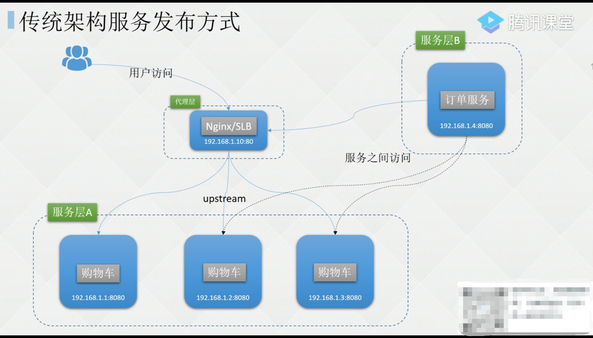

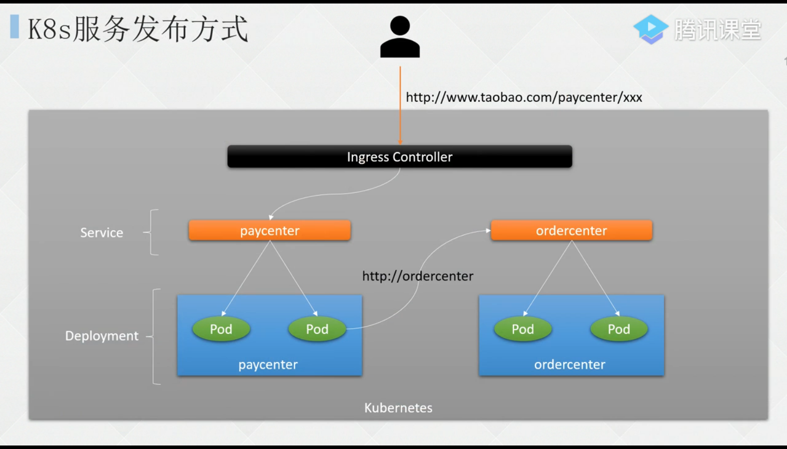

**二者主要区别在于：**

1. **部署复杂性：**传统的服务发布方式通常涉及手动配置和管理服务器、网络设置、负载均衡等，过程相对复杂且容易出错。相比之下，Kubernetes服务发布方式通过使用容器编排和自动化部署工具，简化了部署过程，使得服务的创建、部署和管理更加容易和高效。
2. **弹性伸缩：**Kubernetes 具有自动弹性伸缩功能，可以根据实际需求自动增加或减少容器数量，以保持服务的稳定性和性能。传统服务发布方式通常需要手动调整服务器规模，难以实现快速弹性伸缩。
3. **容错性：**Kubernetes 具有内置的容错机制，当某个容器出现故障时，Kubernetes 会自动将其从集群中移除，并重新启动一个新的容器。这有助于保持服务的可用性和稳定性。传统服务发布方式可能无法很好地处理此类故障，导致服务中断。
4. **资源利用率：**Kubernetes 通过容器化技术，可以实现资源的共享和动态分配，提高了资源的利用率。传统服务发布方式可能会因服务器资源的浪费而降低资源利用率。
5. **可维护性：**Kubernetes 提供了强大的可维护性功能，例如服务发现、配置管理和版本控制等。这些功能有助于简化服务的维护和升级过程。传统服务发布方式可能需要更多的手动维护工作，且升级过程可能更加复杂。
6. **成本：**虽然 Kubernetes 需要一定的学习曲线和初始配置成本，但从长远来看，其自动化部署、弹性伸缩和资源优化等功能可以帮助企业节省大量的运维成本。传统服务发布方式可能需要更多的运维人力和资源投入。

# 二、Label 和 Selector

- Label：标签，可以对 K8S 的些对象，如 Pod 和节点进行分组，通过添加 key=value 格式的标签，用于区分同样的资源不同的分组。
- Selector：标签选择器，可以根据资源标签查询出精确的对象信息。

## 1. 自定义 Label

**为某个节点添加标签 Label**

```shell
[root@master pod]# kubectl label nodes k8s-node01 subnet=ip7
node/k8s-node01 labeled
[root@master pod]# kubectl get node -l subnet=ip7
NAME         STATUS   ROLES    AGE   VERSION
k8s-node01   Ready    <none>   13d   v1.28.2
```


**在 deployment 或其他控制器中指定将 Pod 部署到该节点**

spec.template.spec.nodeselector

​	abc: "1"

```shell
[root@master pod]# vim nginx-deploy.yaml 
apiVersion: apps/v1
kind: Deployment
metadata:
  name: nginx
  labels:
    app: nginx
spec:
  replicas: 3
  selector:
    matchLabels:
      app: nginx
  template:
    metadata:
      labels:
        app: nginx
    spec:
      nodeSelector:		# 选择node标签
        subnet: ip7		# 指定刚才定义的标签
      containers:
      - name: nginx
        image: nginx:1.20.0
        ports:
        - containerPort: 80
[root@master pod]# kubectl create -f nginx-deploy.yaml 
deployment.apps/nginx created
[root@master pod]# kubectl get po -o wide 
NAME                     READY   STATUS    RESTARTS   AGE   IP              NODE         NOMINATED NODE   READINESS GATES
nginx-8656469f69-42ht6   1/1     Running   0          19s   172.16.85.230   k8s-node01   <none>           <none>
nginx-8656469f69-n8hwm   1/1     Running   0          19s   172.16.85.227   k8s-node01   <none>           <none>
nginx-8656469f69-vh8gm   1/1     Running   0          19s   172.16.85.238   k8s-node01   <none>           <none>
# pod已添加到node01节点上
```


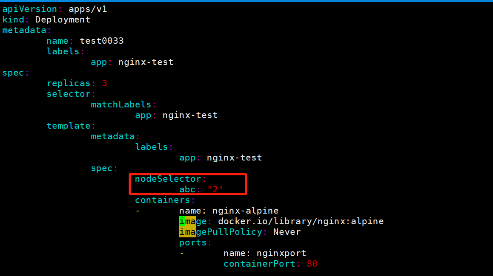

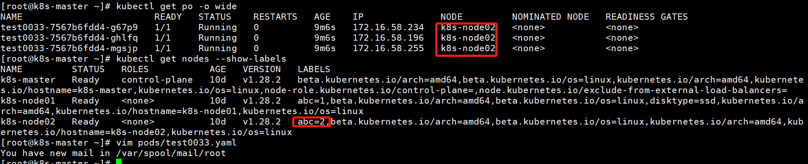

## 2. 污点信息

```shell
[root@master pod]# kubectl describe nodes master | grep Taints
Taints:             node-role.kubernetes.io/control-plane:NoSchedule
# 查看master的污点信息，该master为禁调度节点
[root@master pod]# kubectl taint node master node-role.kubernetes.io/control-plane-
# 可通过该命令去除master节点的禁调度污点，但正常情况下不允许这么做，因为master节点是管理node节点的，不需要进行负载
```

## 3. 为各节点设置 Label

```shell
[root@master pod]# kubectl label nodes master role=master
node/master labeled
# 为master节点设置master角色标签
[root@master pod]# kubectl label nodes k8s-node01 k8s-node02 role=node
node/k8s-node01 labeled
node/k8s-node02 labeled
# 为node节点设置node角色标签
```

## 4. Selector 选择器

```shell
[root@master pod]# kubectl get nodes --show-labels 
NAME         STATUS   ROLES           AGE   VERSION   LABELS
k8s-node01   Ready    <none>          13d   v1.28.2   beta.kubernetes.io/arch=amd64,beta.kubernetes.io/os=linux,kubernetes.io/arch=amd64,kubernetes.io/hostname=k8s-node01,kubernetes.io/os=linux,role=node,subnet=ip7
k8s-node02   Ready    <none>          13d   v1.28.2   beta.kubernetes.io/arch=amd64,beta.kubernetes.io/os=linux,kubernetes.io/arch=amd64,kubernetes.io/hostname=k8s-node02,kubernetes.io/os=linux,role=node
master       Ready    control-plane   13d   v1.28.2   beta.kubernetes.io/arch=amd64,beta.kubernetes.io/os=linux,kubernetes.io/arch=amd64,kubernetes.io/hostname=master,kubernetes.io/os=linux,node-role.kubernetes.io/control-plane=,node.kubernetes.io/exclude-from-external-load-balancers=,role=master
# 查看所有节点的标签

[root@master pod]# kubectl get nodes -l 'role in (master, node)'
NAME         STATUS   ROLES           AGE   VERSION
k8s-node01   Ready    <none>          13d   v1.28.2
k8s-node02   Ready    <none>          13d   v1.28.2
master       Ready    control-plane   13d   v1.28.2
# 匹配标签，匹配规则：role这个key的value在master和node之间

[root@master pod]# kubectl get nodes -l subnet!=ip7,'role in (master, node)'
NAME         STATUS   ROLES           AGE   VERSION
k8s-node02   Ready    <none>          13d   v1.28.2
master       Ready    control-plane   13d   v1.28.2
# 选择匹配role为master或node且不包括subnet=ip7的node

[root@master pod]# kubectl get nodes -l subnet
NAME         STATUS   ROLES    AGE   VERSION
k8s-node01   Ready    <none>   13d   v1.28.2
# 匹配标签的key为subnet的node
```

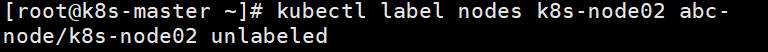

## 5. 修改标签

**将 subnet=ip7 这个标签改为 subnet=ip10，直接指定 key ，然后使用 --overwrite 参数重写标签**

```shell
[root@master pod]# kubectl get nodes k8s-node01 --show-labels | grep -w subnet | awk -F',' '{print $NF}'
subnet=ip10
# 查看node节点标签并使用grep加awk语法精准匹配出对应标签
```

## 6. 删除标签

**删除 node01 的 subnet=ip7 的标签**

```shell
[root@master pod]# kubectl label nodes k8s-node01 subnet-
node/k8s-node01 unlabeled
[root@master pod]# kubectl get nodes k8s-node01 --show-labels 
NAME         STATUS   ROLES    AGE   VERSION   LABELS
k8s-node01   Ready    <none>   13d   v1.28.2   beta.kubernetes.io/arch=amd64,beta.kubernetes.io/os=linux,kubernetes.io/arch=amd64,kubernetes.io/hostname=k8s-node01,kubernetes.io/os=linux,role=node
```


**批量删除标签**

```shell
[root@master pod]# kubectl label nodes master k8s-node01 k8s-node02 type=haha
node/master labeled
node/k8s-node01 labeled
node/k8s-node02 labeled
# 先为多个节点设定标签

[root@master pod]# kubectl label nodes -l type type-
node/k8s-node01 unlabeled
node/k8s-node02 unlabeled
node/master unlabeled
# 直接让所有node节点删除以type为key的标签

[root@master pod]# for i in 01 02;do kubectl label nodes k8s-node$i type-;done
node/k8s-node01 unlabeled
node/k8s-node02 unlabeled
# 可以使用for循环删除多个但并非全部节点的标签
```

# 三、Service

## 1. K8S 的 Service

Kubernetes（k8s）中的 Service 是一种抽象概念，它定义了一种可以访问 Pod 逻辑分组的策略。它通常通过 Label Selector 访问 Pod 组，解决了 Pod 的 IP 地址可能发生变化的问题。

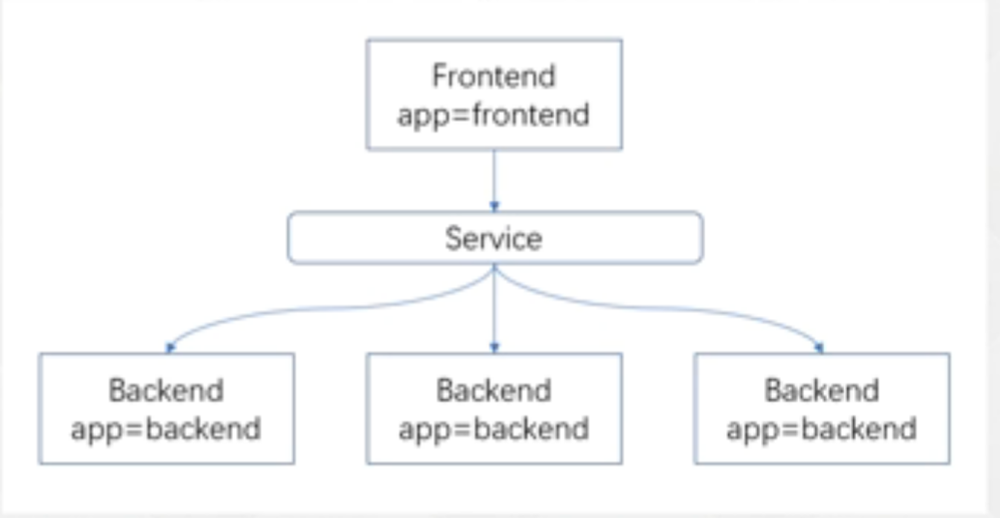

## 2. 定义 Service

```shell
[root@master pod]# vim service.yaml 

apiVersion: v1
kind: Service
metadata:
  name: nginx-svc
spec:
  selector: 
    app: nginx		# 要匹配的pod标签
  ports:
  - protocol: TCP 	# 协议
    port: 80 		# service的端口
    targetPort: 80 	# 目标容器的端口
```

该示例为 my-service:80 即可访问到具有 app=nginx 标签的 Pod 的80 端口上。

需要注意的是，Service 能够将一个接收端口映射到任意的 targetPort，但如果 targetPort 为空，targetPort 将被设置为与 Port 字段相同的值。targetPort 可以设置为一个字符串，可引用 backend Pod 的一个端口的名称，这样的话即使更改了 Pod 的端口，也不会对 Service 的访问造成影响。

Kubernetes Service 能够支持 TCP、UDP、SCTP 等协议，默认为 TCP 协议。


**创建 Service**

```shell
[root@master pod]# vim nginx-deploy.yaml
apiVersion: apps/v1
kind: Deployment
metadata:
  name: nginx		# deploy资源名称
  labels:				# 标签
    app: nginx
spec:
  replicas: 3
  selector:
    matchLabels:
      app: nginx
  template:
    metadata:
      labels:		# 配置pod标签
        app: nginx
    spec:
      containers:
      - name: nginx
        image: nginx:1.20.0
        ports:
        - containerPort: 80
[root@master pod]# kubectl create -f nginx-deploy.yaml 
deployment.apps/nginx created
[root@master pod]# kubectl create -f service.yaml 
service/nginx-svc created
[root@master pod]# kubectl get svc
NAME         TYPE        CLUSTER-IP      EXTERNAL-IP   PORT(S)   AGE
kubernetes   ClusterIP   10.96.0.1       <none>        443/TCP   13d
nginx-svc    ClusterIP   10.96.241.232   <none>        80/TCP    28s
[root@master pod]# curl 10.96.241.232
<!DOCTYPE html>
<html>
<head>
<title>Welcome to nginx!</title>
# curl通说明service和pod连接成功
# 此时，如果删除了pod，根据deployment特性会再次建立pod，而这时pod的IP地址会发生变化
# 但根据k8s的service特性，不论后面的pod的IP如何变化，只要绑定了对应pod的标签，就可以访问到pod
# 可以在同命名空间的pod内访问service名称来达到访问后端pod的效果
[root@master pod]# kubectl exec -it nginx-69fb58f9bc-dtpnx -- bash
root@nginx-69fb58f9bc-dtpnx:/# curl nginx-svc
<!DOCTYPE html>
<html>
<head>
<title>Welcome to nginx!</title>
```

## 3. Service 类型

**K8S Service Type（服务类型）主要包括：**

- **ClusterIP：**在集群内部使用，默认值，只能从集群中访问。
- **NodePort：**在所有安装了 Kube-Proxy 的节点上打开一个端口，此端口可以代理至后端Pod，可以通过 NodePort 从集群外部访问集群内的服务，格式为 NodelP:NodePort。
- **LoadBalancer：**使用云提供商的负载均衡器公开服务，成本较高。
- **ExternalName：**通过返回定义的 CNAME 别名，没有设置任何类型的代理，需要1.7 或更高版本kube-dns 支持。

## 4. NodePort 类型

如果将 Service 的 Type 字段设置为 NodePort，则 K8S 将从指定范围(默认 30000-32767)内自动分配端口，也可手动指定 NodePort，创建该 Service 后，集群中的每个节点都将暴露一个端口，通过某个宿主机的 IP+端口即可访问到后端应用。

**定义格式如下：**

```shell
[root@master pod]# vim service.yaml 
apiVersion: v1
kind: Service
metadata:
  name: nginx-svc
spec:
  selector:
    app: nginx
  ports:
  - protocol: TCP
    port: 80
    targetPort: 80
  type: NodePort
```


**重新加载 yaml**

```shell
[root@master pod]# kubectl replace -f service.yaml 
service/nginx-svc replaced
[root@master pod]# kubectl get svc
NAME         TYPE        CLUSTER-IP      EXTERNAL-IP   PORT(S)        AGE
kubernetes   ClusterIP   10.96.0.1       <none>        443/TCP        13d
nginx-svc    NodePort    10.96.241.232   <none>        80:30358/TCP   13m
# 服务的80端口映射到了宿主机的30358端口
```


**宿主机访问测试：http://192.168.15.11:30358**

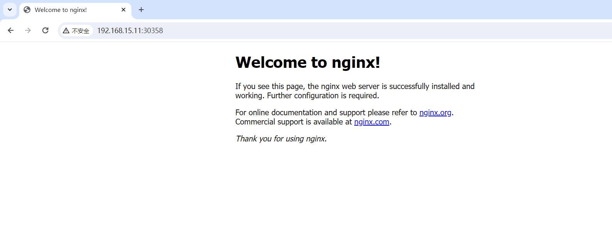


**修改随机端口为指定端口（范围：30000-32767）**

```shell
[root@master pod]# kubectl edit svc nginx-svc 

# Please edit the object below. Lines beginning with a '#' will be ignored,
# and an empty file will abort the edit. If an error occurs while saving this file will be
# reopened with the relevant failures.
#
apiVersion: v1
kind: Service
metadata:
  creationTimestamp: "2024-01-04T03:29:04Z"
  name: nginx-svc
  namespace: default
  resourceVersion: "458290"
  uid: 9dd5c416-a9cb-4178-8c4c-24298adfe005
spec:
  clusterIP: 10.96.241.232
  clusterIPs:
  - 10.96.241.232
  externalTrafficPolicy: Cluster
  internalTrafficPolicy: Cluster
  ipFamilies:
  - IPv4
  ipFamilyPolicy: SingleStack
  ports:
  - nodePort: 32222		# 修改为32222
    port: 80
    protocol: TCP
    targetPort: 80
:wq
[root@master pod]# kubectl get svc
NAME         TYPE        CLUSTER-IP      EXTERNAL-IP   PORT(S)        AGE
kubernetes   ClusterIP   10.96.0.1       <none>        443/TCP        13d
nginx-svc    NodePort    10.96.241.232   <none>        80:32222/TCP   17m
```


**再次访问测试：**

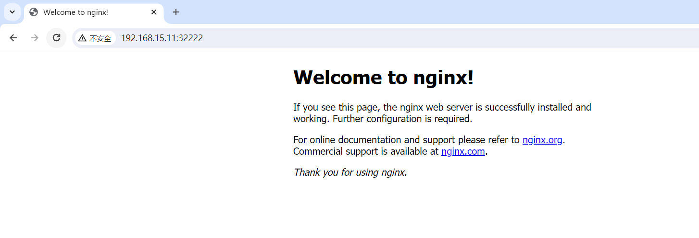

## 5. 使用 Service 代理 K8S 外部服务

**使用场景：**

- 希望在生产环境中使用某个固定的名称而非 IP 地址访问外部的中间件服务;
- 希望 Service 指向另一个 Namespace 中或其他集群中的服务;
- 正在将工作负载转移到 Kubernetes 集群，但是一部分服务仍运行在 Kubernetes 集群之外的 backend。


**外部 Service 配置：**

```shell
[root@master pod]# vim nginx-svc-external.yaml 
apiVersion: v1
kind: Service
metadata:
  labels:
    app: nginx-svc-external
  name: nginx-svc-external
spec:
  ports:
  - name: http
    protocol: TCP
    port: 80
    targetPort: 80
  type: ClusterIP		# 修改类型为ClusterIP，只需要k8s集群访问
---
apiVersion: v1
kind: Endpoints
metadata:
 labels:
   app: nginx-svc-external
 name: nginx-svc-external
subsets:
- addresses:
  - ip: 192.168.15.101		# 更改为另一台主机的IP，这台主机要安装nginx，方便测试
  ports:
  - name: http
    port: 80
    protocol: TCP
---
```


**创建并测试：**

```shell
[root@master pod]# kubectl create -f nginx-svc-external.yaml 
service/nginx-svc-external created
endpoints/nginx-svc-external created
[root@master pod]# kubectl get svc
NAME                 TYPE        CLUSTER-IP      EXTERNAL-IP   PORT(S)   AGE
kubernetes           ClusterIP   10.96.0.1       <none>        443/TCP   14d
nginx-svc-external   ClusterIP   10.96.236.202   <none>        80/TCP    115s
[root@master pod]# kubectl get ep
NAME                 ENDPOINTS            AGE
kubernetes           192.168.15.11:6443   14d
nginx-svc-external   192.168.15.101:80    50s
[root@master pod]# curl 10.96.236.202
<!DOCTYPE html>
<html>
<head>
<title>Welcome to nginx!</title>
[root@master pod]# kubectl exec nginx-69fb58f9bc-f8qng -it -- bash
root@nginx-69fb58f9bc-f8qng:/# curl nginx-svc-external
<!DOCTYPE html>
<html>
<head>
<title>Welcome to nginx!</title>
```

**注：**Endpoint IP 地址不能是 loopback (127.0.0.0/8) 、link-local (169.254.0.0/16) 或者 link-local 多播地址 (224.0.0.0/24)。

访问没有 Selector 的 Service 与有 Selector 的 Service 的原理相同，通过 Service 名称即可访问，请求将被路由到用户定义的 Endpoint。

## 6. ExternalName Service

ExternalName Service 是 Service 的特例，它没有 Selector，也没有定义任何端口和 Endpoint，它通过返回该外部服务的别名来提供服务。

比如可以定义一个 Service，后端设置为一个外部域名，这样通过 Service 的名称即可访问到该域名。使用 nslookup 解析以下文件定义的 Service，集群的 DNS 服务将返回一个值为www.baidu.com 的 CNAME 记录：

```shell
[root@master pod]# vim external.yaml
kind: Service
apiVersion: v1
metadata:
  name: external-service
spec:
  type: ExternalName		# 类型
  externalName: www.baidu.com		# 外部域名
[root@master pod]# kubectl create -f external.yaml 
service/external-service created
[root@master pod]# kubectl get svc
NAME                 TYPE           CLUSTER-IP      EXTERNAL-IP     PORT(S)   AGE
external-service     ExternalName   <none>          www.baidu.com   <none>    5s
kubernetes           ClusterIP      10.96.0.1       <none>          443/TCP   14d
nginx-svc            ClusterIP      10.96.142.216   <none>          80/TCP    11h
nginx-svc-external   ClusterIP      10.96.236.202   <none>          80/TCP    11h
```

## 7. 多端口 Service

```shell
[root@master pod]# vim any-port.yaml
apiVersion: v1
kind: Service
metadata:
  name: my-service
spec:
  selector:
    app: nginx
  ports:
  - name: http
    protocol: TCP
    port: 80
    targetPort: 9376		# 映射了一个80端口
  - name: https
    protocol: TCP
    port: 443			# 又映射了一个443端口，后续可以继续按此格式添加
    targetPort: 9377
[root@master pod]# kubectl create -f any-port.yaml 
service/my-service created
[root@master pod]# kubectl get svc
NAME                 TYPE           CLUSTER-IP      EXTERNAL-IP     PORT(S)          AGE
external-service     ExternalName   <none>          www.baidu.com   <none>           13m
kubernetes           ClusterIP      10.96.0.1       <none>          443/TCP          14d
my-service           ClusterIP      10.96.225.75    <none>          80/TCP,443/TCP   109s
nginx-svc            ClusterIP      10.96.142.216   <none>          80/TCP           11h
nginx-svc-external   ClusterIP      10.96.236.202   <none>          80/TCP           11h
```

# 四、Ingress

## 1. Ingress 概念

Ingress 是 Kubernetes 中的一种资源对象，用于将外部流量路由到集群内部的服务。它充当了一个入口 (gateway) 的角色，可以根据不同的规则将流量导向到不同的服务，从而实现负载均衡和路由管理。

使用 ingress 可以将多个服务公开给外部网络，并进行灵活的流量控制。通常与 ingress controller（如 nginx ingress controller、HAProxy 等）一起使用，ingress controller 负责实际的流量管理和请求转发操作。

Service 是由 kube-proxy 控制的四层负载均衡（端口＋IP），而 Ingress 是七层负载均衡的 API 对象（主机名、URI、请求头、证书等）。

1. **简化访问方式**：用域名替代 “IP + 端口”，更符合互联网访问习惯；
2. **精细化流量管理**：通过域名 / 路径规则分发流量到不同服务，实现多服务共享一个入口；
3. **扩展能力**：支持 HTTPS 加密、限流、跨域等高级功能，是生产环境暴露 HTTP 服务的标准方案。

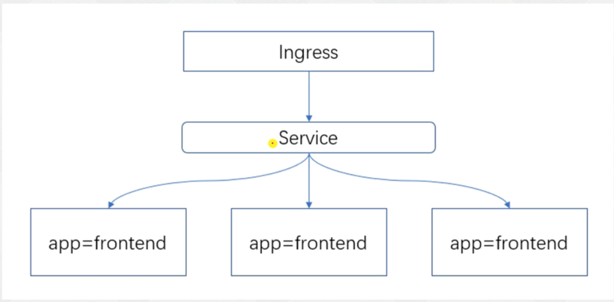

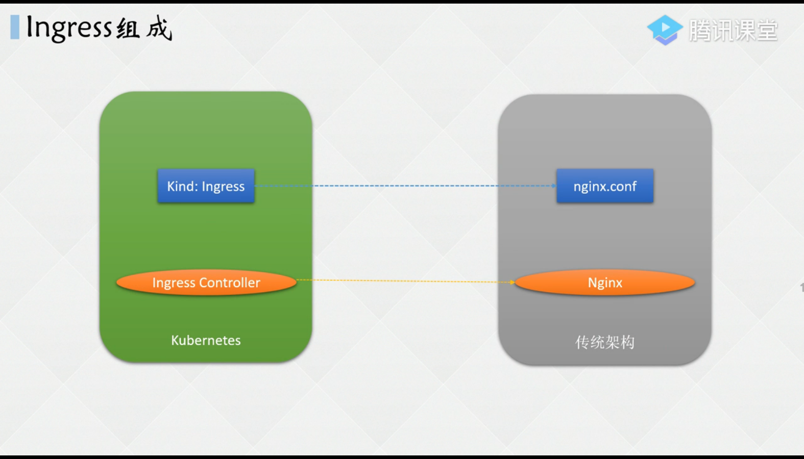

## 2. Ingress Controller

Service 本身是没有服务能力的，它只是一些 iptables 规则，真正配置、应用这些规则的实际上是节点里的 kube-proxy 组件。如果没有 kube-proxy，Service 定义得再完善也没有用。

Ingress 也只是一些 HTTP 路由规则的集合，相当于一份静态的描述文件，真正要把这些规则在集群里实施运行，还需要有另外一个东西，这就是 Ingress Controller，它的作用就相当于 Service 的 kube-proxy，能够读取、应用 Ingress 规则，处理、调度流量。

Nginx 是代理服务器中稳定性最好、性能最高的产品，所以它可以被誉为 Kubernetes 里应用最为广泛的 Ingress Controller。

## 3. Ingress Class

随着 Ingress 在实践中的大量应用，很多用户发现 Ingress+Ingress Controller 这种用法会带来一些问题，比如：

- 由于某些原因，项目组需要引入不同的 Ingress Controller，但 Kubernetes 不允许这样做。
- Ingress 规则太多，都交给一个 Ingress Controller 处理会让它不堪重负。
- 多个 Ingress 对象没有很好的逻辑分组方式，管理和维护成本很高。
- 集群里有不同的租户，他们对 Ingress 的需求差异很大甚至有冲突，无法部署在同一个 Ingress Controller 上。

**而 K8S 提出了一个 Ingress Class 的概念**，让它插在 Ingress 和 Ingress Controller 中间，作为*流量规则和控制器的协调人*，解除了 Ingress 和 Ingress Controller 的强绑定关系。

Kubernetes 用户可以转向管理 Ingress Class，用它来定义不同的业务逻辑分组，简化 Ingress 规则的复杂度。

比如说，我们可以用 Class A 处理博客流量、Class B 处理短视频流量、Class C 处理购物流量。


## 4. 安装 Ingress Contorller

[ingress.yaml](https://www.yuque.com/attachments/yuque/0/2024/yaml/27632550/1704426623262-496917bf-7f4b-48e6-83e1-429f2e1ee853.yaml)

下载附件再导入到服务器内，再进行安装

```shell
[root@master pod]# kubectl create -f ingress.yaml 
namespace/ingress-nginx created
serviceaccount/ingress-nginx created
serviceaccount/ingress-nginx-admission created
role.rbac.authorization.k8s.io/ingress-nginx created
role.rbac.authorization.k8s.io/ingress-nginx-admission created
rolebinding.rbac.authorization.k8s.io/ingress-nginx created
rolebinding.rbac.authorization.k8s.io/ingress-nginx-admission created
configmap/ingress-nginx-controller created
service/ingress-nginx-controller created
service/ingress-nginx-controller-admission created
deployment.apps/ingress-nginx-controller created
job.batch/ingress-nginx-admission-create created
job.batch/ingress-nginx-admission-patch created
ingressclass.networking.k8s.io/nginx created
validatingwebhookconfiguration.admissionregistration.k8s.io/ingress-nginx-admission created
[root@master pod]# kubectl get po -n ingress-nginx 
NAME                                        READY   STATUS      RESTARTS   AGE
ingress-nginx-admission-create-hqqx2        0/1     Completed   0          5m57s
ingress-nginx-admission-patch-ptzh2         0/1     Completed   1          5m57s
ingress-nginx-controller-674f66cf96-zvmgs   1/1     Running     0          5m57s
```

## 5. 使用域名发布 K8S 服务

```shell
[root@master pod]# kubectl create -f nginx-deploy.yaml 
deployment.apps/nginx created
# 添加nginx-deployment

[root@master pod]# kubectl get po
NAME                     READY   STATUS    RESTARTS   AGE
nginx-677c94b6fd-bpj2k   1/1     Running   0          10s
nginx-677c94b6fd-nspr8   1/1     Running   0          10s
nginx-677c94b6fd-ztpjd   1/1     Running   0          10s

[root@master pod]# kubectl expose deployment nginx --port 80
service/nginx exposed
# 暴露端口
```

## 6. 	

```shell
[root@master pod]# vim web-ingress.yaml 
apiVersion: networking.k8s.io/v1 	# k8s >= 1.22 必须 v1
kind: Ingress
metadata:
  name: nginx-ingress 	# Ingress名称
spec: 	# 资源配置
  ingressClassName: nginx # Controller类型
  rules: 	# 路由规则
  - host: nginx.test.com 	# 域名
    http:
      paths:
      - backend:
          service:
            name: my-service 	# service名称
            port:
              number: 80 	# service的端⼝号
        path: /
        pathType: ImplementationSpecific # 路径匹配⽅式
[root@master pod]# kubectl create -f web-ingress.yaml 
ingress.networking.k8s.io/nginx-ingress created
[root@master pod]# kubectl get ingress
NAME            CLASS   HOSTS            ADDRESS   PORTS   AGE
nginx-ingress   nginx   nginx.test.com             80      16s
```

pathType: 路径的匹配方式，目前有 ImplementationSpecific、Exact 和 Prefix 方式

- **Exact:** 精确匹配，比如配置的 path 为/bar，那么/bar/将不能被路由;
- **Prefix:** 前缀匹配，基于以/分隔的 URL 路径。比如 path 为/abc，可以匹配到/abc/bbb 等，比较常用的配置;
- **ImplementationSpecific:** 这种类型的路由匹配根据 Ingress Controller 来实现，可以当做一个单独的类型，也可以当做 Prefix 和 Exact。ImplementationSpecific是 1.18 版本引入 Prefix 和 Exact的默认配置;

## 7. 访问测试

```shell
[root@master pod]# kubectl get svc -n ingress-nginx 
NAME                                 TYPE        CLUSTER-IP      EXTERNAL-IP   PORT(S)                      AGE
ingress-nginx-controller             NodePort    10.96.169.209   <none>        80:32656/TCP,443:31657/TCP   18m
ingress-nginx-controller-admission   ClusterIP   10.96.233.211   <none>        443/TCP                      18m
```

修改 windows 映射文件：

C:\Windows\System32\drivers\etc

找到 hosts 文件，使用记事本打开，编辑最后的内容


访问域名＋端口：nginx.test.com:32656

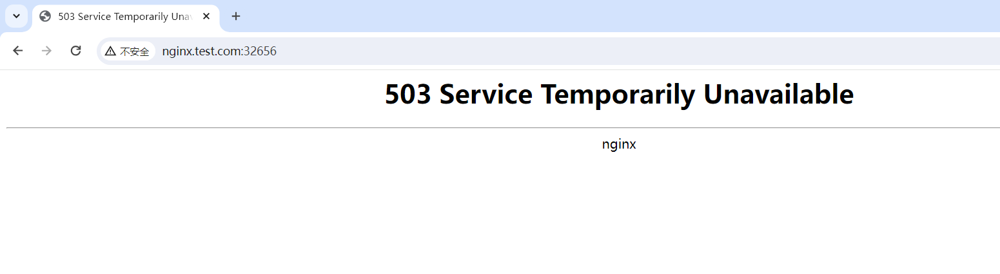

# 五、实战：Ingress 搭建 Nginx+WP 论坛+MariaDB

## 1. 网站架构

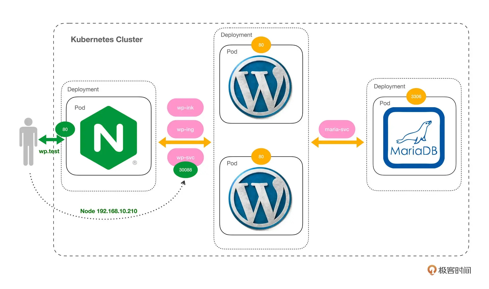

本次部署形式完全舍弃 Docker，将所有应用都置于 Kubernetes，采用 Deployment 而非单 Pod 部署，稳定性得到升级。

在上次实战环节，Nginx 作为反向代理服务器，在本次实战中，Nginx 便作为 Ingress Controller。Wordpress 扩容到两个，提高可用性。而 MariaDB 因为要保证数据一致性，所以只用一个实例。

## 2. 部署 MariaDB

### （1）定义 ConfigMap

```shell
[root@master mari-ng-wd]# vim maria-cm.yaml 
apiVersion: v1
kind: ConfigMap
metadata:
  name: maria-cm
data:
  DATABASE: 'db'
  USER: 'wp'
  PASSWORD: '123'
  ROOT_PASSWORD: '123'
```

### （2）定义 Deployment

```shell
[root@master mari-ng-wd]# vim maria-deploy.yaml 
apiVersion: apps/v1
kind: Deployment
metadata:
  name: maria-dep
  labels:
    app: maria-dep

spec:
  selector:
    matchLabels:
      app: maria-dep
  replicas: 1
  template:
    metadata:
      labels:
        app: maria-dep
    spec:
      containers:
      - name: mariadb
        image: mariadb:10
        ports:
        - containerPort: 3306
        envFrom:
        - prefix: 'MARIADB_'
          configMapRef:
            name: maria-cm
```

### （3）定义 Service

```shell
[root@master mari-ng-wd]# vim maria-svc.yaml
apiVersion: v1
kind: Service
metadata:
  name: maria-svc
spec:
  type: NodePort
  ports:
  - port: 3306
    protocol: TCP
    targetPort: 3306
  selector:
    app: maria-dep		# 指定mariaDB的deployment标签
```

### （4）启动 MariaDB 

```shell
[root@master mari-ng-wd]# kubectl create -f maria-cm.yaml -f maria-deploy.yaml -f maria-svc.yaml 
configmap/maria-cm created
deployment.apps/maria-dep created
service/maria-svc created
[root@master mari-ng-wd]# kubectl get all
# Pod信息：
NAME                            READY   STATUS    RESTARTS   AGE
pod/maria-dep-9577989f4-pt8qb   1/1     Running   0          5m10s
# Service信息：
NAME                 TYPE        CLUSTER-IP      EXTERNAL-IP   PORT(S)    AGE
service/kubernetes   ClusterIP   10.96.0.1       <none>        443/TCP    16d
service/maria-svc    ClusterIP   10.96.128.147   <none>        3306/TCP   5m10s
# Deployment信息：
NAME                        READY   UP-TO-DATE   AVAILABLE   AGE
deployment.apps/maria-dep   1/1     1            1           5m10s
# Replicaset控制器：
NAME                                  DESIRED   CURRENT   READY   AGE
replicaset.apps/maria-dep-9577989f4   1         1         1       5m10s
```

## 3. 部署 Wrodpress

### （1）定义 ConfigMap

```shell
[root@master mari-ng-wd]# vim wp-cm.yaml 

apiVersion: v1
kind: ConfigMap
metadata:
  name: wp-cm

data:
  HOST: 'maria-svc'		# 将此处写为mariadb的service名称，不用再写IP
  USER: 'wp'
  PASSWORD: '123'
  NAME: 'db'
```

### （2）定义 Deployment

```shell
[root@master mari-ng-wd]# vim wp-deploy.yaml 
apiVersion: apps/v1
kind: Deployment
metadata:
  name: wp-dep
  labels:
    app: wp-dep
spec:
  replicas: 2
  selector:
    matchLabels:
      app: wp-dep
  template:
    metadata:
      labels:
        app: wp-dep
    spec:
      containers:
      - image: wordpress:5
        name: wordpress
        imagePullPolicy: IfNotPresent
        ports:
        - containerPort: 80
        envFrom:
        - prefix: 'WORDPRESS_DB_'
          configMapRef:
            name: wp-cm
```

### （3）定义 Service

```shell
[root@master mari-ng-wd]# vim wp-svc.yaml 
apiVersion: v1
kind: Service
metadata:
  name: wp-svc
spec:
  selector:
    app: wp-dep
  ports:
  - name: http80 
    protocol: TCP
    port: 80
    targetPort: 80
    nodePort: 30088
type: NodePor
```

### （4）启动 WordPress

```shell
[root@master mari-ng-wd]# kubectl create -f wp-cm.yaml -f wp-deploy.yaml -f wp-svc.yaml 
configmap/wp-cm created
deployment.apps/wp-dep created
service/wp-svc created
[root@master mari-ng-wd]# kubectl get all
NAME                            READY   STATUS    RESTARTS   AGE
pod/maria-dep-9577989f4-pt8qb   1/1     Running   0          28m
pod/wp-dep-54f5744774-b6tjd     1/1     Running   0          8m17s
pod/wp-dep-54f5744774-bft7r     1/1     Running   0          8m17s

NAME                 TYPE        CLUSTER-IP      EXTERNAL-IP   PORT(S)        AGE
service/kubernetes   ClusterIP   10.96.0.1       <none>        443/TCP        16d
service/maria-svc    ClusterIP   10.96.128.147   <none>        3306/TCP       28m
service/wp-svc       NodePort    10.96.227.140   <none>        80:30088/TCP   7m20s

NAME                        READY   UP-TO-DATE   AVAILABLE   AGE
deployment.apps/maria-dep   1/1     1            1           28m
deployment.apps/wp-dep      2/2     2            2           8m17s

NAME                                  DESIRED   CURRENT   READY   AGE
replicaset.apps/maria-dep-9577989f4   1         1         1       28m
replicaset.apps/wp-dep-54f5744774     2         2         2       8m17s
[root@master mari-ng-wd]# kubectl get svc -o wide 
NAME         TYPE        CLUSTER-IP      EXTERNAL-IP   PORT(S)        AGE     SELECTOR
kubernetes   ClusterIP   10.96.0.1       <none>        443/TCP        16d     <none>
maria-svc    ClusterIP   10.96.128.147   <none>        3306/TCP       30m     app=maria-dep
wp-svc       NodePort    10.96.227.140   <none>        80:30088/TCP   9m40s   app=wp-dep
```

现在就可以做访问网站测试了，此时是没有 Ingress 的

### （5）访问测试

访问 192.68.15.11:30088

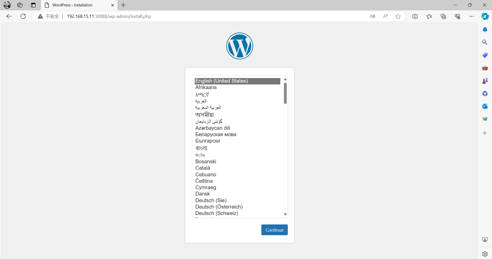

## 4. 部署 Nginx Ingress Controller

### （1）安装 Ingress Controller

按照上文安装 ingress controller，安装好后执行下面操作

```shell
[root@master mari-ng-wd]# kubectl get svc -n ingress-nginx 
NAME                                 TYPE        CLUSTER-IP     EXTERNAL-IP   PORT(S)                      AGE
ingress-nginx-controller             NodePort    10.96.184.24   <none>        80:30080/TCP,443:30443/TCP   10m
ingress-nginx-controller-admission   ClusterIP   10.96.123.87   <none>        443/TCP                      10m
# 记住ingress-nginx-controller的端口映射80=>30080
```

### （2）部署 Ingress

在安装本文的Ingress时，Ingress class已连带被定义，所以直接部署 Ingress

```shell
[root@master mari-ng-wd]# kubectl get ingressclasses.networking.k8s.io 
NAME    CONTROLLER             PARAMETERS   AGE
nginx   k8s.io/ingress-nginx   <none>       13m
[root@master mari-ng-wd]# vim web-ingress.yaml

apiVersion: networking.k8s.io/v1        # k8s >= 1.22 必须 v1
kind: Ingress
metadata:
  name: nginx-ingress   	# Ingress名称
spec:   # 资源配置
  ingressClassName: nginx 		# Controller类型
  rules:        # 路由规则
  - host: wp-web.com        # 域名
    http:
      paths:
      - backend:
          service:
            name: wp-svc 		# service名称，这里要匹配到wordpress的service
            port:
              number: 80        # service的端⼝号
        path: /
        pathType: ImplementationSpecific # 路径匹配⽅式
[root@master mari-ng-wd]# kubectl create -f web-ingress.yaml
ingress.networking.k8s.io/nginx-ingress created
```

## 5. 访问测试

### （1）修改 Hosts

修改 windows 映射文件：

C:\Windows\System32\drivers\etc

找到 hosts 文件，使用记事本打开，编辑最后的内容

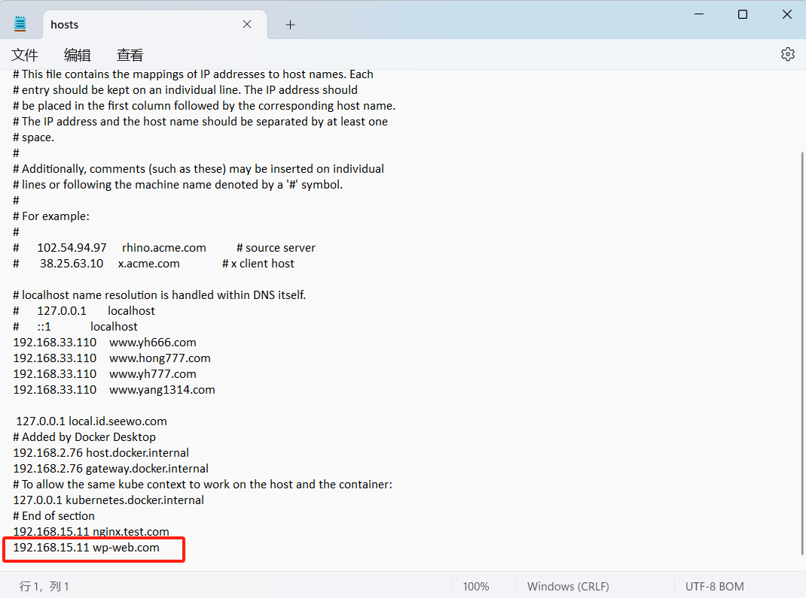

### （2）测试访问 IP

访问 IP＋Ingress 

入后端服务器的

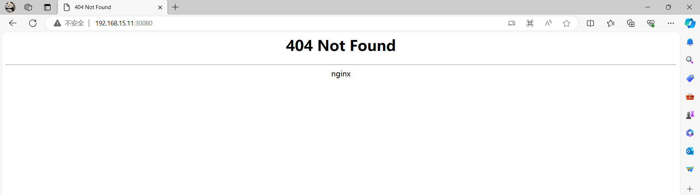

### （3）测试访问 URL

只有访问先前定义的域名＋端口才可访问到后端服务器

本次实战域名服务器为：wp-web.com:30080

后续论坛网站自行搭建

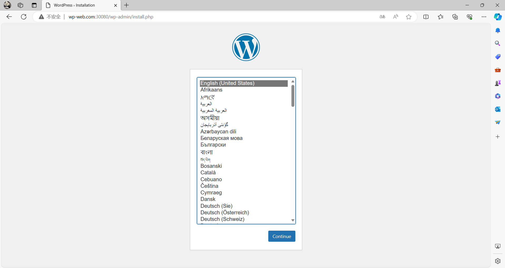