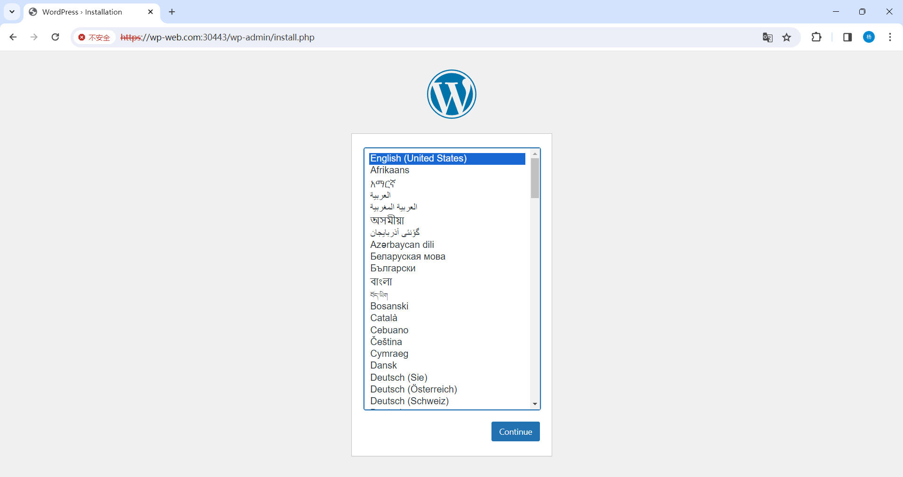

# 一、Secret 概念

Secret 解决了密码、token、密钥等敏感数据的配置问题，而不需要把这些敏感数据暴露到镜像或 Pod Spec 中。Secret 可以以 Volume 或环境变量的方式使用。

**Kubernetes 里 Secret 对象又细分出很多类，比如：**

- 访问私有镜像仓库的认证信息
- 身份识别的凭证信息
- HTTPS 通信的证书和私钥
- 一般的机密信息（格式由用户自行解释）

**Secret 常用类型：**

- **Opaque：***base64 编码格式的 Secret，用来存储密码、秘钥等身份识别的凭证信息。*可以通过 base64 --decode (base64 -d)解码获得原始数据，因此安全性弱。
- **TLS：***用于存储与 TLS 证书相关的密和证书文件。*它通常用于配置 ngress 或 Service 来启用HTTPS 加密。TLS Secret 包含一个私钥和一个相关的数字证书。
- **kubernetes.io/dockerconfigjson：***用来存储私有 Docker registry 的认证信息。*

# 二、Secret 创建

## 1. 命令行创建

与 ConfigMap 一样，可以通过命令行、文件或目录的方式创建。

```shell
[root@master secret]# kubectl create secret generic mysql-root --from-literal=username=admin --from-literal=password=kjashd123@[p
secret/mysql-root created
[root@master secret]# kubectl get secrets 
NAME            TYPE     DATA   AGE
mysql-root      Opaque   2      13s
user-and-pass   Opaque   2      5m20s
[root@master secret]# kubectl get secrets mysql-root -o yaml
apiVersion: v1
data:
  password: a2phc2hkMTIzQFtw
  username: YWRtaW4=
kind: Secret
metadata:
  creationTimestamp: "2024-01-07T12:56:46Z"
  name: mysql-root
  namespace: default
  resourceVersion: "631912"
  uid: 27594f2b-2df8-4335-84c3-50dfc1ff3e2c
type: Opaque
[root@master secret]# echo "a2phc2hkMTIzQFtw" | base64 -d
kjashd123@[p
[root@master secret]# 
```

## 2. 通过文件创建

```shell
[root@master pod]# mkdir secret
[root@master pod]# cd secret/
[root@master secret]# kubectl create secret generic user-and-pass --from-file=username.txt --from-file=password.txt 
secret/user-and-pass created
[root@master secret]# kubectl get secrets 
NAME            TYPE     DATA   AGE
stringsecret    Opaque   2      4d6h
user-and-pass   Opaque   2      5s
[root@master secret]# kubectl get secrets -o yaml
apiVersion: v1
data:
  password.txt: MTIzNDU2cXdlcgo=		# base64编码格式的密文，这里是设置的密码
  username.txt: dXNlcgo=		# 设置的用户名
kind: Secret
metadata:
  creationTimestamp: "2024-01-07T12:51:39Z"
  name: user-and-pass
  namespace: default
  resourceVersion: "631408"
  uid: 0b6e9237-78df-47a1-88b9-56ef107653d4
type: Opaque
[root@master secret]# echo "MTIzNDU2cXdlcgo=" | base64 -d
123456qwer
```

## 3. 通过 YAML 文件创建

**手动基于 base64 加密**

```shell
[root@master secret]# echo -n 'zhangsan' | base64 
emhhbmdzYW4=
[root@master secret]# echo -n 'qwer1234' | base64 
cXdlcjEyMzQ=
```


**创建 YAML 文件**

```shell
[root@master secret]# vim redis-secret.yaml

apiVersion: v1
kind: Secret
metadata:
  name: redis-user
type: Opaque		# secret类型
data:
  username: emhhbmdzYW4=		# 加密后的账号
  password: cXdlcjEyMzQ=		# 加密后的密码
[root@master secret]# kubectl get secrets redis-user -o yaml
apiVersion: v1
data:
  password: cXdlcjEyMzQ=
  username: emhhbmdzYW4=
kind: Secret
metadata:
  creationTimestamp: "2024-01-07T13:11:29Z"
  name: redis-user
  namespace: default
  resourceVersion: "633358"
  uid: 3d2f6ebc-a012-4eea-8daa-2a79fcfff7e8
type: Opaque
```


**自动加密的 secret**

```shell
[root@master secret]# vim stringsecret.yaml

apiVersion: v1
kind: Secret
metadata:
  name: string-secret
type: Opaque
stringData:
  username: admin
  password: password123
[root@master secret]# kubectl create -f stringsecret.yaml 
secret/string-secret created
[root@master secret]# kubectl get secrets string-secret -o yaml
apiVersion: v1
data:
  password: cGFzc3dvcmQxMjM=		# 通过stringSecret自动加密
  username: YWRtaW4=
kind: Secret
metadata:
  creationTimestamp: "2024-01-07T13:13:19Z"
  name: string-secret
  namespace: default
  resourceVersion: "633538"
  uid: 6b17b169-61c7-47f8-b0dc-7953e584ccde
type: Opaque
```

## 4. 创建 TLS 的 Secret

**创建证书 SSL 证书**

```shell
[root@master secret]# mkdir tls
[root@master secret]# cd tls
[root@master tls]# openssl req -x509 -nodes -days 365 -newkey rsa:2048 -keyout tls.key -out tls.crt -subj "/CN=test.com"
Generating a RSA private key
.+++++
.............+++++
writing new private key to 'tls.key'
-----
[root@master tls]# ls
tls.crt  tls.key
```


**指定证书创建 secret**

```shell
[root@master tls]# kubectl create secret tls nginx-https --key=tls.key --cert=tls.crt 
secret/nginx-https created
[root@master tls]# kubectl get secrets nginx-https -o yaml
apiVersion: v1
data:
  tls.crt: LS0tLS1CRUdJTiBDRVJUSUZJQ0FURS0tLS0tCk1JSURCekNDQWUrZ0F3SUJBZ0lVWDBRTUlnb1RaRU0xRG1ISnRBN1NlTmJoWnYwd0RRWUpLb1pJaHZjTkFRRUwKQlFBd0V6RVJNQThHQTFVRUF3d0lkR1Z6ZEM1amIyMHdIaGNOTWpRd01UQTNNVE14TlRVMVdoY05NalV3TVRBMgpNVE14TlRVMVdqQVRNUkV3RHdZRFZRUUREQWgwWlhOMExtTnZiVENDQVNJd0RRWUpLb1pJaHZjTkFRRUJCUUFECmdnRVBBRENDQVFvQ2dnRUJBTEJ1VkprbTRhSklrSzlGYXZ3bUhhT1BLS0pmS3pqNHg3aUNlZStSYzJrZmZhbG4KWTFQS1pUUzhCa2xpNUw1RzZGMmhWMEh2WXZJM0szT0lNaDh0TVp3U0FXOFhOZjYyeHpxS3N5alRXMW5qcjFCUApDOVhXb0NNd0dPUlR1WTdRRGh4cjF5UHljTkd0ciswUDdiWDdTcXJlS1p4SXo0RFErTjBRTUpQVkd4ZUtFeHZ5CkdqQ2JxVnlLeEQ2cm9WWWJRdlo4UDBGTjRlb2QwR0ZvSFNBTWE1WGMyVnliQXovQkw2UVR6VEl4cnloM1REU0kKQWRNT2lnSnFkZm1ncElIS3RyTHA2S25vWExrUnNGTW1qbi95NmxicEpPR2lYdmFiSDFoR0Z0TG9zcEp0cnFrbgpUbjJydVp3UHBudEMrWjlubXhTM1cxUmhpclIyNXhMbkl2Z3h5aU1DQXdFQUFhTlRNRkV3SFFZRFZSME9CQllFCkZHOUVFT09mUjd2eUZ3NXlnL1dtVkUrYzRTMHBNQjhHQTFVZEl3UVlNQmFBRkc5RUVPT2ZSN3Z5Rnc1eWcvV20KVkUrYzRTMHBNQThHQTFVZEV3RUIvd1FGTUFNQkFmOHdEUVlKS29aSWh2Y05BUUVMQlFBRGdnRUJBQUJHMHh6UwoxaTI2Y3k1bkNhdy9TdlROSjAza2FsQ1pQNzZJL3J6Q01lc0FBcFkzVmFHLzg1Z0dHSkVRaFRrV290OUhTMVlaCkpEVUpucnMzOVlwN096VllkaTZlQ1RxVTJSdG1pU3A2eUFBNG1WT0tqUjU5TWJiSzAxemtKenZ2Z1d6MXpnU3UKNDVSTnJGU1BrNjBiSGhOc2REdEpxNk03ZzdsUmdYK1Z4TTBERm11ZlVsKzVuS1hqbGZqeTN4cUFmTlo1a0RwZQphY1dyRUVNUXh3Vk84RjN2b0VXRU84UmZxOGlwNit0RGdEUGw1U2NnT3Z2V0EyWDcya2pJNzI2aVZXWmlRR1BMCng0ZitkWG5IWEU5R1N1M2puc2FhbzBoNzBJRi9EaHY2eHVWZndlR0ZobktNS0J0ejRnZUlZSlA4eXNEeGpRZUYKbWZPYlN2T29aREU3VFJNPQotLS0tLUVORCBDRVJUSUZJQ0FURS0tLS0tCg==
  tls.key: LS0tLS1CRUdJTiBQUklWQVRFIEtFWS0tLS0tCk1JSUV2UUlCQURBTkJna3Foa2lHOXcwQkFRRUZBQVNDQktjd2dnU2pBZ0VBQW9JQkFRQ3dibFNaSnVHaVNKQ3YKUldyOEpoMmpqeWlpWHlzNCtNZTRnbm52a1hOcEgzMnBaMk5UeW1VMHZBWkpZdVMrUnVoZG9WZEI3Mkx5Tnl0egppRElmTFRHY0VnRnZGelgrdHNjNmlyTW8wMXRaNDY5UVR3dlYxcUFqTUJqa1U3bU8wQTRjYTljajhuRFJyYS90CkQrMjErMHFxM2ltY1NNK0EwUGpkRURDVDFSc1hpaE1iOGhvd202bGNpc1ErcTZGV0cwTDJmRDlCVGVIcUhkQmgKYUIwZ0RHdVYzTmxjbXdNL3dTK2tFODB5TWE4b2QwdzBpQUhURG9vQ2FuWDVvS1NCeXJheTZlaXA2Rnk1RWJCVApKbzUvOHVwVzZTVGhvbDcybXg5WVJoYlM2TEtTYmE2cEowNTlxN21jRDZaN1F2bWZaNXNVdDF0VVlZcTBkdWNTCjV5TDRNY29qQWdNQkFBRUNnZ0VBS2ZqbGFWWGxvYnpQcHRMRjQ5eVJlb0twTVErZzhibkZrYkNBbjZ5am55T2QKdW5wZEYrYnpjcnMwWjZyK0xnSWliM3ZkalZNTTRBQ2Q5cXMwK1ZQQUZKZjMvVnl4UExwdzVRMXdGOHRJVlRjawpVdCtyT2lFSUViYjBoUVVpQk1hY1JNaW04dWRQVGFLYlVyTlNZdE80YkxQVGhGbVIrOXc3Q0NRODJqNTlabmpPCkxqT0FtV2VSenZvU2Rzd2lPbitNTmdtS3d3ZFZVbEt5NlY3bzlPbHpUOTVrMUIzWFlPSHR6NmRWUVhEend5akcKbGQweXc2RVpIa1o3K3QxUmRsTFNlS0k5OUVoZ2ZoelN0NHVweGtuVFlQc29CZnI5YVllS3YvNHJ6azBUdDF0cApmQTQwWW8wT0ZGQzdPN0lnRDFJZWJWNE1scEpBMi9aM1hyYlZkNW0zdVFLQmdRRGxmYnd4cGdyZlJXSXppMjZaCkdpZ3JZdGZMM1IzRmJWTXpQWWxVYkFRUDEyNXZvWjVyV25CanVRbFVpck1QS0ZXY3NocWVnQVF3ZVU3N0FwUzQKdDNkV0lzYzNiK0tyQzlLTEJjU3FHaDNzajdJbUU4eHJPZHhpNEtyOFhhK0xoTmx2MFZtTEM1WnJBYjhqTk1yYQpQY1JCTGkzaW9oS3M5L0NYb05HTDV2MTYvUUtCZ1FERXo0NmNhOEpvQmRxaFJSR1JsMXlrbEdzTStOMzFKc1NtClRScG1Ebk1NMDA0OFBVaGN2WEdHcnRnRDFPUks2V0dsQmUrNzRQbU9kM1p4QWtvSUVpeDdjM2lzT2ZleEU5MWkKckZUWmd5WFV3ODZocHhYQXNqeTRYckxNNGlNaUp5QkdpVUhDK1RYYlpWajU4emNlOG5rOUc5Z1N6VW5OUTQ0ZQo0N2pRenVvem53S0JnR2ZOOCs1Uk9PRzlOS28wQzViZEtnWlY4MTZYYWZ2L2MzN2QrdHhnNzRWcTROMUZzYTdGCmZjamR6Y2FiNWxxWTJBREUzeDJLc2xwcXhMcnRjL0FKck1VZGZoY3BXTklkeXVKdmZZR2p4cDFXY2pLZkNmd0cKZEJXVm9rSDg3b2FoVk9rclBPR1VJRG5PMUhKTVV1VmN3d1RvcW9DMDV0V3VZUGwxR05PN2JEVFJBb0dBVjVvWApYVkt0eHNXTVNpcEhKcW5iNTduVWFJTEJzU1FmZGZKdDVLMWIwb0tmbVRxaDRmM0U4WEVUMzZpOE1RZnVtWmlwCjI5UEk0UHdWc1RtV29EOE9vNmlETnczYVRXeU5KeVdUNHZsNE5sc3R0MUI2NHpteXcxSUxmaHpPREo2anhDSEcKTHJYa25oSmZaMm8xeDhXZjUyNWtZQUlXYnBJNlNVK05iUXdjdlBzQ2dZRUFoSTR1ajJEL1V3TW11WXYvdmk3awp4djdOM1VjM0EzWkhvOWwreDJkZDlkaGhHb084UWo4L1pHemFmNTNpYXllSGYxdWpaREdUTkhKS0ZFUGZmNzJnCk43VlhWZjNZWU5hQUk5K0FLS085R0VBUWhWelRxWCtGa29RdDg0bzZOcU1CSTh1VHNNMXUxdTBsdHJzZG5VcEkKSVpWNFhBeWtKbUlnek1hSDVKVUhhNzg9Ci0tLS0tRU5EIFBSSVZBVEUgS0VZLS0tLS0K
kind: Secret
metadata:
  creationTimestamp: "2024-01-07T13:17:41Z"
  name: nginx-https
  namespace: default
  resourceVersion: "633969"
  uid: b274d2a6-4d48-414a-824b-1a3a07070f4b
type: kubernetes.io/tls
```

# 三、使用 TLS

## 1. 引用 TLS

```shell
[root@master ~]# cd /root/pod/mari-ng-wd/
[root@master mari-ng-wd]# vim web-ingress.yaml 

apiVersion: networking.k8s.io/v1        # k8s >= 1.22 必须 v1
kind: Ingress
metadata:
  name: nginx-ingress   # Ingress名称
spec:   # 资源配置
  ingressClassName: nginx # Controller类型
  rules:        # 路由规则
  - host: wp-web.com    # 域名
    http:
      paths:
      - backend:
          service:
            name: wp-svc # service名称
            port:
              number: 80        # service的端⼝号
        path: /
        pathType: ImplementationSpecific # 路径匹配⽅式
  tls:  
      - secretName: nginx-https
[root@master mari-ng-wd]# kubectl replace -f web-ingress.yaml 
ingress.networking.k8s.io/nginx-ingress replaced
[root@master mari-ng-wd]# kubectl get svc -n ingress-nginx 
NAME                                 TYPE        CLUSTER-IP     EXTERNAL-IP   PORT(S)                      AGE
ingress-nginx-controller             NodePort    10.96.184.24   <none>        80:30080/TCP,443:30443/TCP   66m
ingress-nginx-controller-admission   ClusterIP   10.96.123.87   <none>        443/TCP                      66m
```

## 2. 访问测试

https://wp-web:30443



# 四、容器引入 Secret 变量

```shell
[root@master pod]# vim nginx-deploy.yaml 

apiVersion: apps/v1
kind: Deployment
metadata:
  name: nginx
  labels:
    app: nginx
spec:
  replicas: 1
  selector:
    matchLabels:
      app: nginx
  template:
    metadata:
      labels:
        app: nginx
    spec:
      containers:
      - image: nginx
        name: nginx
        env:
        - name: mysql-username
          valueFrom:
            secretKeyRef:
              name: mysql-root
              key: username
        - name: mysql-password
          valueFrom:
            secretKeyRef:
              name: mysql-root
              key: password
[root@master pod]# kubectl create -f nginx-deploy.yaml 
deployment.apps/nginx created
[root@master pod]# kubectl get po
NAME                        READY   STATUS    RESTARTS       AGE
maria-dep-9577989f4-pt8qb   1/1     Running   1 (3h4m ago)   29h
nginx-7bff4554fd-l8n8g      1/1     Running   0              10s
wp-dep-54f5744774-b6tjd     1/1     Running   1 (3h4m ago)   29h
wp-dep-54f5744774-bft7r     1/1     Running   1 (3h4m ago)   29h
[root@master pod]# kubectl exec pods/nginx-7bff4554fd-l8n8g -- env
PATH=/usr/local/sbin:/usr/local/bin:/usr/sbin:/usr/bin:/sbin:/bin
HOSTNAME=nginx-7bff4554fd-l8n8g
NGINX_VERSION=1.25.3
NJS_VERSION=0.8.2
PKG_RELEASE=1~bookworm
mysql-username=admin		# 用户变量已引入
mysql-password=kjashd123@[p		# 密码变量已引入
KUBERNETES_PORT_443_TCP=tcp://10.96.0.1:443
KUBERNETES_PORT_443_TCP_PROTO=tcp
KUBERNETES_PORT_443_TCP_PORT=443
WP_SVC_SERVICE_HOST=10.96.227.140
MARIA_SVC_SERVICE_HOST=10.96.128.147
MARIA_SVC_PORT=tcp://10.96.128.147:3306
KUBERNETES_SERVICE_HOST=10.96.0.1
MARIA_SVC_PORT_3306_TCP_ADDR=10.96.128.147
WP_SVC_SERVICE_PORT=80
WP_SVC_SERVICE_PORT_HTTP80=80
WP_SVC_PORT_80_TCP_PROTO=tcp
MARIA_SVC_SERVICE_PORT=3306
MARIA_SVC_PORT_3306_TCP_PORT=3306
WP_SVC_PORT_80_TCP_ADDR=10.96.227.140
KUBERNETES_SERVICE_PORT=443
KUBERNETES_SERVICE_PORT_HTTPS=443
KUBERNETES_PORT=tcp://10.96.0.1:443
KUBERNETES_PORT_443_TCP_ADDR=10.96.0.1
WP_SVC_PORT=tcp://10.96.227.140:80
WP_SVC_PORT_80_TCP=tcp://10.96.227.140:80
WP_SVC_PORT_80_TCP_PORT=80
MARIA_SVC_PORT_3306_TCP=tcp://10.96.128.147:3306
MARIA_SVC_PORT_3306_TCP_PROTO=tcp
HOME=/root
```

# 五、SubPath 解决挂载覆盖问题

一般情况下，不论是 ConfigMap 还是 Secret 挂载，都是覆盖容器某个目录下原有的文件，而使用 subpath 参数可以实现文件到文件的挂载。

## 1. 创建 nginx 主配置文件

```shell
[root@master pod]# vim nginx.conf
# For more information on configuration, see:
#   * Official English Documentation: http://nginx.org/en/docs/
#   * Official Russian Documentation: http://nginx.org/ru/docs/

user nginx;
worker_processes auto;
error_log /var/log/nginx/error.log;
pid /run/nginx.pid;

# Load dynamic modules. See /usr/share/doc/nginx/README.dynamic.
include /usr/share/nginx/modules/*.conf;

events {
    worker_connections 1024;
}

http {
    log_format  main  '$remote_addr - $remote_user [$time_local] "$request" '
                      '$status $body_bytes_sent "$http_referer" '
                      '"$http_user_agent" "$http_x_forwarded_for"';

    access_log  /var/log/nginx/access.log  main;

    sendfile            on;
    tcp_nopush          on;
    tcp_nodelay         on;
    keepalive_timeout   65;
    types_hash_max_size 2048;

    include             /etc/nginx/mime.types;
    default_type        application/octet-stream;

    # Load modular configuration files from the /etc/nginx/conf.d directory.
    # See http://nginx.org/en/docs/ngx_core_module.html#include
    # for more information.
    include /etc/nginx/conf.d/*.conf;

    server {
        listen       80 default_server;
        listen       [::]:80 default_server;
        server_name  _;
        root         /usr/share/nginx/html;

        # Load configuration files for the default server block.
        include /etc/nginx/default.d/*.conf;

        location / {
        }

        location ~ /http/ {
        default_type text/plain;
        return 200
          'srv : $server_addr:$server_port\nhost: $hostname\nuri : $request_method $host $request_uri\ndate: $time_iso8601\n';
        }
# 设置一个http页面的跳转，当访问到该页面时，显示IP等内置变量
        error_page 404 /404.html;
            location = /40x.html {
        }

        error_page 500 502 503 504 /50x.html;
            location = /50x.html {
        }
    }

# Settings for a TLS enabled server.
#
#    server {
#        listen       443 ssl http2 default_server;
#        listen       [::]:443 ssl http2 default_server;
#        server_name  _;
#        root         /usr/share/nginx/html;
#
#        ssl_certificate "/etc/pki/nginx/server.crt";
#        ssl_certificate_key "/etc/pki/nginx/private/server.key";
#        ssl_session_cache shared:SSL:1m;
#        ssl_session_timeout  10m;
#        ssl_ciphers PROFILE=SYSTEM;
#        ssl_prefer_server_ciphers on;
#
#        # Load configuration files for the default server block.
#        include /etc/nginx/default.d/*.conf;
#
#        location / {
#        }
#
#        error_page 404 /404.html;
#            location = /40x.html {
#        }
#
#        error_page 500 502 503 504 /50x.html;
#            location = /50x.html {
#        }
#    }

}
```

## 2. 创建 nginx 的 cm 资源

```shell
[root@master pod]# kubectl create cm nginx-conf --from-file=nginx.conf 
configmap/nginx-conf created
[root@master pod]# kubectl get cm
NAME               DATA   AGE
kube-root-ca.crt   1      17d
maria-cm           4      29h
nginx-conf         1      3s
wp-cm              4      29h
[root@master pod]# kubectl get cm nginx-conf -o yaml 
apiVersion: v1
data:
  nginx.conf: |
    # For more information on configuration, see:
    #   * Official English Documentation: http://nginx.org/en/docs/
    #   * Official Russian Documentation: http://nginx.org/ru/docs/

    user nginx;
    worker_processes auto;
    error_log /var/log/nginx/error.log;
    pid /run/nginx.pid;

    # Load dynamic modules. See /usr/share/doc/nginx/README.dynamic.
    include /usr/share/nginx/modules/*.conf;

    events {
        worker_connections 1024;
    }
......省略部分内容......
```

## 3. 挂载 nginx 的 ConfigMap

```shell
[root@master pod]# vim nginx-deploy.yaml 

apiVersion: apps/v1
kind: Deployment
  name: nginx
  labels:
    app: nginx
spec:
  replicas: 1
  selector:
    matchLabels:
      app: nginx
  template:
    metadata:
      labels:
        app: nginx
    spec:
      volumes:
      - name: conf
        configMap:
          name: nginx-conf
      containers:
      - image: nginx
        name: nginx
        volumeMounts:
        - name: conf
          mountPath: /etc/nginx/nginx.conf		# 指定文件名称，全部绝对路径
          subPath: nginx.conf		# 添加参数只挂载此⽂件，不要覆盖其他⽂件
[root@master pod]# kubectl create -f nginx-deploy.yaml 
deployment.apps/nginx created
[root@master pod]# kubectl get po -o wide 
NAME                        READY   STATUS    RESTARTS        AGE   IP              NODE         NOMINATED NODE   READINESS GATES
maria-dep-9577989f4-pt8qb   1/1     Running   1 (3h24m ago)   30h   172.16.58.201   k8s-node02   <none>           <none>
nginx-75cd74546f-cfnkp      1/1     Running   0               85s   172.16.58.211   k8s-node02   <none>           <none>
wp-dep-54f5744774-b6tjd     1/1     Running   1 (3h24m ago)   29h   172.16.85.216   k8s-node01   <none>           <none>
wp-dep-54f5744774-bft7r     1/1     Running   1 (3h24m ago)   29h   172.16.58.251   k8s-node02   <none>           <none>
```

## 4. curl 测试

```shell
[root@master pod]# curl 172.16.58.211		# 测试nginx容器是否可访问
<!DOCTYPE html>
<html>
<head>
<title>Welcome to nginx!</title>
<style>
html { color-scheme: light dark; }
body { width: 35em; margin: 0 auto;
font-family: Tahoma, Verdana, Arial, sans-serif; }
</style>
</head>
<body>
<h1>Welcome to nginx!</h1>
<p>If you see this page, the nginx web server is successfully installed and
working. Further configuration is required.</p>

<p>For online documentation and support please refer to
<a href="http://nginx.org/">nginx.org</a>.<br/>
Commercial support is available at
<a href="http://nginx.com/">nginx.com</a>.</p>

<p><em>Thank you for using nginx.</em></p>
</body>
</html>
[root@master pod]# curl 172.16.58.211/http/		# 测试新编辑的nginx配置文件是否挂载成功并且未覆盖其他文件
srv : 172.16.58.211:80
host: nginx-75cd74546f-cfnkp
uri : GET 172.16.58.211 /http/
date: 2024-01-07T14:05:49+00:00
```

# 六、CM 和 Secret 热更新

1. 通过 yaml 文件创建的 cm 或 secret，直接 vim 修改源 yaml 文件，再通过 replace 或 apply 热加载配置。
2. 通过非 yaml 文件创建的 cm 或 secret，需要使用 create 和--dry-run 参数创建 yaml 文件，再通过 replace 热更新。

## 1. 修改 nginx 配置

```shell
# For more information on configuration, see:
#   * Official English Documentation: http://nginx.org/en/docs/
#   * Official Russian Documentation: http://nginx.org/ru/docs/

user nginx;
worker_processes auto;
error_log /var/log/nginx/error.log;
pid /run/nginx.pid;

# Load dynamic modules. See /usr/share/doc/nginx/README.dynamic.
include /usr/share/nginx/modules/*.conf;

events {
    worker_connections 512;		# 原来为1024，修改成512
}
......省略部分内容......
```

## 2. 热更新 nginx 配置

```shell
[root@master pod]# kubectl create cm nginx-conf --from-file=nginx.conf --dry-run=client -o yaml | kubectl replace -f -
configmap/nginx-conf replaced
[root@master pod]# kubectl get cm nginx-conf -o yaml
apiVersion: v1
data:
  nginx.conf: |
    # For more information on configuration, see:
    #   * Official English Documentation: http://nginx.org/en/docs/
    #   * Official Russian Documentation: http://nginx.org/ru/docs/

    user nginx;
    worker_processes auto;
    error_log /var/log/nginx/error.log;
    pid /run/nginx.pid;

    # Load dynamic modules. See /usr/share/doc/nginx/README.dynamic.
    include /usr/share/nginx/modules/*.conf;

    events {
        worker_connections 512;		# 已更新
    }
......省略部分内容......
```

## 3. deployment 更新

configmap 更新不会连带 deployment 一起更新，所以需要手动重新加载

**对于 nginx 这类无状态应用可以进行热更新，而数据库有状态应用不建议这样做**

```shell
[root@master pod]# kubectl delete -f nginx-deploy.yaml && kubectl create -f nginx-deploy.yaml 
deployment.apps "nginx" deleted
deployment.apps/nginx created
```

# 七、CM 和 Secret 使用限制

- ConfigMap 和 Secret 在引用时，要确保提前创建完成。
- 引用的 Key 必须存在。
- envFrom、valueFrom 无法热更新环境变量，需要手动重启 deployment 等资源
- ConfigMap 和 Secret 必须要和已引用它们的资源(deployment)在同一命名空间。
- subPath 也无法进行热更新。
- ConfigMap 和 Secret 最好不要太大，尽量维持在 1MB，若超出该限制，请考虑使用 PV 和 PVC 等 volume 资源。