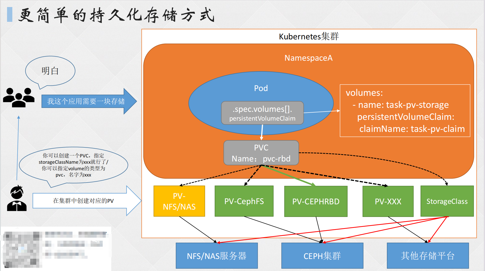

# 一、Volumes

**容器的弊端：**

1. Container (容器) 中的磁盘文件是短暂的，当容器崩溃时，kubelet 会重新启动容器，但最初的文件将丢失，Container 会以最干净的状态启动。
2. 当一个 Pod 运行多个 Container 时，各个容器可能需要共享一些文件。

**Kubernetes Volume 可以解决这两个问题。**

一些需要持久化数据的程序才会用到 Volumes，或者一些需要共享数据的容器需要 volumes。

如：Redis 分片集群模式，Redis-Cluster：nodes.conf

日志收集的需求:需要在应用程序的容器里面加一个 sidecar，这个容器是一个收集日志的容器，比如 filebeat，它通过 volumes 共享应用程序的日志文件目录。

Kubernetes Volumes 官方文档：https://kubernetes.io/docs/concepts/storage/volumes/

## 1. Docker 和 K8S 的 Volume 区别

1. **生命周期管理：**Docker的卷生命周期由其容器决定，如果容器被删除，卷并不会被自动删除。而Kubernetes的卷与Pod生命周期绑定，当Pod被删除时，其卷也会被自动删除。
2. **共享与访问：**在Docker中，每个容器都有自己的卷，无法共享卷。而在Kubernetes中，多个容器可以共享同一个卷，并且通过在每个容器的volumeMounts字段中指定相同的卷，可以实现多容器共享数据。
3. **卷类型和功能：**Kubernetes支持多种类型的卷，如EmptyDir、Secret、ConfigMap、PersistentVolumeClaim等，提供了丰富的选择和功能。而Docker的卷功能相对基础，主要关注持久存储数据的解决方案。
4. **数据持久性：**Kubernetes的卷在容器重启或销毁后仍然可以保留数据，因为其生命周期与Pod相同。而Docker的卷在容器删除后数据可能会丢失。
5. **扩展性和灵活性：**Kubernetes的卷架构更加开放和灵活，支持多种存储后端和插件机制，方便扩展和定制。而Docker的卷功能相对固定，扩展性和灵活性相对较低。

## 2. EmptyDir 容器卷

EmptyDir 卷用于 Pod 中的不同 Container 共享数据，如果删除 Pod，EmptyDir 卷中的数据也将被删除。

**使用方式：**

- 默认情况下，EmptyDir 卷支持节点上的任何介质，可以是 SSD、磁盘或网络存储，具体如何使用取决于自身的环境。
- 还可以将 emptyDir.medium 字段设置为 Memory，让 Kubernetes 使用 tmpfs（内存支持的文件系统），不过这样虽然提高性能，但因为是运行在内存中，所以数据无法持久化，且设置的大小会被计入到 Container 的内存限制中。

**使用 emptyDir 卷的示例，直接指定 emptyDir 为 {} 即可：**

```shell
[root@master pod]# vim nginx-deploy.yaml 

    app: nginx
spec:
  replicas: 1
  selector:
    matchLabels:
      app: nginx
  template:
    metadata:
      labels:
        app: nginx
    spec:
      volumes:
      - name: con-share		# 设定enptyDir卷名称
        emptyDir: {}			# emptyDir格式
       #medium: Memory		# 需要使用tmfps取消注释即可
      containers:
      - image: nginx:1.20.0
        name: nginx01
        volumeMounts:		# 为01容器配置emptyDir参数
        - name: con-share
          mountPath: /opt
      - image: nginx:1.20.0
        name: nginx02
        command:		# 当两个nginx同pod启动时，要加入sleep命令，否则会冲突
        - sh
        - -c
        - sleep 100
        volumeMounts:		# 为02容器配置emptyDir参数
        - name: con-share
          mountPath: /mnt
[root@master pod]# kubectl create -f nginx-deploy.yaml 
deployment.apps/nginx created
[root@master pod]# kubectl get po
NAME                        READY   STATUS    RESTARTS       AGE
maria-dep-9577989f4-pt8qb   1/1     Running   1 (4h3m ago)   30h
nginx-7c6c76fbd4-znqj8      2/2     Running   0              3s
wp-dep-54f5744774-b6tjd     1/1     Running   1 (4h3m ago)   30h
wp-dep-54f5744774-bft7r     1/1     Running   1 (4h3m ago)   30h
```


**挂载验证**

```shell
[root@master pod]# kubectl exec nginx-7c6c76fbd4-znqj8 -c nginx01 -- touch /opt/haha.txt
[root@master pod]# kubectl exec nginx-7c6c76fbd4-znqj8 -c nginx02 -- ls /mnt
haha.txt
```

## 3. HostPath 本地卷

HostPath 卷可将将宿主机的文件或目录挂载到 Pod 上，用于 Pod 自定义日志输出或访问 Docker 内部的容器等。

在挂载时，要注意该 Pod 是在哪个节点上运行的，要在对应的 node 上创建需要挂载的文件或目录。

**使用 hostPath 卷的示例。将主机的 /root/test.txt 挂载到 Pod 的 /tmp 下：**

- **先为两台节点分别设置标签**

```shell
[root@master pod]# kubectl label nodes k8s-node01 role=node01
node/k8s-node01 labeled
[root@master pod]# kubectl label nodes k8s-node02 role=node02
node/k8s-node02 labeled
```


- **在 node01 节点上创建 test.txt**

```shell
[root@k8s-node01 ~]# touch test.txt
[root@k8s-node01 ~]# ls
公共  视频  文档  音乐  anaconda-ks.cfg  initial-setup-ks.cfg  k8s-ha-install
模板  图片  下载  桌面  hostname.sh      ip.sh                 test.txt
```


- **修改 nginx 的 deplyment 资源**

```shell
[root@master pod]# vim nginx-deploy.yaml
apiVersion: apps/v1
kind: Deployment
metadata:
  name: nginx
  labels:
    app: nginx
spec:
  replicas: 1
  selector:
    matchLabels:
      app: nginx
  template:
    metadata:
      labels:
        app: nginx
    spec:
      nodeSelector:
        role: node01
      volumes:
      - name: host-mount
        hostPath:
          path: /root/test.txt
          type: File
      containers:
      - image: nginx:1.20.0
        name: nginx01
        volumeMounts:
        - name: host-mount
          mountPath: /tmp/test.txt
[root@master pod]# kubectl delete -f nginx-deploy.yaml
deployment.apps "nginx" deleted
[root@master pod]# kubectl create -f nginx-deploy.yaml
deployment.apps/nginx created
[root@master pod]# kubectl get po
NAME                        READY   STATUS    RESTARTS        AGE
maria-dep-9577989f4-pt8qb   1/1     Running   1 (4h18m ago)   30h
nginx-846c6c8946-g2rw8      1/1     Running   0               2s
wp-dep-54f5744774-b6tjd     1/1     Running   1 (4h18m ago)   30h
wp-dep-54f5744774-bft7r     1/1     Running   1 (4h18m ago)   30h
[root@master pod]# kubectl exec pods/nginx-846c6c8946-g2rw8 -- ls /tmp
test.txt
```

## 4. NFS 网络卷

**node02 使用 nfs 部署网络存储**

```shell
[root@k8s-node02 ~]# rpm -q nfs-utils rpcbind 
nfs-utils-2.3.3-59.el8.x86_64
rpcbind-1.2.5-10.el8.x86_64
[root@k8s-node02 ~]# systemctl start rpcbind nfs-server.service 
[root@k8s-node02 ~]# mkdir /hehe
[root@k8s-node02 ~]# vim /etc/exports
/hehe *(rw,sync,no_root_squash)
[root@k8s-node02 ~]# systemctl restart nfs-server.service 
```


**修改 yaml 文件**

```shell
[root@master pod]# showmount -e 192.168.15.33
Export list for 192.168.15.33:
/hehe *
[root@master pod]# vim nginx-deploy.yaml 

apiVersion: apps/v1
kind: Deployment
metadata:
  name: nginx
  labels:
    app: nginx
spec:
  replicas: 1
  selector:
    matchLabels:
      app: nginx
  template:
    metadata:
      labels:
        app: nginx
    spec:
      nodeSelector:
        role: node01
      volumes:
      - name: nfs-mount
        nfs:     
          server: 192.168.15.33
          path: /hehe
      containers:
      - image: nginx:1.20.0
        name: nginx01
        volumeMounts:
        - name: nfs-mount
          mountPath: /mnt
[root@master pod]# kubectl replace -f nginx-deploy.yaml 
deployment.apps/nginx replaced
[root@master pod]# kubectl get po
NAME                        READY   STATUS    RESTARTS        AGE
maria-dep-9577989f4-pt8qb   1/1     Running   1 (4h25m ago)   31h
nginx-5bfc8c4787-2sbtz      1/1     Running   0               3s
wp-dep-54f5744774-b6tjd     1/1     Running   1 (4h25m ago)   30h
wp-dep-54f5744774-bft7r     1/1     Running   1 (4h25m ago)   30h
```


**node02 在/hehe 共享目录下创建文件**

```shell
[root@k8s-node02 ~]# echo "hello,there is node02" > /hehe/hello.txt
[root@k8s-node02 ~]# cat /hehe/hello.txt 
hello,there is node02
```


**查看 Pod 是否挂载成功**

```shell
[root@master pod]# kubectl exec nginx-5bfc8c4787-2sbtz -- ls /mnt
hello.txt
[root@master pod]# kubectl exec nginx-5bfc8c4787-2sbtz -- cat /mnt/hello.txt
hello,there is node02
[root@master pod]# kubectl exec -it nginx-5bfc8c4787-5w8v9 -- bash		# master进容器建文件，验证是否可以双向数据传输
root@nginx-5bfc8c4787-5w8v9:/# cd mnt/
root@nginx-5bfc8c4787-5w8v9:/mnt# echo "hello,there is master" > hello-too.txt
root@nginx-5bfc8c4787-5w8v9:/mnt# ls
hello-too.txt  hello.txt
```


**node02 节点验证/hehe**

```shell
[root@k8s-node02 ~]# cd /hehe
[root@k8s-node02 hehe]# ls
hello-too.txt  hello.txt
[root@k8s-node02 hehe]# cat hello-too.txt 
hello,there is master
```

# 二、持久化存储 PV 和 PVC

## 1. PV 概念

- PersistentVolume，简称 PV，持久化卷，是集群中由管理员配置的一段网络共享存储资源，可以从远程的 NFS 或分布式对象存储系统中创建得来。
- PV 独立于使用 PV 的任何单个 Pod 的生命周期，删除 Pod 时，PV 不会被自动清理，可由多个 Pod 共享使用。
- PV 可以与多种存储技术配合使用，包括 NFS（Network File System）、ISCSI（Internet Small Computer System Interface）以及云提供商特定的存储系统等，且无需关心底层存储技术的实现细节。
- PV 就是从存储设备中的空间创建出的一个存储资源
- PV 分为静态和动态。

- - 静态 PV 需要手动创建和管理，适用于业务量较小的情况。
  - 在业务量较大或静态 PV 无法满足需求时，通常会选择使用动态 PV，在动态 PV 的情况下，管理员通常会创建一个或多个 StorageClass。

## 2. PVC 概念

- PersistentVolumeClaim (PVC) 是用户存储的请求。
- 在 Pod 中定义一个存储卷，该存储卷类型为 PVC。在定义时直接指定所需的大小。PVC 必须与对应的 PV 建立关系，PVC 会根据定义去 PV 申请，而 PV 是由存储空间创建出来的。
- PV 定义卷的大小，而用户可根据需求，通过 PVC 请求使用多大的 PV 卷，并且请求会根据具体使用情况来定。此时需要集群管理员提供不同需求的 PV，而不仅仅是 PV的大小和访问模式，但又不需要用户了解这些卷的实现细节。

官方文档：https://kubernetes.io/docs/concepts/storage/persistent-volumes/


## 3. 可解决的问题

- 当某个数据卷不再被挂载使用时，其内的数据可以持久化保存下来，以供下次或其他 Pod 使用。
- PV 卷可以实现指定权限的挂载，如：单 Pod 只读或多 Pod 可读可写的方式挂载等。
- PV 卷可以指定单个 Pod 挂载。
- PVC 可限制卷的大小用量，如：用户仅需要 10G 空间，而 PV 有 100G 空间，此时可以使用 PVC 来申请具体使用 PV 多少空间，可实现空间高质量分配。



## 4. PV 的访问和回收策略

- **Retain：**保留策略，该策略允许手动回收资源，当删除 PVC 时，PV 仍存在，且被视为已释放，管理员可手动回收卷或将上一个 Pod 已存储的数据提供给下一个 Pod 使用。
- **Recycle：**回收策略，如果 Volume 插件支持，Recycle 策略会对 PV 卷执行清理，并使其可用于下一个新的 PVC，但本策略将来会被弃用，目前只有 NFS 和 HostPath 支持该策略。
- **Delete：**删除策略，删除 PVC 时会同时删除 PV，动态卷默认为 Delete，目前支持的后端存储包括 AWS EBS、GCE PD、Azure Disk、OpenStack Cinder 等。

**可通过 persistentVolumeReclaimPolicy: Recycle 字段配置**

官方文档：https://kubernetes.io/docs/concepts/storage/persistent-volumes/#reclaim-policy

## 5. PV 访问策略

- **ReadWriteOnce：**缩写 RWO，可以被单节点以读写模式挂载。
- **ReadOnlyMany：**缩写 ROX，可被多个节点以只读模式挂载。
- **ReadWriteMany：**缩写 RWX，可被多个节点以读写模式挂载。
- **ReadWriteOncePod：**只允许被单个 Pod 访问，需要 K8S 1.22+以上版本，并且时 CSI 创建的 PV 才可使用。

官方文档：https://kubernetes.io/docs/concepts/storage/persistent-volumes/#access-modes

## 6. 存储分类

- **文件存储：**一些数据可能需要被多个节点使用，比如用户上传的文件等。（实现方式：NFS、NAS、FTP、CephFS 等）
- **块存储：**一些数据只能被一个节点使用，或将一块硬盘整个挂载使用，比如数据库、redis 等。（实现方式：Ceph、ClusterFS、公有云）
- **对象存储：**由程序代码直接实现的一种存储方式，云原生应用无状态化常用的实现方式。（实现方式：一般是符合 S3 协议的云存储，如 AWS 的 S3 存储、Minio、七牛云等）

# 三、PV 配置——NFS

## 1. 配置 NFS 节点

**（在生产环境中，这类网络存储要保证安全性高的节点，且存储量尽量要大）**

```shell
[root@YH1 ~]# rpm -q nfs-utils rpcbind
nfs-utils-2.3.3-57.el8.x86_64
rpcbind-1.2.5-10.el8.x86_64
[root@YH1 ~]# systemctl enable --now rpcbind nfs-server.service 
Created symlink /etc/systemd/system/multi-user.target.wants/nfs-server.service → /usr/lib/systemd/system/nfs-server.service.
[root@YH1 ~]# mkdir /k8s-volume
[root@YH1 ~]# vim /etc/exports
/k8s_volume *(rw,sync,no_root_squash)
[root@YH1 ~]# systemctl restart nfs-server.service 
[root@YH1 ~]# showmount -e 192.168.15.101
Export list for 192.168.15.101:
/k8s_volume 192.168.15.*
[root@YH1 ~]# systemctl enable --now firewalld.service 	# 开启防火墙
Created symlink /etc/systemd/system/dbus-org.fedoraproject.FirewallD1.service → /usr/lib/systemd/system/firewalld.service.
Created symlink /etc/systemd/system/multi-user.target.wants/firewalld.service → /usr/lib/systemd/system/firewalld.service.
[root@YH1 ~]# firewall-cmd --zone=internal --change-interface=ens32 
success
[root@YH1 ~]# firewall-cmd --zone=internal --add-service=nfs
success
[root@YH1 ~]# firewall-cmd --zone=public --list-services 
cockpit dhcpv6-client nfs ssh
# 为nfs主机添加防火墙规则，放行nfs服务
```

## 2. 定义 PV 卷

```shell
[root@master pod]# vim pv-nfs.yaml 

apiVersion: v1
kind: PersistentVolume		# 类型：PV卷
metadata:
  name: pv-nfs
spec:
  capacity:		# 容量配置
    storage: 7Gi		# PV容量大小
  volumeMode: Filesystem		# 卷模式，目前支持Filesystem(文件系统)和Block(块存储)，块存储需要后端存储支持，默认为文件系统
  accessModes:		# 访问模式
  - ReadWriteOnce		# 只允许被单节点以读写权限访问
  persistentVolumeReclaimPolicy: Recycle		# 回收策略
  storageClassName: nfs-slow		# PV卷名
  nfs:		# NFS挂载配置
    path: /k8s_volume		# NFS存储的挂载源
    server: 192.168.15.101		# NFS服务器的IP
[root@master pod]# kubectl create -f pv-nfs.yaml 
persistentvolume/pv-nfs created
[root@master pod]# kubectl get pv
NAME     CAPACITY   ACCESS MODES   RECLAIM POLICY   STATUS      CLAIM   STORAGECLASS   REASON   AGE
pv-nfs   7Gi        RWO            Recycle          Available           nfs-slow                4s
# PV的状态：
# Available：可⽤，没有被PVC绑定的空闲资源。
# Bound：已绑定，已经被PVC绑定。
# Released：已释放，PVC被删除，但是资源还未被重新使⽤。
# Failed：失败，⾃动回收失败。
```

## 3. 定义 PVC 请求

```shell
[root@master pod]# vim pvc-nfs.yaml

apiVersion: v1
kind: PersistentVolumeClaim		# 该资源类型：PVC
metadata:
  name: pvc-nfs
spec:
  storageClassName: nfs-slow		# 指定PV卷名
  accessModes:		# 访问模式
  - ReadWriteOnce
  resources:		# 资源限制
    requests:		# 请求量
      storage: 4Gi		# 请求PV的最终容量，不可超过PV定义的存储卷容量大小
[root@master pod]# kubectl create -f pvc-nfs.yaml
persistentvolumeclaim/pvc-nfs created
[root@master pod]# kubectl get pvc
NAME      STATUS   VOLUME   CAPACITY   ACCESS MODES   STORAGECLASS   AGE
pvc-nfs   Bound    pv-nfs   7Gi        RWO            nfs-slow       5s
```

此时，Pod 等资源就可以使用 PVC 挂载 PV 卷了

## 4. 创建容器资源

```shell
[root@master pod]# vim nginx-deploy.yaml 

apiVersion: apps/v1
kind: Deployment
metadata:
  name: nginx
  labels:
    app: nginx
spec:
  replicas: 1
  selector:
    matchLabels:
      app: nginx
  template:
    metadata:
      labels:
        app: nginx
    spec:
      volumes:
      - name: nfs-mount
        persistentVolumeClaim:
          claimName: pvc-nfs
      containers:
      - image: nginx:1.20.0
        name: nginx01
        volumeMounts:
        - name: nfs-mount
          mountPath: /usr/share/nginx/html
[root@master pod]# kubectl create -f nginx-deploy.yaml 
deployment.apps/nginx created
[root@master pod]# kubectl get po
NAME                        READY   STATUS    RESTARTS       AGE
maria-dep-9577989f4-pt8qb   1/1     Running   4 (107m ago)   2d6h
nginx-85469954d7-8jskh      1/1     Running   0              13s
wp-dep-54f5744774-b6tjd     1/1     Running   4 (107m ago)   2d5h
wp-dep-54f5744774-bft7r     1/1     Running   4 (107m ago)   2d5h
```

## 5. 测试 NFS 挂载结果

**在 NFS 服务器内创建文件**

```shell
[root@YH1 ~]# cd /k8s_volume/
[root@YH1 k8s_volume]# echo "123qwe" > index.html
```


**回到容器查看文件是否创建**

```shell
[root@master pod]# kubectl exec pods/nginx-65f99c675c-24n9s -- cat /usr/share/nginx/html/index.html
123qwe
[root@master pod]# kubectl get po -o wide
NAME                        READY   STATUS    RESTARTS       AGE     IP              NODE         NOMINATED NODE   READINESS GATES
maria-dep-9577989f4-pt8qb   1/1     Running   4 (114m ago)   2d6h    172.16.58.218   k8s-node02   <none>           <none>
nginx-65f99c675c-24n9s      1/1     Running   0              3m56s   172.16.58.222   k8s-node02   <none>           <none>
wp-dep-54f5744774-b6tjd     1/1     Running   4 (115m ago)   2d5h    172.16.85.198   k8s-node01   <none>           <none>
wp-dep-54f5744774-bft7r     1/1     Running   4 (114m ago)   2d5h    172.16.58.220   k8s-node02   <none>           <none>
[root@master pod]# curl 172.16.58.222
123qwe
```

# 四、PV 配置——HostPath

[HostPath持久化挂载.pdf](https://www.yuque.com/attachments/yuque/0/2024/pdf/27632550/1704723364423-58b5240b-67d5-42f6-87be-0c86d4a8567c.pdf)

# 五、PVC 创建和挂载失败的原因

1. PVC 一直 Pending 的原因：

- - PVC 的空间申请大小超过 PV 的大小。
  - PVC 的 StorageClassName 没有和 PV 的一致。
  - PVC 的 accessModes 和 PV 不一致。

1. 挂载 PVC 的 Pod 一直处于 Pending：

- - PVC 没有创建成功/PVC 不存在。
  - PVC 和 Pod 不在同一个 Namespace。