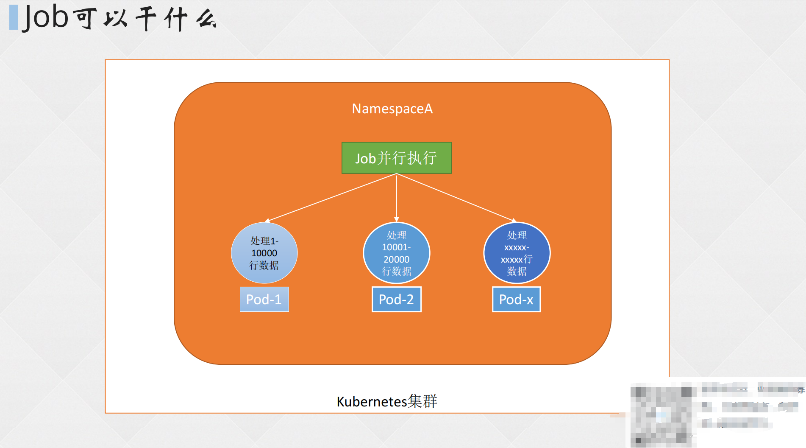
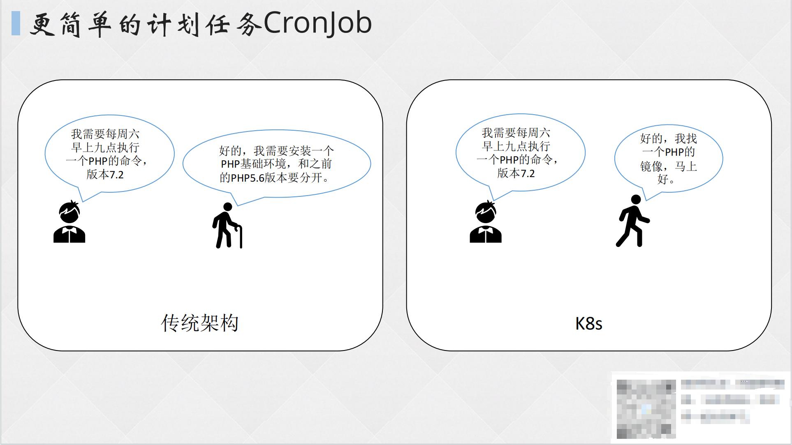
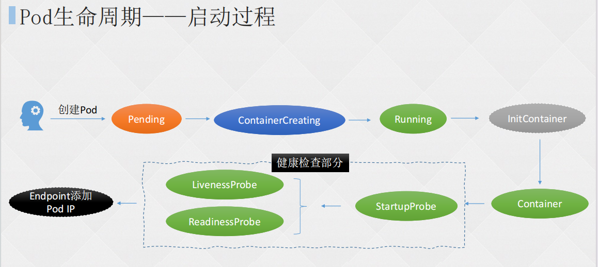
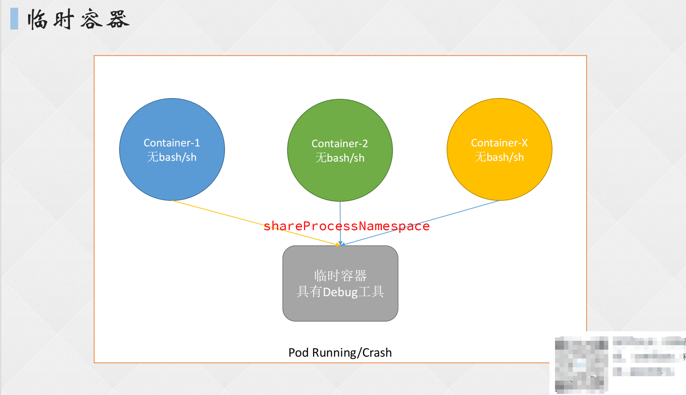

# 一、Job

## 1. Job 概念

Kubernetes 中使用 Job 和 CronJob 两个资源分别定义了一次性任务和定时任务，这两种资源对象使用控制器来实现资源的管理。

Job 负责批量处理短暂的一次性任务，它适用于执行短暂、一次性任务，如数据导入、日志处理等。Job 的目标是确保批处理任务的一个或多个 Pod 成功完成。



## 2. Job 特点

1. **确保成功完成**：Job 保证至少有一个 Pod 成功完成，即使其他 Pod 失败。如果某个 Pod 失败，Job 会重新启动一个新的 Pod 来完成任务。
2. **一次性和短暂**：Job 旨在处理一次性任务，这些任务通常是短暂的，执行完成后就会结束。
3. **状态管理**：通过 Job 的状态，你可以了解任务的当前状态（如成功、失败或正在进行中）。
4. **自动重启**：如果 Pod 失败，Job 会自动重启一个新的 Pod 来完成任务。
5. **并行处理**：你可以配置 Job 以并行运行多个 Pod，以提高处理能力。

## 3. Job 的模式

| **Job 类型**           | **使用示例**              | **行为**                                          | **完成数量** | **并行处理数量** |
| ---------------------- | ------------------------- | ------------------------------------------------- | ------------ | ---------------- |
| 一次性 Job             | 数据库迁移                | 创建**一个** Pod 直至其成功结束                   | 1            | 1                |
| 固定结束次数的 Job     | 处理工作队列的 Pod        | 依次创建**一个** Pod 直至目标完成数量成功结束任务 | 2+           | 1                |
| 固定结束次数的并行 Job | 多个 Pod 同时处理工作队列 | 依次创建**多个** Pod 直至目标完成数量成功结束任务 | 2+           | 2+               |
| 并行 Job               | 多个 Pod 同时处理工作队列 | 创建一个或多个 Pod 直至有一个成功结束             | 1            | 2+               |

## 4. 创建 Job

```shell
[root@master pod]# vim job.yaml 

apiVersion: batch/v1
kind: Job
metadata:
  labels:
    job-name: echo
  name: echo
  namespace: default
spec:
  #ttlSecondsAfterFinished: 5		# Job在执行结束后自动清理。设置为0表示立即清理，以秒为单位，需要开启TTLAfterFinished特性
  backoffLimit: 4		# 如果任务失败，失败多少次后不再执行
  completions: 1		# 有多少Pod执行成功，认为任务是成功的
# 为空默认和parallelism数值一样
  parallelism: 1		# 并行执行任务的数量
# 如果parallelism数值⼤于未完成任务数，只会创建未完成的数量；⽐如completions是4，并发是3，第⼀次会创建3个Pod执⾏任务，第⼆次只会创建⼀个Pod执⾏任务 
  template:
    spec:
      containers:
      - command:
        - echo
        - Hello, Job
        image: busybox
        imagePullPolicy: IfNotPresent
        name: echo
        resources: {}
      restartPolicy: Never
[root@master pod]# kubectl create -f job.yaml 
job.batch/echo created
[root@master pod]# kubectl get po		# 新建的容器执行一次echo命令，完成便退出
NAME                        READY   STATUS      RESTARTS      AGE
echo-r4rpd                  0/1     Completed   0             4s
[root@master pod]# kubectl logs echo-r4rpd 
Hello, Job
```

# 二、CronJob

## 1. CronJob 概念

CronJob 是基于时间进行任务的定时管理：

- 在特定的时间点运行任务
- 反复在指定的时间点运行任务:比如定时进行数据库备份，定时发送电子邮件等等。
- CronJob 类似于 Linux 系统内的 Crontab，其格式也基本相同。
- CronJob 使用 Job 对象来完成任务，每次运行时都会创建一个 Job 对象，该 Job 对象会创建一个 Pods 来执行任务，任务执行完成后容器会被停止。CronJob 非常适合用于自动执行任务，例如备份、报告、发送电子邮件或清理任务。



## 2. 创建 CronJob

```shell
[root@master pod]# vim cronjob.yaml
apiVersion: batch/v1
kind: CronJob
metadata:
  labels:
    run: hello
  name: hello
  namespace: default
spec:
  schedule: '*/1 * * * *'		# 调度周期，“*”代表分时日月周
  successfulJobsHistoryLimit: 3		# 保留多少已完成的任务，按需配置
  suspend: false		# 如果设置为true，则暂停后续的任务，默认为false
  concurrencyPolicy: Allow		# 并发调度策略
# 并发调度策略，可选参数如下：
# Allow：允许同时运⾏多个任务。
# Forbid：不允许并发运⾏，如果之前的任务尚未完成，新的任务不会被创建。
# Replace：如果之前的任务尚未完成，新的任务会替换的之前的任务。
  failedJobsHistoryLimit: 1		# 保留多少失败任务
  jobTemplate:
    metadata:
    spec:
      template:
        metadata:
          labels:
            run: hello
        spec:
          containers:
          - args:
            - /bin/sh
            - -c
            - date; echo Hello from the Kubernetes cluster
            image: busybox
            imagePullPolicy: IfNotPresent
            name: hello
            resources: {}
          restartPolicy: OnFailure
[root@master pod]# kubectl create -f cronjob.yaml 
cronjob.batch/hello created
[root@master pod]# kubectl get cj
NAME    SCHEDULE      SUSPEND   ACTIVE   LAST SCHEDULE   AGE
hello   */1 * * * *   False     0        <none>          6s
```

# 三、初始化容器 InitContainer

## 1. 初始化容器用途

初始化容器（InitContainer）的主要用途是在主容器启动之前执行一些初始化任务。这些任务可以包括配置文件的准备、数据的预处理、网络设置等。

**具体用途：**

1. 包含一些安装过程中应用容器中不存在的实用工具或个性化代码。
2. 安全地运行这些工具，避免这些工具导致应用镜像的安全性降低。
3. 以root身份运行，执行一些高权限命令。
4. 初始化容器相关操作执行完成以后即退出，不会给业务容器带来安全隐患。

## 2. 初始化容器和 PostStart 区别

- PostStart：依赖主应用的环境，而且并不一定先于Command运行。
- lnitContainer：不依赖主应用的环境，可以有更高的权限和更多的工具，一定会在主应用启动之前完成。

## 3. 初始化容器和普通容器的区别

1. **生命周期：**初始化容器在 Pod 中其他容器之前启动，并在所有初始化任务完成后退出。而普通容器则一直运行，直到被手动停止或发生错误导致崩溃。
2. **执行任务：**初始化容器主要负责在 Pod 中其他容器启动之前完成一些预先定义的任务，例如初始化数据库表、加载配置文件或进行网络连接检查。这些任务通常是必要的，以确保应用程序在启动时拥有正确的环境。普通容器则主要负责运行应用程序本身。
3. **运行方式：**所有的初始化容器会按照定义的顺序逐个运行，只有在前一个容器运行成功后，下一个容器才会开始执行。而普通容器则是并发启动的。
4. **重启策略：**如果 Pod 的 Init 容器失败，Kubernetes 会不断地重启该 Pod，直到 Init 容器成功为止。然而，如果 Pod 的 restartPolicy 的值为 Never，Kubernetes 不会重新启动Pod。
5. **资源限制和策略设置：**在初始化容器的定义中也可以设置资源限制、Volume的使用和安全策略等，但这些设置与应用容器的资源限制和策略设置有所不同。



## 4. 创建初始化容器

```shell
[root@master pod]# vim nginx-deploy.yaml
apiVersion: apps/v1
kind: Deployment
metadata:
  name: nginx
  labels:
    app: nginx
spec:
  replicas: 1
  selector:
    matchLabels:
      app: nginx
  template:
    metadata:
      labels:
        app: nginx
    spec:
      volumes: 
      - name: init-volume
        emptyDir: {}		# 设置一个pod到pod的挂载策略
      initContainers: 	# init容器配置，与普通容器配置相差无几
      - command: 		# 容器启动前执行的命令
        - sh 
        - -c
        - touch /mnt/test-init.txt
        image: nginx
        name: init-test
        volumeMounts: 
        - name: init-volume		# 挂载提前设定好的emptyDir
          mountPath: /mnt
      containers:		# 普通容器
      - image: nginx:1.20.0
        name: nginx01
        volumeMounts: 
        - name: init-volume
          mountPath: /mnt
[root@master pod]# kubectl create -f nginx-deploy.yaml 
deployment.apps/nginx created
[root@master pod]# kubectl exec nginx-67f9b78699-r8kbm -- ls /mnt
Defaulted container "nginx01" out of: nginx01, init-test (init)
test-init.txt
```

# 四、临时容器



**临时容器是一种特殊的容器，它在现有Pod中临时运行，以便完成用户发起的操作，例如故障排查。**与普通容器不同，临时容器主要用于检查服务，而不是用于构建应用程序。

当由于容器崩溃或容器镜像不包含调试工具而导致 kubectl exec 命令无用时。此时可以使用临时容器进行交互式故障排查。

临时容器的另一个优点是，由于它们在Pod 中临时运行，因此*不会占用任何持久资源或自动重启。*

**注意：**由于临时容器的生命周期有限且不可预测，因此它们不适用于构建应用程序。此外，临时容器在使用上也存在一些限制，例如它们没有端口配置，不允许使用诸如 livenessProbe 或 readinessProbe 之类的指针字段。

## 1. 开启临时容器

**注意：**1.25+不需要开启！ 

```shell
⼆进制：
vim /usr/lib/systemd/system/kube-apiserver.service
--feature-gates=EphemeralContainers=true

vim /etc/kubernetes/kubelet-conf.yml
featureGates:
EphemeralContainers: true

kubeadm:
vim /etc/kubernetes/manifests/kube-apiserver.yaml
--feature-gates=EphemeralContainers=true
vim /var/lib/kubelet/config.yaml
featureGates:
  EphemeralContainers: true
```

## 2. 使用 Pod 临时容器

```shell
[root@master pod]# vim nginx-deploy.yaml 

apiVersion: apps/v1
kind: Deployment
metadata:
  name: nginx
  labels:
    app: nginx
spec:
  replicas: 1
  selector:
    matchLabels:
      app: nginx
  template:
    metadata:
      labels:
        app: nginx
    spec:
      containers:
      - image: nginx:1.20.0
        name: nginx01
[root@master pod]# kubectl create -f nginx-deploy.yaml 
deployment.apps/nginx created
[root@master pod]# kubectl exec -it nginx-5bdd68b495-drmtw -- bash
root@nginx-5bdd68b495-drmtw:/# netstat -anpt 
bash: netstat: command not found
# 容器内是没有netstat等一些系统排查的命令的

[root@master pod]# kubectl debug nginx-5bdd68b495-drmtw -it --image=busybox
Defaulting debug container name to debugger-td4nt.
If you dont see a command prompt, try pressing enter.
/ # 
/ # 
/ # netstat -anpt
Active Internet connections (servers and established)
Proto Recv-Q Send-Q Local Address           Foreign Address         State       PID/Program name    
tcp        0      0 0.0.0.0:80              0.0.0.0:*               LISTEN      -
tcp        0      0 :::80                   :::*                    LISTEN      -
# 使用busybox作为临时容器，即可使用netstat等命令
```

## 3. 使用临时容器运行 node

```shell
[root@master pod]# kubectl debug node/k8s-node02 -it --image=registry.cn-beijing.aliyuncs.com/dotbalo/debug-tools
Creating debugging pod node-debugger-k8s-node02-bgfx9 with container debugger on node k8s-node02.
If you don't see a command prompt, try pressing enter.
(130 09:09 k8s-node02:/) 
```