# 一、生产环境的调度规则

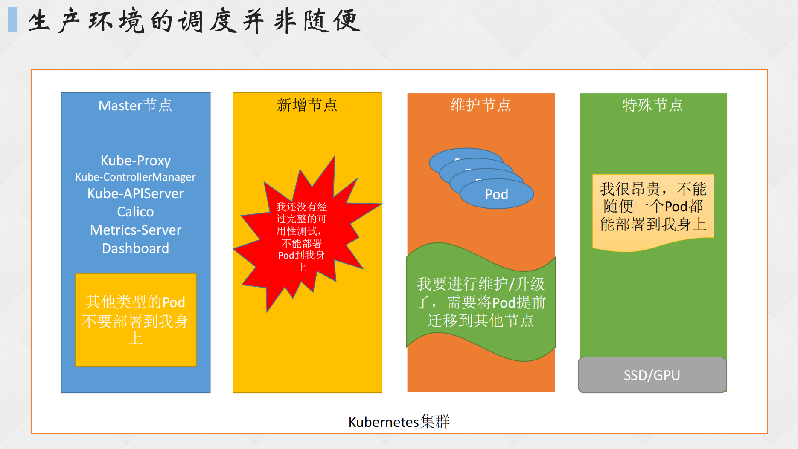

# 二、污点和容忍

**亲和性：**在 Kubernetes 集群中，节点亲和性 NodeAffinity 是 Pod 上定义的一种属性，能够使 Pod 按要求调度到某个节点上。

**污点：**Taints 是 Node 上的一个属性，可以让 Pod 不能调度到带污点的节点上，甚至会对带污点的节点上的 Pod 进行驱逐。

**容忍度：**Pod 可设置 Toleration 容忍度属性来让 Pod 能够容忍节点上设置的污点，此时该节点便可被调度。

**官方文档：**https://kubernetes.io/docs/concepts/scheduling-eviction/taint-and-toleration/

## 1. 配置解析

**创建污点格式**（一个节点可以有多个污点）

- kubectl taint nodes 节点名 污点key=污点value:模式

**举例：**

- kubectl taint nodes k8s-node01 ssd=true:NoSchedule

**模式：**

- **NoSchedule：**禁止调度到该节点，已经在该节点上的 Pod 不受影响。
- **NoExecute：**禁止调度到该节点，如果不符合这个污点，会立马被驱逐，也可能在一段时间后被驱逐。
- **PreferNoSchedule：**尽量避免将 Pod 调度到该节点上，如果没有更合适的节点，可以部署到该节点。

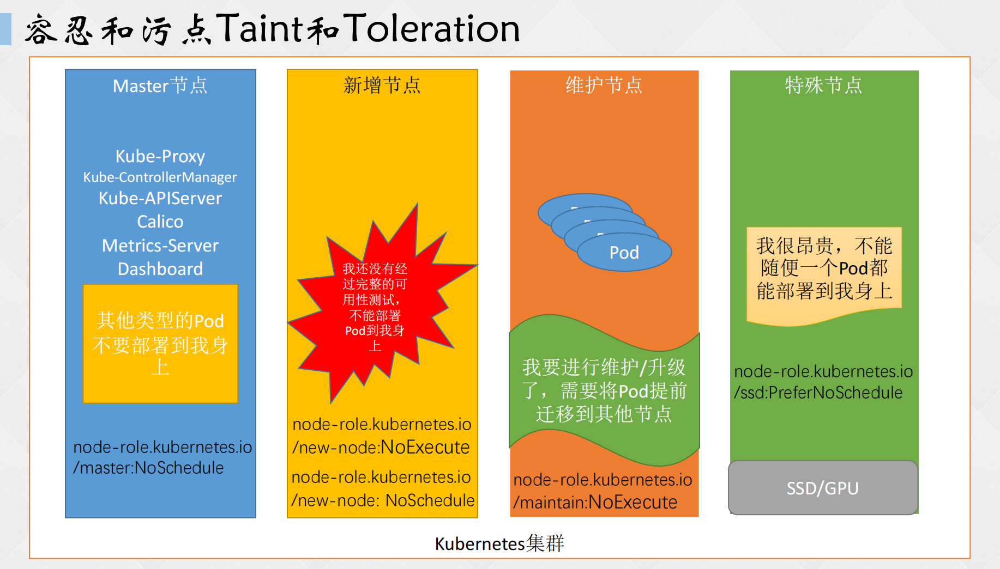

## 2. Toleration 配置解析

### （1）完全匹配

```shell
tolerations:
- key: "ssd"		# 键
  operator: "Equal"		# Equal：等于
  value: "true"		# 值
  effect: "NoSchedule"		# 禁调度
# 若Pod设置以上容忍度规则，优先调度到其他没有污点的节点，但如果其他节点都存在污点，那么优先调度到有ssd=true：NoSchedule这个污点的node上
```

### （2）不完全匹配

```shell
tolerations:
- key: "ssd"		# 键
  operator: "Exists"		# Exists：存在
  effect: "NoSchedule"	# 禁调度
# 当某个node存在ssd这个键且污点模式为禁调度时，而Pod设置以上容忍度便会调度到有ssd这个污点的节点上
```

### （3）大范围匹配

此匹配模式不推荐 key 为内置 Taint

```shell
tolerations:
- key: "ssd"		# 键
  operator: "Exists"		# Exists
# 不论调度模式，只要某个node节点存在ssd这个污点，Pod设置以上容忍度便会调度到该节点，前提是其他节点都存在污点
```

### （4）匹配所有(不推荐)

```shell
tolerations:
- operator: "Exists"
# 所有存在污点的node都被视为可调度对象
```

### （5）停留时间配置

```shell
tolerations:
- key: "key1"
  operator: "Equal"
  value: "value1"
  effect: "NoExecute"
  tolerationSeconds: 3600		
# 当设置了该参数后，pod调度到有key1=value1：NoExecute这个污点的节点上时，只能停留3600秒，过了时间后即被驱逐。
```

## 3. 污点案例

有一个节点是纯SSD硬盘的节点，现需要只有一些需要高性能存储的 Pod 才能调度到该节点上

**给节点设置污点和标签：**

1. kubectl taint nodes k8s-node01 ssd=true:NoExecute（此时会驱逐没有容忍该污点的 Pod）
2. kubectl taint nodes k8s-node01 ssd=true:NoSchedule
3. kubectl label node k8s-node01 ssd=true

### （1）node01 设置污点

```shell
[root@master pod]# kubectl get po -owide
NAME                        READY   STATUS    RESTARTS      AGE    IP              NODE         NOMINATED NODE   READINESS GATES
maria-dep-9577989f4-pt8qb   1/1     Running   7 (24m ago)   3d7h   172.16.58.254   k8s-node02   <none>           <none>
wp-dep-54f5744774-b6tjd     1/1     Running   7 (24m ago)   3d6h   172.16.85.211   k8s-node01   <none>           <none>
wp-dep-54f5744774-bft7r     1/1     Running   7 (24m ago)   3d6h   172.16.58.212   k8s-node02   <none>           <none>
# 未设置污点前，wp-dep-54f5744774-b6tjd这个pod还在node01上
[root@master pod]# kubectl taint node k8s-node01 ssd=true:NoSchedule
node/k8s-node01 tainted
[root@master pod]# kubectl taint node k8s-node01 ssd=true:NoExecute
node/k8s-node01 tainted
[root@master pod]# kubectl get po -owide
NAME                        READY   STATUS    RESTARTS      AGE    IP              NODE         NOMINATED NODE   READINESS GATES
maria-dep-9577989f4-pt8qb   1/1     Running   7 (25m ago)   3d7h   172.16.58.254   k8s-node02   <none>           <none>
wp-dep-54f5744774-bft7r     1/1     Running   7 (25m ago)   3d6h   172.16.58.212   k8s-node02   <none>           <none>
wp-dep-54f5744774-jskcx     1/1     Running   0             3s     172.16.58.216   k8s-node02   <none>           <none>
# 设置污点后，wp-dep-54f5744774-b6tjd从node01上被驱逐，在node02上新建了一个相同pod
[root@master pod]# kubectl label nodes k8s-node01 ssd=true
node/k8s-node01 labeled
```

### （2）Pod 设置容忍度

```shell
[root@master pod]# vim nginx-deploy.yaml 

apiVersion: apps/v1
kind: Deployment
metadata:
  name: nginx
  labels:
    app: nginx
spec:
  replicas: 1
  selector:
    matchLabels:
      app: nginx
  template:
    metadata:
      labels:
        app: nginx
    spec:
      nodeSelector:		# node标签选择器
        ssd: "true"
      tolerations:		# 容忍度
      - key: "ssd"		# 键=ssd
        operator: "Exists"		# 键存在
      containers:
      - image: nginx:1.20.0
        name: nginx01
[root@master pod]# kubectl create -f nginx-deploy.yaml 
deployment.apps/nginx created
[root@master pod]# kubectl get po -o wide 
NAME                        READY   STATUS    RESTARTS      AGE     IP              NODE         NOMINATED NODE   READINESS GATES
maria-dep-9577989f4-pt8qb   1/1     Running   7 (31m ago)   3d7h    172.16.58.254   k8s-node02   <none>           <none>
nginx-85dd8cd6dc-6v74n      1/1     Running   0             100s    172.16.85.212   k8s-node01   <none>           <none>
wp-dep-54f5744774-bft7r     1/1     Running   7 (31m ago)   3d7h    172.16.58.212   k8s-node02   <none>           <none>
wp-dep-54f5744774-jskcx     1/1     Running   0             5m56s   172.16.58.216   k8s-node02   <none>           <none>
# 可以看到nginx-deployment被调度到了node01上
```

## 4. 内置污点

当节点处于某个状态时，会自动标记以下污点：

- **node.kubernetes.io/not-ready：**节点未准备好时，系统标记的污点。
- **node.kubernetes.io/unreachable：**节点状态为 UnKnown（未知）。
- **node.kubernetes.io/out-of-disk：**节点磁盘耗尽。
- **node.kubernetes.io/memory-pressure：**节点存在内存压力。
- **node.kubernetes.io/disk-pressure：**节点存在磁盘压力。
- **node.kubernetes.io/network-unavailable：**节点网络不可用。
- **node.kubernetes.io/unschedulable：**节点不可调度
- **node.cloudprovider.kubernetes.io/uninitialized：**指示节点尚未由云控制器管理器初始化。当 kubelet 从外部云服务提供程序启动时，它会自动为节点添加此污点，一旦云控制器管理器中的控制器初始化这个节点后，kubelet 将删除这个污点。
- **node-role.kubernetes.io/control-plane:NoSchedule：**Master 的自带污点，表示这个节点为控制平面节点，只负责管理集群的状态和调度工作，不接受 Pod 调度到该节点。

```shell
kubectl describe nodes master | grep Taint
# 若存在多行污点，grep加-A参数
```

## 5. 节点宕机设置业务高可用

**编辑 deployment yaml 文件**

```shell
[root@master pod]# vim nginx-deploy.yaml 
apiVersion: apps/v1
kind: Deployment
metadata:
  name: nginx
  labels:
    app: nginx
spec:
  replicas: 1
  selector:
    matchLabels:
      app: nginx
  template:
    metadata:
      labels:
        app: nginx
    spec:
      nodeSelector: 
        ssd: "true"
      tolerations:
      - key: "ssd"	
        operator: "Exists"
      - key: node.kubernetes.io/unreachable		# 节点状态未知的污点容忍度
        effect: NoExecute		# 驱逐模式
        operator: "Exists"	# 该污点存在
        tolerationSeconds: 10		# 存在该容忍度时，10秒后被驱逐
      - effect: NoExecute
        key: node.kubernetes.io/not-ready
        operator: Exists
        tolerationSeconds: 10
      containers:
      - image: nginx:1.20.0
        name: nginx01
[root@master pod]# kubectl replace -f nginx-deploy.yaml 
deployment.apps/nginx replaced
[root@master pod]# kubectl get po -o wide 
NAME                        READY   STATUS    RESTARTS      AGE    IP              NODE         NOMINATED NODE   READINESS GATES
maria-dep-9577989f4-pt8qb   1/1     Running   7 (47m ago)   3d7h   172.16.58.254   k8s-node02   <none>           <none>
nginx-5d744d659b-mnsgj      1/1     Running   0             9s     172.16.85.217   k8s-node01   <none>           <none>
wp-dep-54f5744774-bft7r     1/1     Running   7 (47m ago)   3d7h   172.16.58.212   k8s-node02   <none>           <none>
wp-dep-54f5744774-jskcx     1/1     Running   0             22m    172.16.58.216   k8s-node02   <none>           <none>
```


**关闭 Node01 节点，测试 Pod 状态**

```shell
[root@master pod]# kubectl get nodes
NAME         STATUS     ROLES           AGE   VERSION
k8s-node01   NotReady   <none>          19d   v1.28.2
k8s-node02   Ready      <none>          19d   v1.28.2
master       Ready      control-plane   19d   v1.28.2
[root@master pod]# kubectl get po -o wide 
NAME                        READY   STATUS        RESTARTS      AGE     IP              NODE         NOMINATED NODE   READINESS GATES
maria-dep-9577989f4-pt8qb   1/1     Running       7 (49m ago)   3d7h    172.16.58.254   k8s-node02   <none>           <none>
nginx-5d744d659b-mnsgj      1/1     Terminating   0             2m10s   172.16.85.217   k8s-node01   <none>           <none>
nginx-5d744d659b-mrpqh      0/1     Pending       0             6s      <none>          <none>       <none>           <none>
wp-dep-54f5744774-bft7r     1/1     Running       7 (49m ago)   3d7h    172.16.58.212   k8s-node02   <none>           <none>
wp-dep-54f5744774-jskcx     1/1     Running       0             24m     172.16.58.216   k8s-node02   <none>           <none>
# 退出了一个nginx，又新建了一个nginx，但由于容忍度的缘故，所以状态变为Pending待定
```


**启动 node01 节点后，由于 ssd=true 这个污点标签，且 node01 不是 NotReady 状态，所以 Pod 也会启动**

```shell
[root@master pod]# kubectl get nodes
NAME         STATUS   ROLES           AGE   VERSION
k8s-node01   Ready    <none>          19d   v1.28.2
k8s-node02   Ready    <none>          19d   v1.28.2
master       Ready    control-plane   19d   v1.28.2
[root@master pod]# kubectl get po -o wide 
NAME                        READY   STATUS    RESTARTS      AGE     IP              NODE         NOMINATED NODE   READINESS GATES
maria-dep-9577989f4-pt8qb   1/1     Running   7 (53m ago)   3d7h    172.16.58.254   k8s-node02   <none>           <none>
nginx-5d744d659b-mrpqh      1/1     Running   0             4m23s   172.16.85.224   k8s-node01   <none>           <none>
wp-dep-54f5744774-bft7r     1/1     Running   7 (53m ago)   3d7h    172.16.58.212   k8s-node02   <none>           <none>
wp-dep-54f5744774-jskcx     1/1     Running   0             28m     172.16.58.216   k8s-node02   <none>           <none>
```

## 6. Taint 常用命令

**增：**

- 创建一个污点：kubectl taint nodes NODE_NAME TAINT_KEY=TAINT_VALUE:EFFECT
- 比如：kubectl taint nodes k8s-node01 ssd=true:PreferNoSchedule

**删：**

- 基于 Key 删除：kubectl taint nodes k8s-node01 ssd-
- 基于 Key+Effect 删除：kubectl taint nodes k8s-node01 ssd:PreferNoSchedule-

**改：**

- 注意：Key 和 Effect 要相同，只能修改 Value，否则会新建污点
- 修改污点：kubectl taint nodes k8s-node01 ssd=false:NoSchedule --overwrite

**查：**

- kubectl get node k8s-node01 -o go-template --template '{{.spec.taints}}'（太长且复杂，懒得用）
- kubectl describe node k8s-node01 | grep Taints -A 10（有几个污点最后数字就写多少）

# 三、K8S 亲和力 Affinity

## 1. K8S 集群存在的问题

### （1）Pod 与节点之间的关系

- 某些 Pod 优先选择 ssd=true 标签的节点，其次考虑部署到其他节点。
- 某些 Pod 需要部署在 ssd=true 和 type=physical 的节点上，但需要优先部署在 ssd=true 的节点上。

### （2）Pod 与 Pod 之间的关系

- 同一应用的 Pod 的不同副本容器，或同一项目的应用尽量可能不必须部署在同一节点，也可能部署在符合某个标签的一类节点上，甚至可以是不同的区域。
- 相互依赖的两个 Pod 尽量或必须部署在同一节点上或同一域内。

## 2. Affinity 亲和力

Kubernetes 中的亲和性（Affinity）是一种调度策略，用于控制 Pod 在集群中的部署位置。它通过使用标签（Label）来定义 Pod 与节点或其他 Pod 之间的匹配规则。

**亲和力类型：**

- NodeAffinity：节点亲和力/反亲和力
- PodAffinity：Pod 亲和力
- PodAntiAffinity：Pod 反亲和力

**注意：**亲和力是根据节点的标签或 Pod 的标签来决定部署规则，而污点是根据自定义的污点或系统发配的污点来决定部署规则，二者定义不要混淆！

## 3. 软亲和力和硬亲和力

**硬亲和力：**硬亲和力实现的是强制性规则，它是Pod调度时必须要满足的规则。在不存在满足规则的节点时，Pod 对象会被置为 Pending 状态。这意味着如果一个 Pod 的硬亲和性规则无法满足，那么这个Pod 将无法被调度。

**软亲和力：**软亲和力规则实现的是一种柔性调度限制，它倾向于将 Pod 对象运行于某类特定的节点之上，而调度器也将尽量满足此需求。如果在无法满足调度需求时，调度器会退而求其次地选择一个不匹配规则的节点。软亲和性是一种非强制性的规则，它为调度器提供了一种优先级和偏好，而不是绝对的要求。

## 4. Affinity 分类

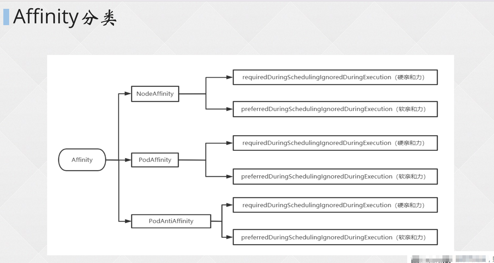

## 5. Affinity 可处理的问题

### （1）提高集群可用性

将资源根据亲和性的调度，分别部署到不同节点，即使其中一台主机宕机，其他节点的应用依旧可使用。

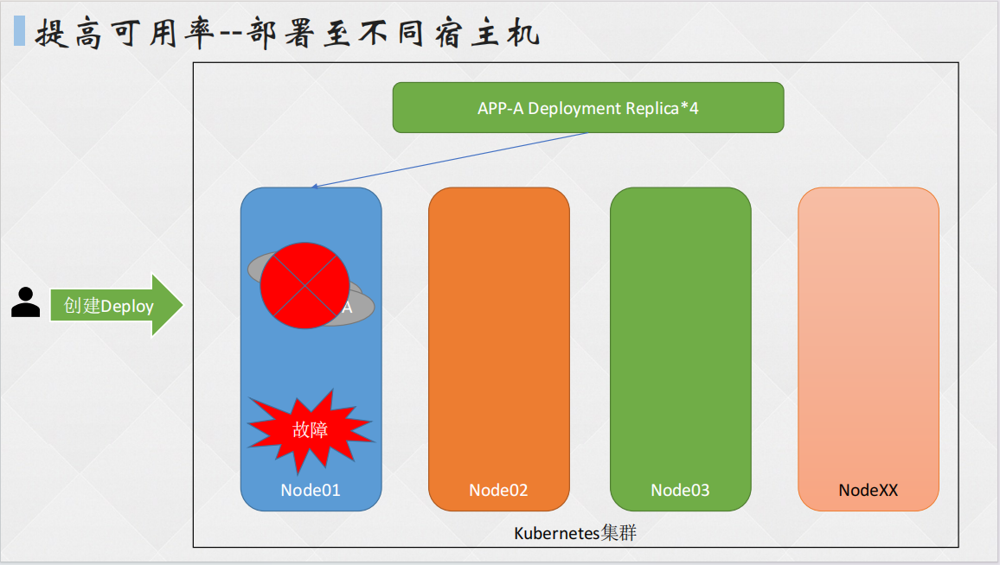

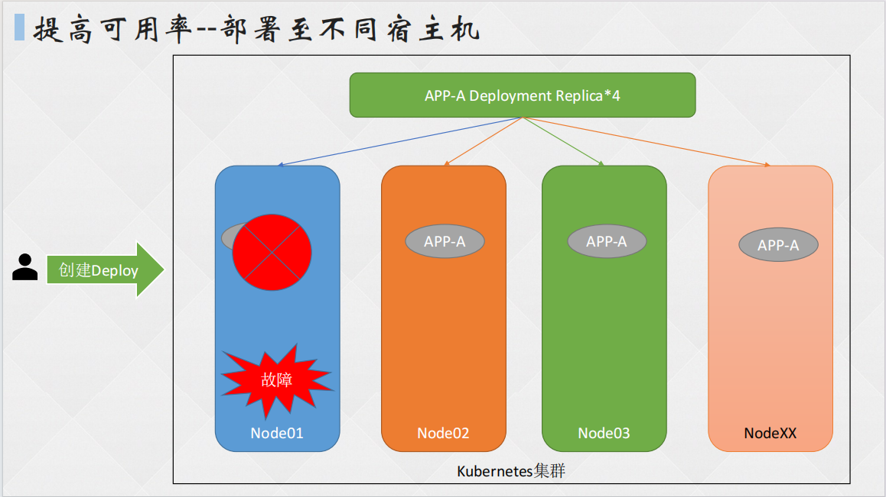

### （2）提高架构可用性

K8S 支持跨机房的分布式部署，应用可根据亲和性来选择具体调度到哪个机房，这样一来，即使其中一个机房出现网络故障等问题，也不会影响其他机房的正常运作。

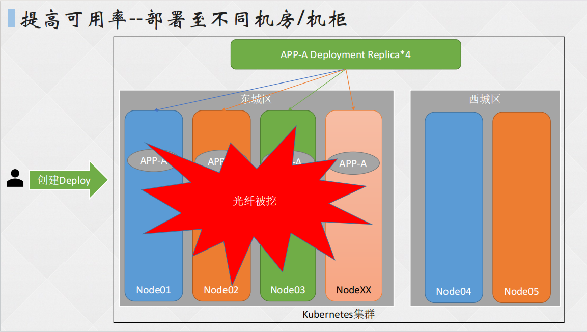


### （3）提高应用可用性

尽量或必须不将两个不同的 APP 部署到同一台节点上，否则节点的宕机会将两个应用同时 Kill！此时可根据 Pod 亲和性分布式调度到不同的节点。

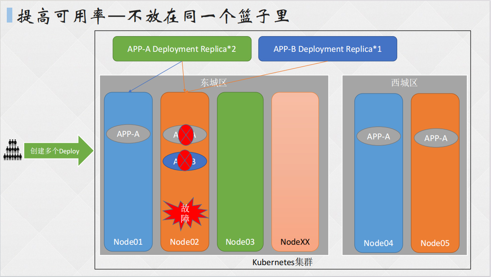

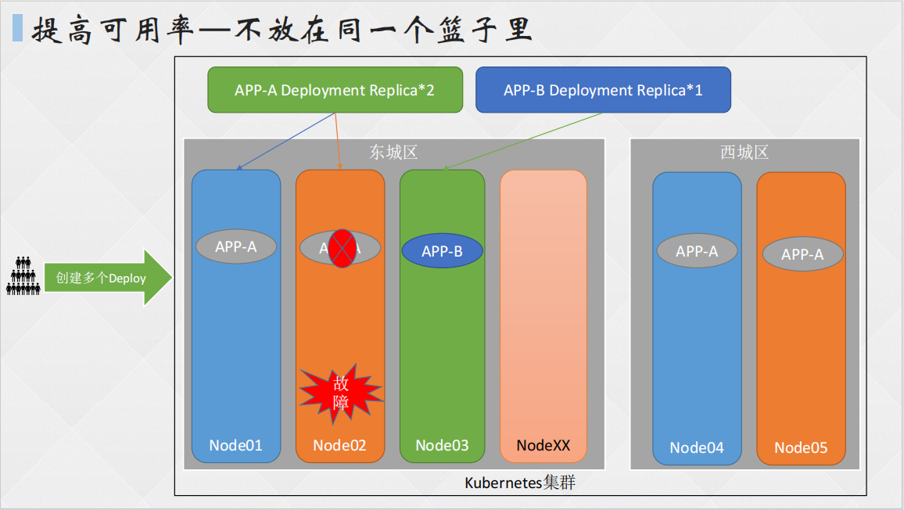

## 6. 节点亲和力配置

```shell
[root@master pod]# vim node-affinity.yaml
apiVersion: v1
kind: Pod
metadata:
 name: with-node-affinity
spec:
  affinity:		# 亲和力配置
    nodeAffinity:		# 节点亲和力配置
      requiredDuringSchedulingIgnoredDuringExecution:		# 硬亲和力配置
        nodeSelectorTerms:		# 节点选择器
        - matchExpressions:		# 标签匹配规则
          - key: kubernetes.io/e2e-az-name
            operator: In
            values:
            - e2e-az1
            - az-2
            # operator参数解释：
            # ln：相当于key=value
            # Notln：相当于key≠value
            # Exists：节点存在某个key即可，不需要配置value字段
            # DoesNotExist：节点不存在某个key即可，不需要配置value字段
            # Gt：大于value指定的值，value需为数字
            # Lt：小于value指定的值
      preferredDuringSchedulingIgnoredDuringExecution:	# 软亲和力配置
      - weight: 1		# 权重值
        preference:	# 软亲和力配置
          matchExpressions:		# 标签匹配规则
          - key: another-node-label-key
            operator: In
            values:
            - another-node-label-value
  containers:
  - name: with-node-affinity
```

## 7. Pod 亲和力和反亲和力

```shell
[root@master pod]# vim pod-affinity.yaml
apiVersion: v1
kind: Pod
metadata:
 name: with-pod-affinity
spec:
  affinity:
    podAffinity:		# Pod亲和力配置
      requiredDuringSchedulingIgnoredDuringExecution:		# 硬亲和力
      - labelSelector:		# 标签选择
          matchExpressions:	# 标签选择规则
          - key: security		# key键
            operator: In		# key和value的关系
            values:					# value值
            - S1
      topologyKey: failure-domain.beta.kubernetes.io/zone		# 匹配的拓扑域的key
    podAntiAffinity:		# Pod反亲和力配置
      preferredDuringSchedulingIgnoredDuringExecution:		# 软亲和力配置
      - weight: 100		# 权重值
        podAffinityTerm:		# 反亲和力配置项
          labelSelector:		# 选择下列键值标签的node优先不部署
            matchExpressions:
            - key: security
              operator: In
              values:
              - S2
            namespaces:		# 目标命名空间配置
            - default
            topologyKey: failure-domain.beta.kubernetes.io/zone		# 匹配的拓扑域
  containers:
  - name: with-pod-affinity
    image: nginx
```

## 8. 亲和力示例

### （1）同一个应用部署在不同的节点

```shell
[root@master pod]# vim affinity.yaml 
apiVersion: apps/v1
kind: Deployment
metadata:
  labels:
    app: must-be-diff-nodes
  name: must-be-diff-nodes
spec:
  replicas: 3
  selector:
    matchLabels:
      app: must-be-diff-nodes
  template:
    metadata:
      labels:
        app: must-be-diff-nodes
    spec:
      affinity:
        podAntiAffinity:		# Pod反亲和力配置
          requiredDuringSchedulingIgnoredDuringExecution:
          - labelSelector:
              matchExpressions:
              - key: app
                operator: In
                values:
                - must-be-diff-nodes
            topologyKey: kubernetes.io/hostname
      containers:
      - image: nginx:1.20.0
        imagePullPolicy: IfNotPresent
        name: must-be-diff-nodes
[root@master pod]# kubectl get po -o wide 
NAME                                  READY   STATUS    RESTARTS   AGE    IP              NODE         NOMINATED NODE   READINESS GATES
must-be-diff-nodes-6b6dc579c9-9kh4p   0/1     Pending   0          7s     <none>          <none>       <none>           <none>
must-be-diff-nodes-6b6dc579c9-bdtjx   1/1     Running   0          7s     172.16.58.232   k8s-node02   <none>           <none>
must-be-diff-nodes-6b6dc579c9-pt4g7   1/1     Running   0          7s     172.16.85.204   k8s-node01   <none>           <none>
```

**配置逻辑：**假设当前 Deployment 将一个 Pod 调度到了 Node01 上，那么此时 Node01 就有了一个标签为 app=must-be-diff-nodes 的 Pod，而在反亲和力的排斥作用下，下一个 Pod 匹配到了第一个已经带有 app=must... 标签的 Pod，所以第二个 Pod 便不会再次在该 Pod 所在的节点上继续部署，而是在 Node02 节点上部署。此时，第三个 Pod 希望在 Master 节点上部署，但 Master 节点有一个自带的禁调度污点，而当前 K8S 集群仅存在三台节点，所以第三个 Pod 就无法被调度，从而状态变为 Pending(待定)。

### （2）同一应用不同副本部署固定节点

```shell
[root@master pod]# vim redis-anti.yaml 

apiVersion: apps/v1
kind: Deployment
metadata:
  name: redis-cache
spec:
  replicas: 3
  selector:
    matchLabels:
      app: redis-cache
  template:
    metadata:
      labels:
        app: redis-cache
    spec:
      nodeSelector:		# node标签选择
        app: redis-cache
      affinity:
        podAntiAffinity:		# Pod反亲和力配置
          requiredDuringSchedulingIgnoredDuringExecution:
          - labelSelector:
              matchExpressions:
              - key: app
                operator: In
                values:
                - redis-cache
            topologyKey: "kubernetes.io/hostname"
      containers:
      - image: redis:3.2-alpine
        name: redis
[root@master pod]# kubectl create -f redis-anti.yaml 
deployment.apps/redis-cache created
[root@master pod]# kubectl get po -o wide 
NAME                                  READY   STATUS    RESTARTS      AGE     IP              NODE         NOMINATED NODE   READINESS GATES
must-be-diff-nodes-6b6dc579c9-hnfh5   1/1     Running   1 (21m ago)   4h34m   172.16.85.231   k8s-node01   <none>           <none>
must-be-diff-nodes-6b6dc579c9-mgmhc   0/1     Pending   0             4h34m   <none>          <none>       <none>           <none>
must-be-diff-nodes-6b6dc579c9-r9xgq   1/1     Running   1 (21m ago)   4h34m   172.16.58.226   k8s-node02   <none>           <none>
rabbitmq-8878d459-7c4dz               1/1     Running   1 (21m ago)   6h54m   172.16.85.228   k8s-node01   <none>           <none>
redis-cache-5ccc7f4fbd-hmdkh          0/1     Pending   0             19s     <none>          <none>       <none>           <none>
redis-cache-5ccc7f4fbd-j964n          0/1     Pending   0             19s     <none>          <none>       <none>           <none>
redis-cache-5ccc7f4fbd-x8w2x          0/1     Pending   0             19s     <none>          <none>       <none>           <none>
[root@master pod]# kubectl label nodes k8s-node01 app=redis-cache
node/k8s-node01 labeled
[root@master pod]# kubectl get po -o wide 
NAME                                  READY   STATUS    RESTARTS      AGE     IP              NODE         NOMINATED NODE   READINESS GATES
must-be-diff-nodes-6b6dc579c9-hnfh5   1/1     Running   1 (21m ago)   4h35m   172.16.85.231   k8s-node01   <none>           <none>
must-be-diff-nodes-6b6dc579c9-mgmhc   0/1     Pending   0             4h35m   <none>          <none>       <none>           <none>
must-be-diff-nodes-6b6dc579c9-r9xgq   1/1     Running   1 (21m ago)   4h35m   172.16.58.226   k8s-node02   <none>           <none>
rabbitmq-8878d459-7c4dz               1/1     Running   1 (21m ago)   6h55m   172.16.85.228   k8s-node01   <none>           <none>
redis-cache-5ccc7f4fbd-hmdkh          0/1     Pending   0             38s     <none>          <none>       <none>           <none>
redis-cache-5ccc7f4fbd-j964n          0/1     Pending   0             38s     <none>          <none>       <none>           <none>
redis-cache-5ccc7f4fbd-x8w2x          1/1     Running   0             38s     172.16.85.230   k8s-node01   <none>           <none>
```

### （3）应用和缓存尽量部署在同一域

```shell
[root@master pod]# vim nginx-anti.yaml
apiVersion: apps/v1
kind: Deployment
metadata:
  name: web-server
spec:
  selector:
    matchLabels:
      app: web-store
  replicas: 3
  template:
    metadata:
      labels:
        app: web-store
    spec:
      affinity:
        podAntiAffinity:
          requiredDuringSchedulingIgnoredDuringExecution:
          - labelSelector:
              matchExpressions:
              - key: app
                operator: In
                values:
                - web-store
            topologyKey: "kubernetes.io/hostname"
        podAffinity:
          preferredDuringSchedulingIgnoredDuringExecution:
          - weight: 100
            podAffinityTerm:
              labelSelector:
                matchExpressions:
                - key: app
                  operator: In
                  values:
                  - store
              topologyKey: "kubernetes.io/hostname"
      containers:
      - name: web-app
        image: nginx:1.20.0
[root@master pod]# kubectl create -f nginx-anti.yaml 
deployment.apps/web-server created
[root@master pod]# kubectl get po
NAME                          READY   STATUS    RESTARTS   AGE
web-server-6c7f67684f-jc47t   1/1     Running   0          10s
web-server-6c7f67684f-mrqrb   1/1     Running   0          10s
web-server-6c7f67684f-twmjk   0/1     Pending   0          10s
```

### （4）尽量调度到高配置服务器

```shell
[root@master pod]# vim prefer-affinity.yaml
[root@master pod]# cat prefer-affinity.yaml 
apiVersion: apps/v1
kind: Deployment
metadata:
  labels:
    app: prefer-ssd
  name: prefer-ssd
spec:
  replicas: 1
  selector:
    matchLabels:
      app: prefer-ssd
  template:
    metadata:
      creationTimestamp: null
      labels:
        app: prefer-ssd
    spec:
      affinity:
        nodeAffinity:
          preferredDuringSchedulingIgnoredDuringExecution:		# 软亲和力总配置
          - preference:		# 软亲和力配置分列表示
              matchExpressions:		# 匹配如下标签，一个“-”代表一个标签
              - key: ssd
                operator: In
                values:
                - "true"
              - key: gpu
                operator: NotIn
                values:
                - "true"
            weight: 100		# 该标签匹配规则的权重值为100
          - preference:		# 软亲和力配置分列表示
              matchExpressions:
              - key: type
                operator: In
                values:
                - physical
            weight: 10
      containers:
      - image: nginx:1.20.0
        imagePullPolicy: IfNotPresent
        name: prefer-ssd
# 为节点设置如下标签
[root@master pod]# kubectl label nodes master ssd=true
node/master labeled
[root@master pod]# kubectl label nodes master gpu=true
node/master labeled
[root@master pod]# kubectl label nodes k8s-node01 ssd=true
node/k8s-node01 labeled
[root@master pod]# kubectl label nodes k8s-node02 type=physical
node/k8s-node02 labeled
[root@master pod]# kubectl create -f prefer-affinity.yaml 
deployment.apps/prefer-ssd created
[root@master pod]# kubectl get po -o wide 
NAME                          READY   STATUS    RESTARTS   AGE   IP              NODE         NOMINATED NODE   READINESS GATES
prefer-ssd-74d569bccf-mjp4q   1/1     Running   0          6s    172.16.85.229   k8s-node01   <none>           <none>
# master不接受调度，不过因为该配置为软亲和力配置，所以pod被调度到了最接近的node01上
```

# 四、拓扑域 TopologyKey

## 1. 拓扑域概念

- 一个拓扑域由一些 Node 节点组成，这些 Node 节点通常有相同的地理空间坐标，比如在同一个机架、机房或地区；
- 一般用 region 表示机架、 机房等的拓扑区域，用 Zone 表示地区这样跨度更大的拓扑区域；
- 极端情况下， 我们也可以认为一个Node就是一个拓扑区域；
- 拓扑域用 label 进行判断，不同的 key 和不同的 value 是属于不同的拓扑域；
- 在k8s集群中，资源有命名空间的限制，而拓扑域有时可以被看成是各节点的一种特殊的“命名空间”（抽象概念）。

K8S 内置了一些常用的默认拓扑域，主要是为了**确定各个节点所属的拓扑域**：

| **默认拓扑域**                | **描述**                                                     |
| ----------------------------- | ------------------------------------------------------------ |
| kubernetes.io/hostname        | 在 Node 节点初始化时，controller–manager 会为 Node 打上该标签 |
| topology.kubernetes.io/region | 公有云厂商提供的Kubernetes服务或者使用cloud-controller-manager创建的集群，会给Node打上该标签 |
| topology.kubernetes.io/zone   | 同上                                                         |

## 2. 拓扑域详解

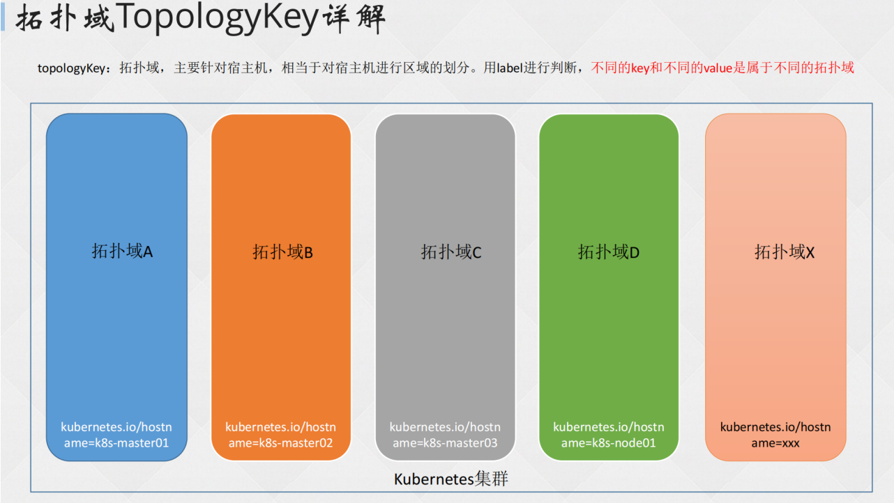

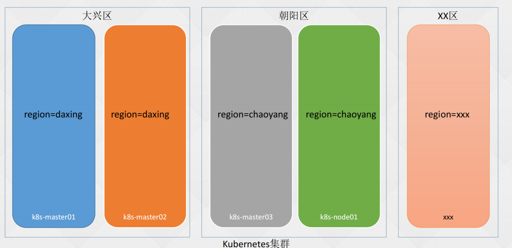

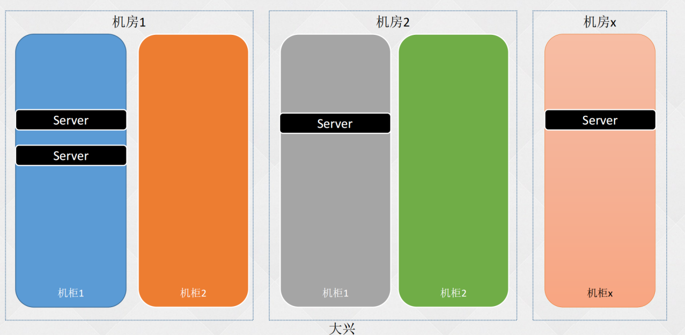

## 3. 拓扑域限制

原则上，topologyKey 可以使用任意合法的标签 Key 赋值，但是出于性能和安全方面的考虑，对 topologyKey 有如下限制：

- 在 Pod 亲和性和 RequiredDuringScheduling 的 Pod 互斥性的定义中，不允许使用空的topologyKey；
- 如果 Admission controller 包含了 LimitPodHardAntiAffinityTopology，那么针对RequiredDuringScheduling 的 Pod 互斥性定义就被限制为 kubernetes.io/hostname，要使用自定义的 topologyKey，就要改写或禁用该控制器。
- 在 PreferredDuringScheduling 类型的 Pod 互斥性定义中，空的 topologyKey 会被解释为 kubernetes.io/hostname、failure-domain.beta.kubernetes.io/zone 及 failure-domain.beta.kubernetes.io/region 的组合。
- 如果不是上述情况，就可以采用任意合法的topologyKey了。

## 4. 同一个应用多区域部署

```shell
[root@master pod]# vim topologyKey.yaml 
apiVersion: apps/v1
kind: Deployment
metadata:
  labels:
    app: must-be-diff-zone
  name: must-be-diff-zone
spec:
  replicas: 2
  selector:
    matchLabels:
      app: must-be-diff-zone
  template:
    metadata:
      labels:
        app: must-be-diff-zone
    spec:
      affinity:
        podAntiAffinity:		# Pod反亲和力配置
          requiredDuringSchedulingIgnoredDuringExecution:		# 硬亲和力配置
          - labelSelector:		# 标签选择
              matchExpressions:
              - key: app
                operator: In
                values:
                - must-be-diff-zone
            topologyKey: region		# 拓扑域选择：region
      containers:
      - image: nginx：1.20.0
        imagePullPolicy: IfNotPresent
        name: must-be-diff-zone
```


**新增拓扑域并运行 Pod**

```shell
[root@master pod]# kubectl label nodes k8s-node01 master region=songshan
node/k8s-node01 labeled
node/master labeled
[root@master pod]# kubectl label nodes k8s-node02 region=hongshan
node/k8s-node02 labeled
[root@master pod]# kubectl get po -o wide
NAME                                 READY   STATUS    RESTARTS   AGE   IP              NODE         NOMINATED NODE   READINESS GATES
must-be-diff-zone-868fdffcdb-jpwvn   1/1     Running   0          15s   172.16.85.227   k8s-node01   <none>           <none>
must-be-diff-zone-868fdffcdb-lfrbr   1/1     Running   0          15s   172.16.58.244   k8s-node02   <none>           <none>
```


**增加 Pod 数量，新增的 Pod 为 Pending 状态，这是因为该反亲和力加拓扑域的限制，从而导致一个 Node 只能部署一个 Pod，而 Master 不支持调度，所以新增 Pod 为 Pending 状态。**

```shell
[root@master pod]# kubectl scale deployment must-be-diff-zone --replicas=3
deployment.apps/must-be-diff-zone scaled
[root@master pod]# kubectl get po -o wide
NAME                                 READY   STATUS    RESTARTS   AGE   IP              NODE         NOMINATED NODE   READINESS GATES
must-be-diff-zone-868fdffcdb-d9rp4   0/1     Pending   0          2s    <none>          <none>       <none>           <none>
must-be-diff-zone-868fdffcdb-jpwvn   1/1     Running   0          57s   172.16.85.227   k8s-node01   <none>           <none>
must-be-diff-zone-868fdffcdb-lfrbr   1/1     Running   0          57s   172.16.58.244   k8s-node02   <none>           <none>
```