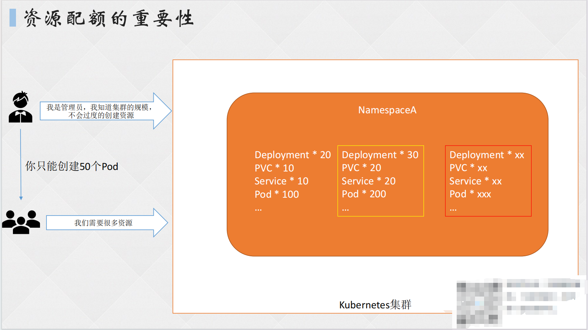
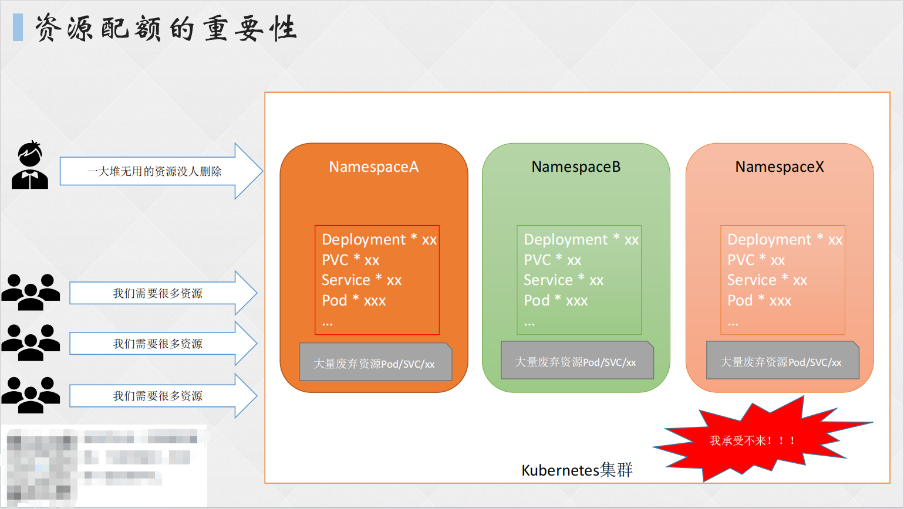
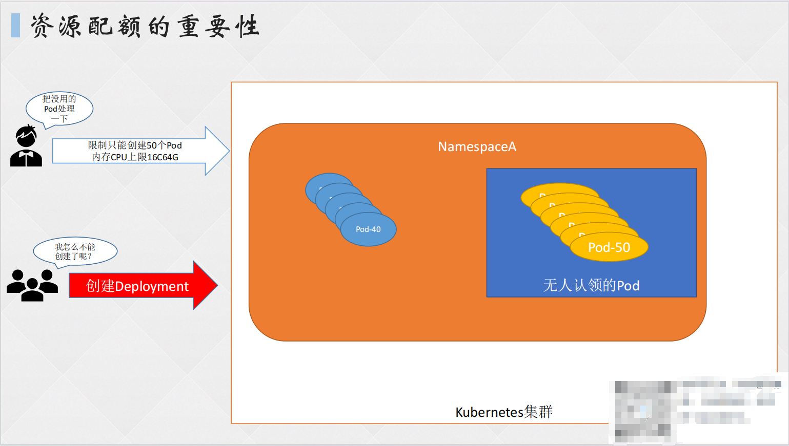
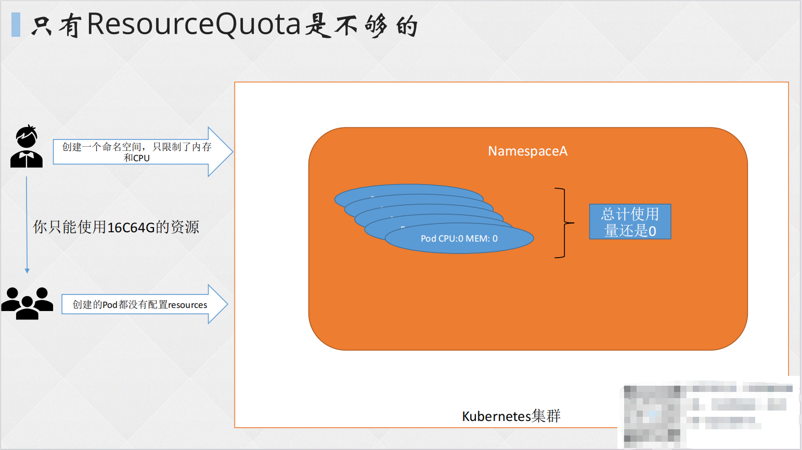
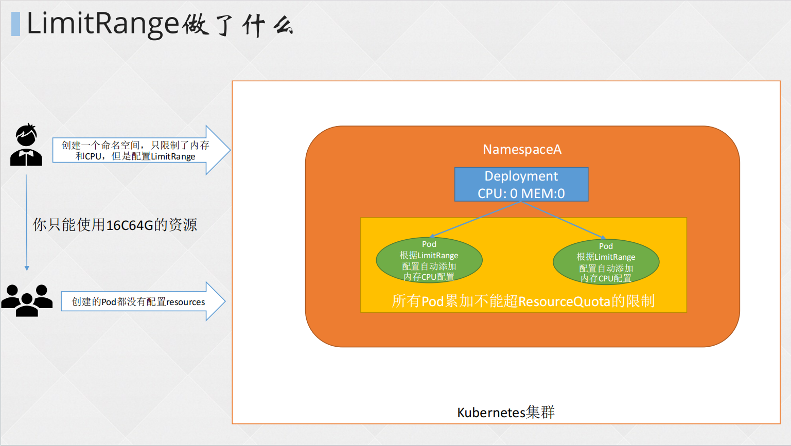
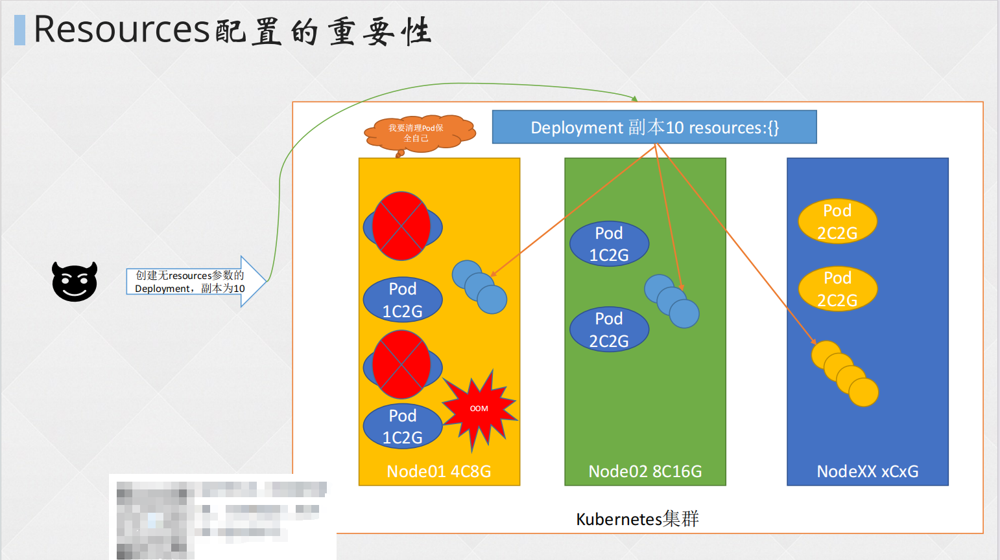
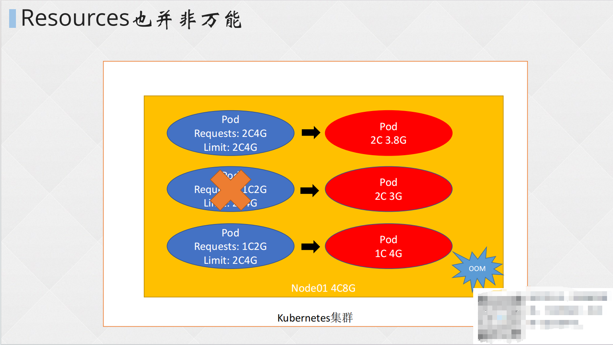

# 一、ResourceQuota 资源配额

## 1. ResourceQuota

在 K8S 集群中，通过 ResourceQuota 对象定义每个命名空间 (namespace) 的资源配额，从而实现资源消耗总量的限制。

**资源配额可解决的问题：**

当多个团队、多个用户共享使用K8s集群时，会出现不均匀资源使用，默认情况下先到先得，这时可以通过 ResourceQuota 来对命名空间资源使用总量做限制，从而解决这个问题。

**使用流程：**

k8s 管理员为每个命名空间创建一个或多个 ResourceQuota 对象，定义资源使用总量，K8s 会跟踪命名空间资源使用情况，当超过定义的资源配额会返回拒绝。

**作用：**

- 可以按类型限制 namespace 下所创建对象的数量
- 限制所消耗计算资源的总量

**注意事项：**

如果在集群中新添加了节点，资源配额不会自动更新，该资源配额所对应的命名空间中的对象也不会自动增加资源上限。

## 2. 资源限制的对象

1. **容器资源请求值（requests）：**命名空间下的所有 pod 申请资源时设置的 requests 总和不能超过这个值。

- - resources.requests.cpu
  - resources.requests.memory

1. **容器资源限制值（limits）：**命名空间下的所有 pod 申请资源时设置的 limits 总和不能超过这个值。

- - resources.limits.cpu
  - resources.limits.memory

**注意事项：**

- CPU 单位：可以写m也可以写浮点数，例如0.5=500m，1=1000m
- requests 必须小于 limits，建议一个理论值：requests 值小于 limits的20%-30%，一般是 limits 的 70%。
- limits 尽量不要超过所分配宿主机物理配置的 80%，否则没有限制意义
- requests 只是一个预留性质，并非实际的占用，用于 k8s 合理的分配资源（每个节点都有可分配的资源，k8s 抽象的将这些节点资源统一分配）。比如 requests 分配 1 核 1G，在满足的节点上创建完容器后实际资源可能只有 0.5C 1G。
- requests 会影响 pod 调度，k8s 只能将 pod 分配到能满足该 requests 值的节点上。
- ResourceQuota 功能是一个准入控制插件，默认已经启用。







# 二、ResourceQuota 配置

## 1. 资源配额常用选项

```shell
apiVersion: v1
kind: ResourceQuota
metadata:
  name: resource-test
  labels:
    app: resourcequota
spec:
  hard:
    pods: 50 		# 限制Pod在某个命名空间下的创建数量
    requests.cpu: 0.5 	# 设定命名空间⾥的单个pod使⽤CPU的限制
    requests.memory: 512Mi # 设定命名空间⾥的单个pod使⽤内存的限制
    limits.cpu: 5 	# 设定命名空间总cpu使⽤限制
    limits.memory: 16Gi 	# 设定命名空间总内存使⽤限制
    configmaps: 20		# 设定命名空间内可创建的CM配置文件数据资源的数量
    requests.storage: 40Gi		# 设定命名空间可使用的硬盘量
    persistentvolumeclaims: 20		# 设定可创建的PVC卷请求的数量
    replicationcontrollers: 20		# 设定可创建RC副本控制器的数量
    secrets: 20			# 限制密文存储的secret资源可创建数量
    services: 50		# 限制命名空间下服务可创建的数量
    services.loadbalancers: "2"		# 限制云提供商的负载均衡器的数量
    services.nodeports: "10"		# 限制service可提供的nodeport服务的数量
```

## 2. 配额示例

**创建 resourcequota**

```shell
[root@master pod]# vim resource.yaml

apiVersion: v1
kind: ResourceQuota
metadata:
  name: resource-test
  labels:
    app: resourcequota
spec:
  hard:
  pods: 2
  #requests.cpu: 0.5
  #requests.memory: 512Mi
  #limits.cpu: 5
  #limits.memory: 16Gi
  #configmaps: 20
  #requests.storage: 40Gi
  #persistentvolumeclaims: 20
  #replicationcontrollers: 20
  #secrets: 20
  #services: 50
  #services.loadbalancers: "2"
  #services.nodeports: "10"
[root@master pod]# kubectl create ns rq-resource
namespace/rq-resource created
[root@master pod]# kubectl create -f resource.yaml -n rq-resource 
resourcequota/resource-test created
[root@master pod]# kubectl get resourcequotas -n rq-resource 
NAME            AGE   REQUEST     LIMIT
resource-test   27s   pods: 0/2   
```


**创建 Pod**

```shell
[root@master pod]# vim nginx-deploy.yaml 

apiVersion: apps/v1
kind: Deployment
metadata:
  name: nginx
  labels: 
    app: nginx
  namespace: rq-resource		# 指定命名空间创建
spec:
  replicas: 3		# 复制集用三个，方便测试
  selector:
    matchLabels:
      app: nginx
  template:
    metadata:
      labels:
        app: nginx
    spec:
      containers:
      - image: nginx:1.20.0
        name: nginx01
[root@master pod]# kubectl create -f nginx-deploy.yaml 
deployment.apps/nginx created
[root@master pod]# kubectl get po -n rq-resource 
NAME                     READY   STATUS    RESTARTS   AGE
nginx-5bdd68b495-6h7xj   1/1     Running   0          47s
nginx-5bdd68b495-n5sc7   1/1     Running   0          47s
# 该resourcequota限制了rq-resource命名空间的Pod的数量，所以无法创建第三个Pod
```

# 三、LimitRange 资源限制

## 1. LimitRange

LimitRange 针对 NameSpace 中的每个组件做的资源限制，如 Pod 等。

- **对 NameSpace 中容器、Pod 等使用的总和限制：**

- - ResourceQuota

- **对 NameSpace 中容器、Pod 等使用的单独限制：**

- - LimitRange

**LimitRange 可限制的资源：**

1. 限制 namespace 中每个 Pod 或容器的最小与最大计算资源
2. 限制 namespace 中每个 Pod 或容器计算资源 request、limit 之间的比例
3. 限制 namespace 中每个存储卷声明（PersistentVolumeClaim）可使⽤的最小与最⼤存储空间
4. 设置 namespace 中容器默认计算资源的 request、limit，并在运行时自动注入到容器中





## 2. LimitRange 配置示例

requests：定义了对应容器需要的最小资源量。

limits：定义了这个容器最大可以消耗的资源上限，防止过量消耗资源导致资源短缺甚至宕机。

### （1）默认的 Requests 和 Limits

```shell
apiVersion: v1
kind: LimitRange
metadata:
 name: cpu-mem-limit-range
spec:
  limits:
  - default:		# 默认limits配置
      cpu: 1
      memory: 512Mi
    defaultRequest:		# 默认requests配置
      cpu: 0.5
      memory: 256Mi
    type: Container
```

### （2）Requests 和 Limits 的范围

```shell
apiVersion: v1
kind: LimitRange
metadata:
  name: cpu-min-max-demo-lr
spec:
  limits:
  - max:		# 内存CPU最大的配置
      cpu: "800m"
      memory: 1Gi
    min:		# 内存CPU最小的配置
      cpu: "200m"
      memory: 500Mi
    type: Container
```

### （3）限制申请存储空间的大小

```shell
apiVersion: v1
kind: LimitRange
metadata:
  name: storagelimits
spec:
  limits:
  - type: PersistentVolumeClaim
  max:		# 最大PVC的空间
    storage: 2Gi
  min:		# 最大PVC的空间
    storage: 1Gi
```

# 四、QoS 服务质量

## 1. 存在的问题

默认情况下，K8S 的节点上的资源会被 Pod 和系统进程所使用，如果什么都不配置，那么节点上的全部资源都是可以分配给 Pod 使用，但这样下来，系统进程本身就没了保障，便会出现下列问题：

- **集群雪崩：**如果节点上调度了大量 Pod，且 Pod 没有合理的 Limit 限制，那么节点资源将被耗尽，sshd、kubelet 等进程 OOM(卡死)，节点就变成了 NotReady 状态，此时，虽然 Pod 重新继续调度到了其他节点，但新节点也有可能被这些 Pod 打挂，最后就会造成集群雪崩。
- **系统进程异常：**就算 Pod 设置了 Limit，但如果机器遇到资源不足，系统进程如 Docker 没有资源保障，也会频繁 OOM，或进程无响应，虽然可以运行，但容器会反复出现问题。





## 2. Qos 概念

QoS，全称 Quality of Service，中文名“服务质量”。在 K8S 集群中，每个 Pod 都有 QoS 标记，QoS 确定 Pod 的调度和驱逐优先级，取决于用户期望的服务质量。

对于 Pod，服务质量体现在两个指标上：

- - CPU
  - 内存

在实际运行过程中，当 Node 节点上的 CPU 和内存资源紧张时，K8S 根据 Pod 具有不同的 QoS 标记，采取不同的处理策略。

## 3. QoS 三种级别

1. **BestEffort****：***最低服务质量*。当宿主机内存不足时，首先 Kill 该 QoS 的 Pod，用以保证其他高级服务质量的 Pod 正常运行。
2. **Burstable****：***服务质量高于 BestEffort，低于 Guaranteed*。当 Kill 掉 QoS 为 BestEffort 的 Pod 时，宿主机内存依然不足时，就会 Kill 掉该等级服务质量的 Pod，用来保证 Guaranteed 的 Pod 正常运行。该级别 Pod 一般知道最小资源使用量，但当机器资源充足时，也会尽可能地使用更多的资源，如：limits 字段的 cpu 和 memory 大于 requests 的 cpu 和 memory 的配置。
3. **Guaranteed****：***最高服务质量*。当其下的两个层级 Kill 掉后，宿主机内存依旧不足，才会 Kill 掉该等级的 Pod。该级别的 requests 的 cpu、memory 和 limits的 cpu、memory 配置一致。

## 4. QoS 示例

### （1）QoS 为 Guaranteed 的 Pod

```shell
[root@master pod]# vim guaranteed.yaml
apiVersion: v1
kind: Pod
metadata: 
  name: qos-guaranteed
spec: 
  containers: 
  - name: guaranteed-nginx
    image: nginx
    resources: 
      limits: 
        cpu: "700m"
        memory: "200Mi"
      requests:		# requests等于limits就是guaranteed级别的Pod 
        memory: "200Mi"
        cpu: "700m"
[root@master pod]# kubectl create -f guaranteed.yaml 
pod/qos-guaranteed created
[root@master pod]# kubectl get po -n
NAME             READY   STATUS    RESTARTS   AGE
qos-guaranteed   1/1     Running   0          37s
[root@master pod]# kubectl describe po qos-guaranteed | grep QoS
QoS Class:                   Guaranteed
```

### （2）Qos 为 Burstable 的 Pod

```shell
[root@master pod]# vim burstable.yaml
apiVersion: v1
kind: Pod
metadata:
  name: qos-burstable
spec:
  containers:
  - name: nginx-burstable
    image: nginx
    resources:
      limits:
        memory: "200Mi"
      requests:
        memory: "100Mi"
# Pod中⾄少有⼀个容器配置了requests.cpu或requests.memory
# limits字段大于requests字段
[root@master pod]# kubectl create -f burstable.yaml 
pod/qos-burstable created
[root@master pod]# kubectl get po 
NAME             READY   STATUS    RESTARTS   AGE
qos-burstable    1/1     Running   0          59s
qos-guaranteed   1/1     Running   0          47s
[root@master pod]# kubectl describe po qos-burstable | grep QoS
QoS Class:                   Burstable
```

### （3）QoS 为 BestEffort 的 Pod

```shell
[root@master pod]# vim besteffort.yaml
apiVersion: v1
kind: Pod
metadata:
  name: qos-besteffort
spec:
  containers:
  - name: nginx-besteffort
    image: nginx
# 不设置resources参数
[root@master pod]# kubectl create -f besteffort.yaml 
pod/qos-besteffort created
[root@master pod]# kubectl get po 
NAME             READY   STATUS    RESTARTS   AGE
qos-besteffort   1/1     Running   0          23s
qos-burstable    1/1     Running   0          4m59s
qos-guaranteed   1/1     Running   0          4m47s
[root@master pod]# kubectl describe po qos-besteffort | grep QoS
QoS Class:                   BestEffort
```