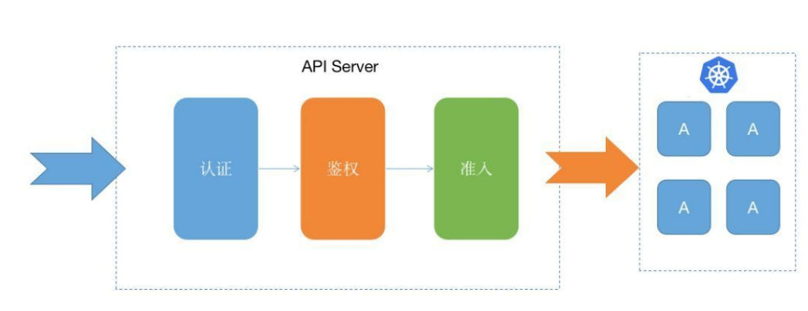
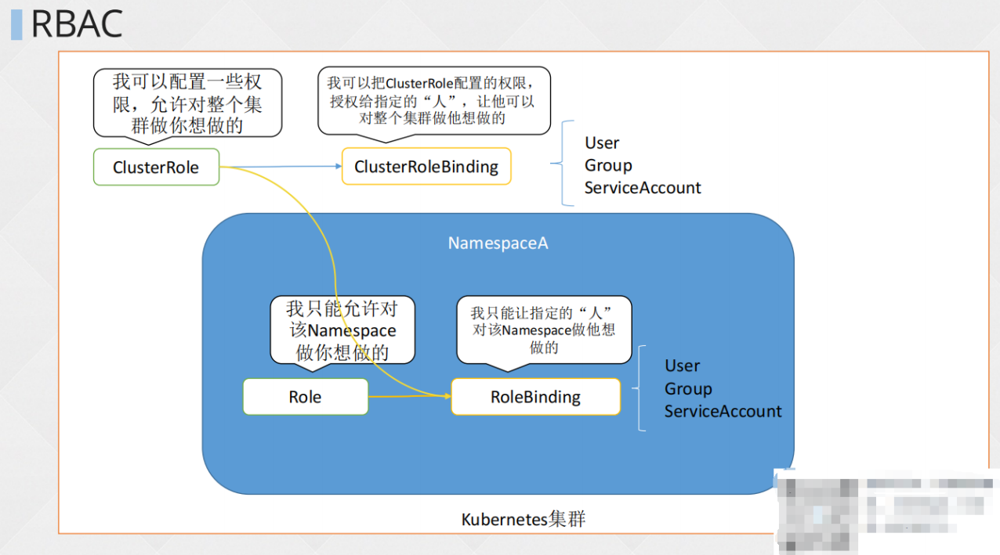
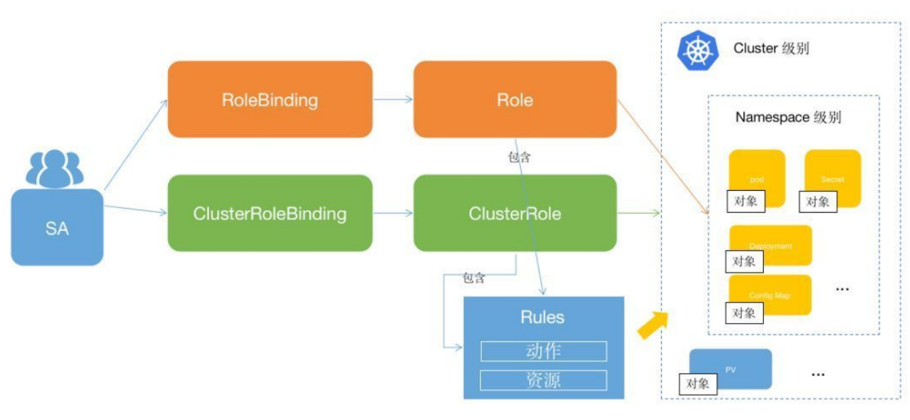
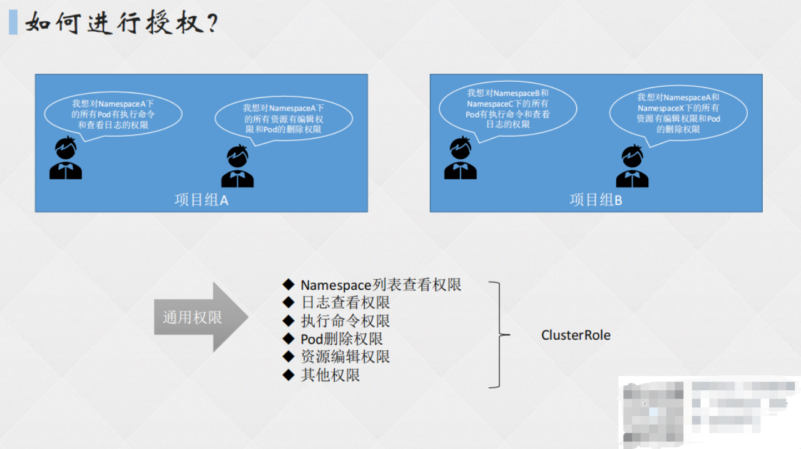
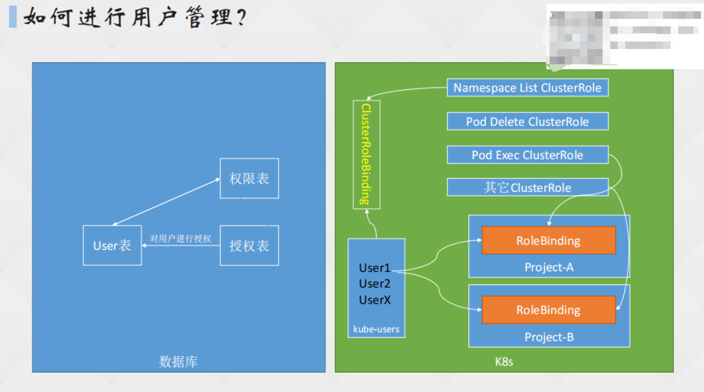

# 一、K8S 集群用户权限

## 1. 用户权限定义

Kubernetes 主要通过 API Server 对外提供服务，对于访问 API 的用户提供了相应的安全控制：认证和授权。

- **认证：**解决用户是谁的问题（身份）。
- **授权：**解决用户能在集群中做什么的问题（允许的行为）。

**下图表示 API 访问需要经过的三个步骤：**



## 2. K8S 鉴权模式

- Node：一种特殊的授权模块，基于 Node 上运行的 Pod，再为 Kubelet 授权。
- ABAC：基于属性的访问控制。
- RBAC：基于角色的访问控制。
- WebHook：HTTP 请求回调，通过 WEB 应用鉴定是否有权限执行某项操作。

# 二、RBAC 模式

## 1. RBAC 概念



RBAC（Role-Based Access Control）权限模型的概念，即：基于角色的权限控制。通过角色管理用户，角色关联权限的方式简介赋予用户权限。

**不用角色分配权限会出现的问题：**

当多个用户拥有相同的权限，在分配时需要分别为这几个用户指定相同的权限，修改时也要为这几个用户的权限进行一一修改，效率不高。

**使用角色分配权限的解决方式：**

使用角色设定权限模型，仅需要为该角色指定好权限规则，将相同的用户都绑定到同一个角色，这样便于权限管理及修改。而对于批量的用户权限调整，只需调整用户关联的角色权限，无需对每一个用户都进行修改，既提升了调整权限的效率，又降低了漏调权限的几率。

**启用 RBAC：**

启用 RBAC，需要在 apiserver 中添加参数 -authorization-mode=RBAC，如果使用的 kubeadm 安装的集群，1.6+ 版本都默认开启了 RBAC。

```shell
[root@master pod]# grep 'authorization-mode' /etc/kubernetes/manifests/kube-apiserver.yaml
    - --authorization-mode=Node,RBAC
```

## 2. 核心元素

- Rule：规则，一组属于不同 API Group 的操作集合。
- Role：角色，定义了用户在指定的 Kubernetes 命名空间资源上可以进行哪些操作，比如可以定一个 NameSpace 中 Pod 的只读权限，同时还可以定义一个 NameSpace 管理员权限，它具有对这个命名空间下所有对象资源的所有操作权限。
- ClusterRole：集群角色，定义了用户在 Kubernetes 集群上可以进行的操作。
- Subject：对象，规则作用的对象，可以是 User、Group、ServiceAccount。
- RoleBinding：将 Role (角色) 和对象进行绑定，范围限定在 NameSpace。
- ClusterRoleBinding：将 ClusterRole（集群角色）和对象进行绑定，限定在 Kubernetes 集群内。



## 3. RBAC 配置说明

**官方文档：**https://kubernetes.io/zh-cn/docs/reference/access-authn-authz/rbac/

### （1）Role 配置

```shell
apiVersion: rbac.authorization.k8s.io/v1
kind: Role		# 资源类型：role
metadata:
  namespace: ns-role		# 在ns-role命名空间下生效
  name: pod-reader		# 该role的资源名
rule:		# 该role的规则
- apiGroup: [""]		# 指定被规则限制的API Group，“”为空表明适用于所有API Group，可用kubectl api-resources查询
  resources: ["pods"]		# 定义了规则适用的资源类型，即Pods
  verbs: ["get","watch","list"]		# 定义了允许执行的操作
```

### （2）ClusterRole 配置

ClusterRole 属于集群范围的权限角色，可为以下资源授权访问资源：

- 集群范围的资源（如：节点 Node）
- 非资源端点（如：系统健康状态检查的路径/healthz）
- 跨命名空间访问作用域的资源（如：Pod），比如，可以使用 ClusterRole 来允许某些特定用户执行 kubectl get pods --all-namespace

```shell
apiVersion: rbac.authorization.k8s.io/v1
kind: ClusterRole
metadata:
  name: deployment-clusterrole
rules:
- apiGroups: [""]		# 指定拥有该权限的apiGroup对象
  resources: ["secrets"]		# 定义了规则使用的资源类型
  verbs: ["create","get","watch","list"]		# 定义了允许执行的操作
```

### （3）RoleBinding 配置

引用 Role 定义的规则绑定到同一命名空间下的 Subject（User、Group、Service Account）

```shell
apiVersion: rbac.authorization.k8s.io/v1
# 此⻆⾊绑定允许 "jane"用户读取 "default" 名字空间中的 Pod
# 需要在该名字空间中有⼀个名为 “pod-reader” 的 Role
kind: RoleBinding
metadata:
  name: read-pods
  namespace: rq-resource		# 该权限角色所处的命名空间
subjects:
	# 可以指定不⽌⼀个“subject（主体）”
- kind: User	# 指定subject类型，这里为用户
  name: jane 	# "name" 是区分⼤⼩写的，也就是用户名
  apiGroup: rbac.authorization.k8s.io		# 可使用kubectl api-resources查询对应的apiGroup
roleRef:
 	# "roleRef" 指定与某 Role 或 ClusterRole 的绑定关系
  kind: Role 	# 此字段必须是 Role 或 ClusterRole
  name: pod-reader 	# 此字段必须与你要绑定的 Role 或 ClusterRole 的名称匹配
  apiGroup: rbac.authorization.k8s.io
```

### （4）ClusterRoleBinding 配置

跨集群完成用户权限的授予

```shell
apiVersion: rbac.authorization.k8s.io/v1
# 此集群⻆⾊绑定允许 “manager” 组中的任何⼈访问任何名字空间中的 Secret 资源
kind: ClusterRoleBinding
metadata:
  name: read-secrets-global
subjects:
- kind: Group			# Subject对象
  name: manager 	# 'name' 是区分⼤⼩写的
  apiGroup: rbac.authorization.k8s.io
roleRef:
  kind: ClusterRole		# 绑定的角色类别
  name: secret-reader	# 该名称指定cluster role
  apiGroup: rbac.authorization.k8s.io
```

# 三、RBAC 实战

1. 创建一个名为 deployment-clusterrole 的 clusterrole (该clusterrole只允许创建Deployment、Daemonset、Statefulset的create操作)
2. 在名字为 app-team1 的 namespace 下创建一个名为 cicd-token 的 serviceAccount， 并且将上一步创建 clusterrole 的权限绑定到 serviceAccount



