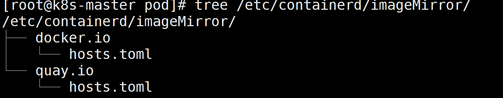

https://blog.csdn.net/qq_31977125/article/details/131242076?ops_request_misc=%257B%2522request%255Fid%2522%253A%2522B77A7FE7-C4B1-47BF-9440-A2E7B342D123%2522%252C%2522scm%2522%253A%252220140713.130102334..%2522%257D&request_id=B77A7FE7-C4B1-47BF-9440-A2E7B342D123&biz_id=0&utm_medium=distribute.pc_search_result.none-task-blog-2~all~top_positive~default-1-131242076-null-null.142^v100^pc_search_result_base8&utm_term=containerd%E9%85%8D%E7%BD%AE%E9%95%9C%E5%83%8F%E5%8A%A0%E9%80%9F&spm=1018.2226.3001.4187


修改 containerd 配置文件 /etc/containerd/config.toml

找到如下行，添加 config_path = “/etc/containerd/imageMirror” (路径可自定义)如下：

```
    [plugins."io.containerd.grpc.v1.cri".registry]
      config_path = "/etc/containerd/imageMirror"
```

如果原来有配置，删掉即可，如我原来的配置如下：

```
    [plugins."io.containerd.grpc.v1.cri".registry]
      [plugins."io.containerd.grpc.v1.cri".registry.mirrors]
        [plugins."io.containerd.grpc.v1.cri".registry.mirrors."docker.io"]
          endpoint = ["https://registry-1.docker.io"]

```

#### 配置[docker](https://so.csdn.net/so/search?q=docker&spm=1001.2101.3001.7020).io仓库加速

创建配置文件路径

```
mkdir -p /etc/containerd/imageMirror/docker.io

```

在路径下创建配置文件hosts.toml

```
server = "https://docker.io"
[host."https://h9c4u2ou.mirror.aliyuncs.com"]

```

#### 配置 quay.io 仓库加速

创建配置文件路径

```
mkdir -p /etc/containerd/imageMirror/quay.io

```

在路径下创建配置文件hosts.toml

```
server = "https://quay.io"
[host."https://quay.mirrors.ustc.edu.cn"]

```

#### 最后重启containerd

```
systemctl restart containerd

```

