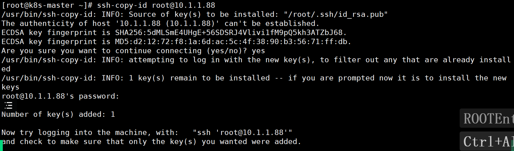
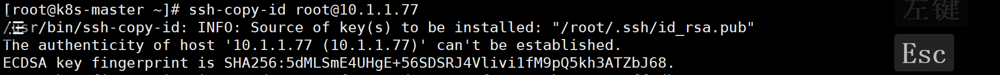
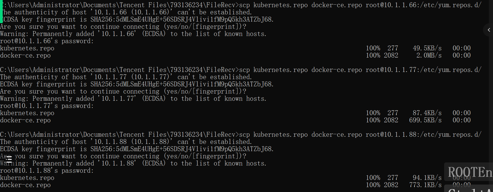
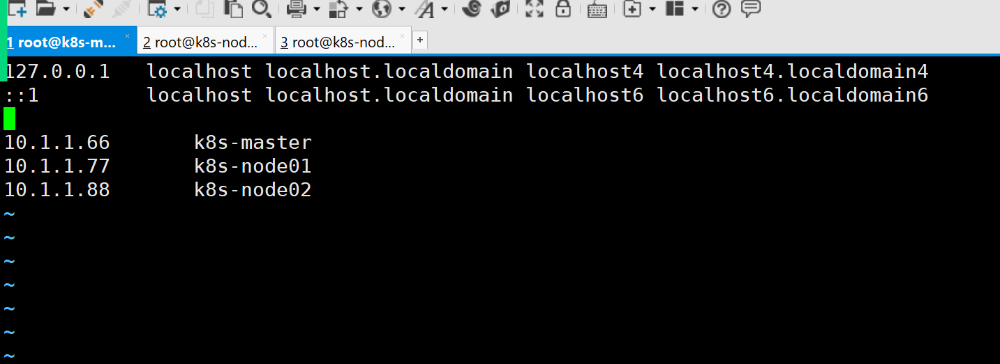
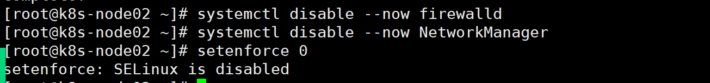
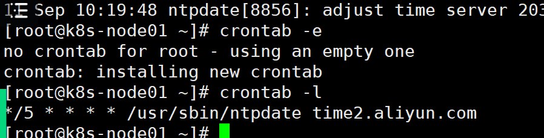
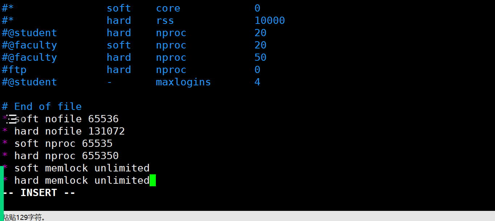
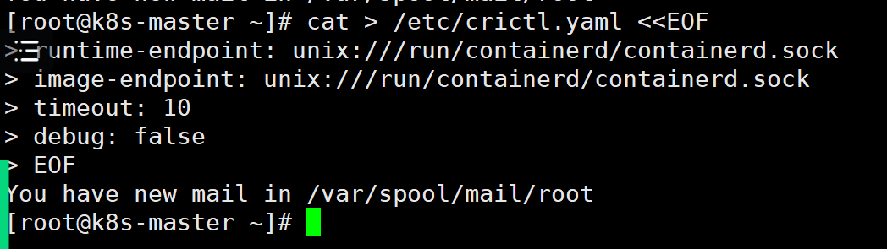
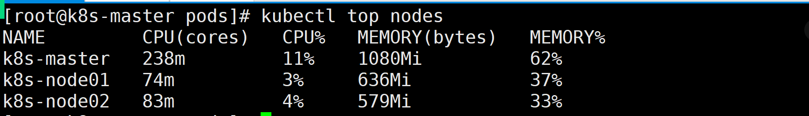
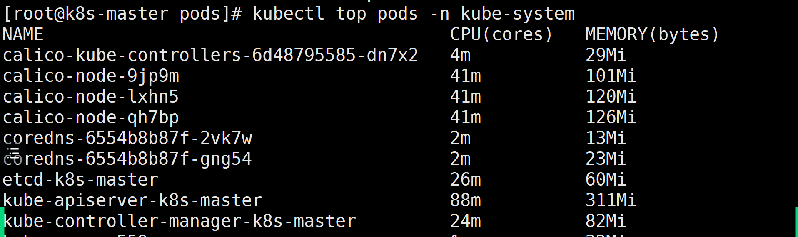

1. 创建主机，设置ip，hostname，firewalld selinux，Netmanage 

   | 编号 | 主机名称   | ip   | 配置 |      |
   | ---- | ---------- | ---- | ---- | ---- |
   | 1    | k8s-master | 66   |      |      |
   | 2    | k8s-node01 | 77   |      |      |
   | 3    | k8s-node02 | 88   |      |      |

   

2. 设置主机之间的ssh免密

3. 三个节点yum源配置

   1. docker

   2. k8s

   3. 清空以及创建缓存

      ```
      yum clean all && yum makecache
      ```

   4. 四个源镜像 aliyun,epel,kubernetes,docker-ce

4. 三个节点主机映射

   ```
   vim /etc/hosts
   
   10.1.1.66	k8s-master
   10.1.1.77	k8s-node01
   10.1.1.88	k8s-node02
   ```

   

5. 三个节点安装常用软件

   ```
   yum install wget jq psmisc vim net-tools telnet yum-utils device-mapper-persistent-data lvm2 git tree -y
   ```

   

6. 三个节点 关闭firewalld NetworkManager SELinux SWAP 虚拟分区

   ```
   vim /etc/selinx/config
   ```

   

   ```
   [root@k8s-master ~]# swapoff -a && sysctl -w vm.swappiness=0
   vm.swappiness = 0	
   [root@k8s-master ~]# sed -ri '/^[^#]*swap/s@^@#@' /etc/fstab
   ```

   

7. 三个节点同步时间,同时设置计划任务

   ```
   yum -y install ntpdate
   ntpdate time2.aliyun.com
   crontab -e
   */5 * * * * /usr/sbin/ntpdate time2.aliyun.com
   ```

   

8. 三个节点配置limit

   ```
   [root@k8s-master ~]# ulimit -SHn 65535		# 单个进程可以打开的文件数量将被限制为 65535
   [root@k8s-master ~]# vim /etc/security/limits.conf
   # 末尾添加如下内容
   * soft nofile 65536
   * hard nofile 131072
   * soft nproc 65535
   * hard nproc 655350
   * soft memlock unlimited
   * hard memlock unlimited
   ```

   

9. 下载yaml文件 从gitee上下载,配置的pod的yaml文件和docker-compose.yaml文件相似,等我的k8s架构搭建起来以后，再添加功能性pod的时候使用

   ```
    cd /root/ ; git clone https://gitee.com/dukuan/k8s-ha-install.git
   ```

   

10. 三个节点ipvs的配置

    ```shell
    [root@k8s-master ~]# yum install ipvsadm ipset sysstat conntrack libseccomp -y
    [root@k8s-master ~]# modprobe -- ip_vs					# 使用 modprobe 命令加载内核模块，核心 IPVS 模块。
    [root@k8s-master ~]# modprobe -- ip_vs_rr				# IPVS 负载均衡算法 rr
    [root@k8s-master ~]# modprobe -- ip_vs_wrr			# IPVS 负载均衡算法 wrr
    [root@k8s-master ~]# modprobe -- ip_vs_sh				# 用于源端负载均衡的模块
    [root@k8s-master ~]# modprobe -- nf_conntrack		# 用于网络流量过滤和跟踪的模块
    [root@k8s-master ~]# vim /etc/modules-load.d/ipvs.conf
    # 在系统启动时加载下列 IPVS 和相关功能所需的模块
    ip_vs					# 负载均衡模块
    ip_vs_lc			# 用于实现基于连接数量的负载均衡算法
    ip_vs_wlc			# 用于实现带权重的最少连接算法的模块
    ip_vs_rr			# 负载均衡rr算法模块
    ip_vs_wrr			# 负载均衡wrr算法模块
    ip_vs_lblc		# 负载均衡算法，它结合了最少连接（LC）算法和基于偏置的轮询（Round Robin with Bias）算法
    ip_vs_lblcr		# 用于实现基于链路层拥塞状况的最少连接负载调度算法的模块
    ip_vs_dh			# 用于实现基于散列（Hashing）的负载均衡算法的模块
    ip_vs_sh			# 用于源端负载均衡的模块
    ip_vs_fo			# 用于实现基于本地服务的负载均衡算法的模块
    ip_vs_nq			# 用于实现NQ算法的模块
    ip_vs_sed			# 用于实现随机早期检测（Random Early Detection）算法的模块
    ip_vs_ftp			# 用于实现FTP服务的负载均衡模块
    ip_vs_sh
    nf_conntrack	# 用于跟踪网络连接的状态的模块
    ip_tables			# 用于管理防护墙的机制
    ip_set				# 用于创建和管理IP集合的模块
    xt_set				# 用于处理IP数据包集合的模块，提供了与iptables等网络工具的接口
    ipt_set				# 用于处理iptables规则集合的模块
    ipt_rpfilter	# 用于实现路由反向路径过滤的模块
    ipt_REJECT		# iptables模块之一，用于将不符合规则的数据包拒绝，并返回特定的错误码
    ipip					# 用于实现IP隧道功能的模块，使得数据可以在两个网络之间进行传输
    [root@k8s-master ~]# systemctl enable --now systemd-modules-load.service		# 开机自启systemd默认提供的网络管理服务
    The unit files have no installation config (WantedBy, RequiredBy, Also, Alias
    settings in the [Install] section, and DefaultInstance for template units).
    This means they are not meant to be enabled using systemctl.
    Possible reasons for having this kind of units are:
    1) A unit may be statically enabled by being symlinked from another unit's
       .wants/ or .requires/ directory.
    2) A unit's purpose may be to act as a helper for some other unit which has
       a requirement dependency on it.
    3) A unit may be started when needed via activation (socket, path, timer,
       D-Bus, udev, scripted systemctl call, ...).
    4) In case of template units, the unit is meant to be enabled with some
       instance name specified.
    [root@k8s-master ~]# lsmod | grep -e ip_vs -e nf_conntrack		# 查看已写入加载的模块
    ip_vs_sh               16384  0
    ip_vs_wrr              16384  0
    ip_vs_rr               16384  0
    ip_vs                 172032  6 ip_vs_rr,ip_vs_sh,ip_vs_wrr
    nf_conntrack          172032  4 xt_conntrack,nf_nat,ipt_MASQUERADE,ip_vs
    nf_defrag_ipv6         20480  2 nf_conntrack,ip_vs
    nf_defrag_ipv4         16384  1 nf_conntrack
    libcrc32c              16384  5 nf_conntrack,nf_nat,nf_tables,xfs,ip_vs
    ```

    

11. 三个节点k8s的内核加载

    ```shell
    [root@k8s-master ~]# vim /etc/sysctl.d/k8s.conf
    # 写入k8s所需内核模块
    net.bridge.bridge-nf-call-iptables = 1		# 控制网络桥接与iptables之间的网络转发行为
    net.bridge.bridge-nf-call-ip6tables = 1		# 用于控制网络桥接（bridge）的IP6tables过滤规则。当该参数设置为1时，表示启用对网络桥接的IP6tables过滤规则
    fs.may_detach_mounts = 1		# 用于控制文件系统是否允许分离挂载，1表示允许
    net.ipv4.conf.all.route_localnet = 1		# 允许本地网络上的路由。设置为1表示允许，设置为0表示禁止。
    vm.overcommit_memory=1		# 控制内存分配策略。设置为1表示允许内存过量分配，设置为0表示不允许。
    vm.panic_on_oom=0		# 决定当系统遇到内存不足（OOM）时是否产生panic。设置为0表示不产生panic，设置为1表示产生panic。
    fs.inotify.max_user_watches=89100		# inotify可以监视的文件和目录的最大数量。
    fs.file-max=52706963		# 系统级别的文件描述符的最大数量。
    fs.nr_open=52706963			# 单个进程可以打开的文件描述符的最大数量。
    net.netfilter.nf_conntrack_max=2310720		# 网络连接跟踪表的最大大小。
    net.ipv4.tcp_keepalive_time = 600		# TCP保活机制发送探测包的间隔时间（秒）。
    net.ipv4.tcp_keepalive_probes = 3		# TCP保活机制发送探测包的最大次数。
    net.ipv4.tcp_keepalive_intvl =15		# TCP保活机制在发送下一个探测包之前等待响应的时间（秒）。
    net.ipv4.tcp_max_tw_buckets = 36000	# TCP TIME_WAIT状态的bucket数量。
    net.ipv4.tcp_tw_reuse = 1		# 允许重用TIME_WAIT套接字。设置为1表示允许，设置为0表示不允许。
    net.ipv4.tcp_max_orphans = 327680		# 系统中最大的孤套接字数量。
    net.ipv4.tcp_orphan_retries = 3			# 系统尝试重新分配孤套接字的次数。
    net.ipv4.tcp_syncookies = 1		# 用于防止SYN洪水攻击。设置为1表示启用SYN cookies，设置为0表示禁用。
    net.ipv4.tcp_max_syn_backlog = 16384		# SYN连接请求队列的最大长度。
    net.ipv4.ip_conntrack_max = 65536		# IP连接跟踪表的最大大小。
    net.ipv4.tcp_max_syn_backlog = 16384		# 系统中最大的监听队列的长度。
    net.ipv4.tcp_timestamps = 0		# 用于关闭TCP时间戳选项。
    net.core.somaxconn = 16384		# 用于设置系统中最大的监听队列的长度
    [root@k8s-master ~]# reboot
    # 保存后，所有节点重启，保证重启后内核依然加载
    [root@k8s-master ~]# lsmod | grep --color=auto -e ip_vs -e nf_conntrack
    ip_vs_ftp              16384  0
    nf_nat                 45056  3 ipt_MASQUERADE,nft_chain_nat,ip_vs_ftp
    ip_vs_sed              16384  0
    ip_vs_nq               16384  0
    ip_vs_fo               16384  0
    ip_vs_sh               16384  0
    ip_vs_dh               16384  0
    ip_vs_lblcr            16384  0
    ip_vs_lblc             16384  0
    ip_vs_wrr              16384  0
    ip_vs_rr               16384  0
    ip_vs_wlc              16384  0
    ip_vs_lc               16384  0
    ip_vs                 172032  25 ip_vs_wlc,ip_vs_rr,ip_vs_dh,ip_vs_lblcr,ip_vs_sh,ip_vs_fo,ip_vs_nq,ip_vs_lblc,ip_vs_wrr,ip_vs_lc,ip_vs_sed,ip_vs_ftp
    nf_conntrack          172032  4 xt_conntrack,nf_nat,ipt_MASQUERADE,ip_vs
    nf_defrag_ipv6         20480  2 nf_conntrack,ip_vs
    nf_defrag_ipv4         16384  1 nf_conntrack
    libcrc32c              16384  5 nf_conntrack,nf_nat,nf_tables,xfs,ip_vs
    ```

    

12. 三个节点卸载podman 安装 docker-ce docker-ce-cli containerd

    ```
    
    [root@k8s-master ~]# yum remove -y podman runc containerd		# 卸载之前的containerd
    [root@k8s-master ~]# yum install docker-ce docker-ce-cli containerd.io -y		# 安装Docker和containerd
    ```

    

13. 配置containerd需要的核心模块 overlay，br_netfilter

    ```shell
        [root@k8s-master ~]# cat <<EOF | sudo tee /etc/modules-load.d/containerd.conf
    > overlay		# 用于支持Overlay网络文件系统的模块，它可以在现有的文件系统之上创建叠加层，以实现虚拟化、隔离和管理等功能。
    > br_netfilter		# 用于containerd的网络过滤模块，它可以对进出容器的网络流量进行过滤和管理。
    > EOF
    overlay
    br_netfilter
    [root@k8s-master ~]# modprobe -- overlay
    [root@k8s-master ~]# modprobe -- br_netfilter
    
    
    
    
    [root@k8s-master ~]# cat <<EOF | sudo tee /etc/sysctl.d/99-kubernetes-cri.conf		# tee：读取的数据写入到一个或多个文件中，同时还将其复制到标准输出
    > net.bridge.bridge-nf-call-iptables  = 1		# 用于控制网络桥接是否调用iptables进行包过滤和转发。
    > net.ipv4.ip_forward                 = 1		# 路由转发，1为开启
    > net.bridge.bridge-nf-call-ip6tables = 1		# 控制是否在桥接接口上调用IPv6的iptables进行数据包过滤和转发。
    > EOF
    net.bridge.bridge-nf-call-iptables  = 1
    net.ipv4.ip_forward                 = 1
    net.bridge.bridge-nf-call-ip6tables = 1
    [root@k8s-master ~]# sysctl --system 
    ```

    

14. containerd配置文件

    ```
    [root@k8s-master ~]# mkdir -p /etc/containerd
    [root@k8s-master ~]# containerd config default | tee /etc/containerd/config.toml		# 读取containerd的配置并保存到/etc/containerd/config.toml
    [root@k8s-master ~]# vim /etc/containerd/config.toml
    # 找到containerd.runtimes.runc.options模块，添加SystemdCgroup = true，如果已经存在则直接修改
              [plugins."io.containerd.grpc.v1.cri".containerd.runtimes.runc.options]
                BinaryName = ""
                CriuImagePath = ""
                CriuPath = ""
                CriuWorkPath = ""
                IoGid = 0
                IoUid = 0
                NoNewKeyring = false
                NoPivotRoot = false
                Root = ""
                ShimCgroup = ""
                SystemdCgroup = false		# 没有就添加，有的话就修改
    # 找到sandbox_image修改为如下参数
    		sandbox_image = "registry.cn-hangzhou.aliyuncs.com/google_containers/pause:3.9"
    [root@k8s-master ~]# systemctl daemon-reload		# 加载systemctl控制脚本
    [root@k8s-master ~]# systemctl enable --now containerd		# 启动containerd并设置开机启动
    Created symlink /etc/systemd/system/multi-user.target.wants/containerd.service → /usr/lib/systemd/system/containerd.service.
    ```

    

15. 配置远程客户端访问

    ```
    [root@k8s-master ~]# cat > /etc/crictl.yaml <<EOF		# 配置容器运行环境的crictl.yml文件
    > runtime-endpoint: unix:///run/containerd/containerd.sock		# 指定了容器运行时的地址为：unix://...
    > image-endpoint: unix:///run/containerd/containerd.sock			# 指定了镜像运行时的地址为：unix://...
    > timeout: 10			# 设置了超时时间为10秒
        > debug: false		# 关闭调试模式
    > EOF
    ```

    

16. 三个节点安装kubernetes组件

    ```shell
    yum -y install kubeadm-1.28* kubectl-1.28* kubelet-1.28*
    systemctl daemon-reoload
    systemctrl enable --now kubelet
    
    ```

    如果Kubelet无法正常启动，检查swap是否已经取消虚拟分区，查看/var/log/message如果是没有/var/lib/kublet/cofig.yaml文件，可能需要重新安装

    ```shell
    yum -y remove kubelet-1.28*
    yum -y install kubelet-1.28*
    systemctl daemon-reload
    system enable --now kubelet
    yum -y install kubelet-1.28*
    # kubelet端口是10248 10250 10255三个端口
    ```

    

17. 初始化

    1. 拉取镜像

       ```shell
       [root@k8s-master ~]# vim kubeadm-config.yaml		# 修改kubeadm配置文件
       apiVersion: kubeadm.k8s.io/v1beta3		# 指定Kubernetes配置文件的版本，使用的是kubeadm API的v1beta3版本
       bootstrapTokens:		# 定义bootstrap tokens的信息。这些tokens用于在Kubernetes集群初始化过程中进行身份验证
       - groups:		# 定义了与此token关联的组
         - system:bootstrappers:kubeadm:default-node-token 
         token: 7t2weq.bjbawausm0jaxury		# bootstrap token的值
         ttl: 24h0m0s		# token的生存时间，这里设置为24小时
         usages:			# 定义token的用途
         - signing		# 数字签名
         - authentication		# 身份验证
       kind: InitConfiguration		# 指定配置对象的类型，InitConfiguration：表示这是一个初始化配置
       localAPIEndpoint:		# 定义本地API端点的地址和端口
         advertiseAddress: 192.168.15.11
         bindPort: 6443
       nodeRegistration:		# 定义节点注册时的配置
         criSocket: unix:///var/run/containerd/containerd.sock		# 容器运行时(CRI)的套接字路径
         name: k8s-master		# 节点的名称
         taints:		# 标记
         - effect: NoSchedule		# 免调度节点
           key: node-role.kubernetes.io/control-plane		# 该节点为控制节点
       ---
       apiServer:		# 定义了API服务器的配置
         certSANs:		# 为API服务器指定了附加的证书主体名称(SAN)，指定IP即可
         - 192.168.15.11
         timeoutForControlPlane: 4m0s		# 控制平面的超时时间，这里设置为4分钟
       apiVersion: kubeadm.k8s.io/v1beta3		# 指定API Server版本
       certificatesDir: /etc/kubernetes/pki	# 指定了证书的存储目录
       clusterName: kubernetes		# 定义了集群的名称为"kubernetes"
       controlPlaneEndpoint: 192.168.15.11:6443		# 定义了控制节点的地址和端口
       controllerManager: {}		# 控制器管理器的配置，为空表示使用默认配置
       etcd:		# 定义了etcd的配置
         local:		# 本地etcd实例
           dataDir: /var/lib/etcd		# 数据目录
       imageRepository: registry.cn-hangzhou.aliyuncs.com/google_containers		# 指定了Kubernetes使用的镜像仓库的地址，阿里云的镜像仓库。
       kind: ClusterConfiguration		# 指定了配置对象的类型，ClusterConfiguration：表示这是一个集群配置
       kubernetesVersion: v1.28.2		# 指定了kubernetes的版本
       networking:		# 定义了kubernetes集群网络设置
         dnsDomain: cluster.local		# 定义了集群的DNS域为：cluster.local
         podSubnet: 172.16.0.0/16		# 定义了Pod的子网
         serviceSubnet: 10.96.0.0/16	# 定义了服务的子网
       scheduler: {}		# 使用默认的调度器行为
       [root@k8s-master ~]# kubeadm config migrate --old-config kubeadm-config.yaml --new-config new.yaml
       # 将旧的kubeadm配置文件转换为新的格式
       
       
       ```

       

    2. 初始化

       ```
       kubeadm init --config /root/new.yaml  --upload-certs
       ```

       保存token

       ```
       kubeadm join 10.1.1.66:6443 --token 7t2weq.bjbawausm0jaxury \
       	--discovery-token-ca-cert-hash sha256:57d745669b7a846cb1e8fba10f5634cbcb5f0758a44f374ec851f469b64660a4 
       ```

    3. 不成功

       1. 主机配置 2核2G40G
       2. echo 1 > /proc/net/ipv4/ip_forward
       3. kubelet无法启动
          1. swap虚拟分区没关
          2. 没有配置文件
       4. vim /var/log/message

18. 将工作节点加入到集群

    ```
    systemctl stop kubelet
    kubeadm join 10.1.1.66:6443 --token 7t2weq.bjbawausm0jaxury \
    	--discovery-token-ca-cert-hash sha256:57d745669b7a846cb1e8fba10f5634cbcb5f0758a44f374ec851f469b64660a4 
    ```

    添加不成功

    1. kubelet没有stop

    2. ip转发没有

    3. token  重新初始化或者生成token

    4. node中containerd是否正常

    查看节点以及pod状态

    ```shell
    #查看节点 查看在集群中的主机的状态
    [root@k8s-master ~]# kubectl get nodes
    NAME         STATUS     ROLES           AGE     VERSION
    k8s-master   NotReady   control-plane   47m     v1.28.2
    k8s-node01   NotReady   <none>          3m12s   v1.28.2
    k8s-node02   NotReady   <none>          2m34s   v1.28.2
    
    
    
    
    
    # 查看所有的pod的状态
    [root@k8s-master ~]# kubectl get po -A
    NAMESPACE     NAME                                 READY   STATUS              RESTARTS   AGE
    kube-system   coredns-6554b8b87f-2vk7w             0/1     Pending             0          52m
    kube-system   coredns-6554b8b87f-gng54             0/1     Pending             0          52m
    kube-system   etcd-k8s-master                      1/1     Running             0          53m
    kube-system   kube-apiserver-k8s-master            1/1     Running             0          53m
    kube-system   kube-controller-manager-k8s-master   1/1     Running             0          53m
    kube-system   kube-proxy-559zm                     1/1     Running             0          52m
    kube-system   kube-proxy-9gz98                     0/1     ContainerCreating   0          8m
    kube-system   kube-proxy-zhgw7                     0/1     ContainerCreating   0          8m38s
    kube-system   kube-scheduler-k8s-master            1/1     Running             0          53m
    
    
    
    # 查看pod完整信息
    [root@k8s-master ~]# kubectl get po -Aowide
    NAMESPACE     NAME                                 READY   STATUS              RESTARTS   AGE   IP          NODE         NOMINATED NODE   READINESS GATES
    kube-system   coredns-6554b8b87f-2vk7w             0/1     Pending             0          65m   <none>      <none>       <none>           <none>
    kube-system   coredns-6554b8b87f-gng54             0/1     Pending             0          65m   <none>      <none>       <none>           <none>
    kube-system   etcd-k8s-master                      1/1     Running             0          65m   10.1.1.66   k8s-master   <none>           <none>
    kube-system   kube-apiserver-k8s-master            1/1     Running             0          65m   10.1.1.66   k8s-master   <none>           <none>
    kube-system   kube-controller-manager-k8s-master   1/1     Running             0          65m   10.1.1.66   k8s-master   <none>           <none>
    kube-system   kube-proxy-559zm                     1/1     Running             0          65m   10.1.1.66   k8s-master   <none>           <none>
    kube-system   kube-proxy-9gz98                     0/1     ContainerCreating   0          20m   10.1.1.88   k8s-node02   <none>           <none>
    kube-system   kube-proxy-zhgw7                     0/1     ContainerCreating   0          21m   10.1.1.77   k8s-node01   <none>           <none>
    kube-system   kube-scheduler-k8s-master            1/1     Running             0          65m   10.1.1.66   k8s-master   <none>           <none>
    
    
    
    ```

    status:

    ​	

    | 状态名称          | 中文         | 说明            |
    | ----------------- | ------------ | --------------- |
    | pending           | 挂起         | 当前pod没有工作 |
    | running           | 运行中       | 当前pod正常工作 |
    | containercreating | 正在创建容器 | 正在创建容器    |

    

19. 部署calico的pod

    ```shell
    # 找到配置的calico.yaml文件
    cd /root/k8s-ha-install && git checkout manual-installation-v1.28.x && cd calico/
    # 修改配置文件，将文件中的POD_CIDR替换成172.16.0.0/16
                - name: CALICO_IPV4POOL_CIDR
                  value: "172.16.0.0/16"
    #创建pod
     kubectl apply -f calico.yaml
    ```

    这里遇到了一个问题：

    node01 和node02中仓库的配置出错了

    ```shell
    63 sandbox = "registry.cn-hangzhou-aliyuncs.com/google.container/pause:3.9"
    
    systemctl restart containerd.service
    ```

    

20. 使用ifconfig或者 ip a s指令查看虚拟网卡

21. 处理calico网络无法连接

    1. 镜像下载的网络是否正常
    2. 更新kernel版本 yum -y update kernel

22. 部署资源监控metries-server

    1. components.yaml

       ```
       apiVersion: v1
       kind: ServiceAccount
       metadata:
         labels:
           k8s-app: metrics-server
         name: metrics-server
         namespace: kube-system
       ---
       apiVersion: rbac.authorization.k8s.io/v1
       kind: ClusterRole
       metadata:
         labels:
           k8s-app: metrics-server
           rbac.authorization.k8s.io/aggregate-to-admin: "true"
           rbac.authorization.k8s.io/aggregate-to-edit: "true"
           rbac.authorization.k8s.io/aggregate-to-view: "true"
         name: system:aggregated-metrics-reader
       rules:
       - apiGroups:
         - metrics.k8s.io
         resources:
         - pods
         - nodes
         verbs:
         - get
         - list
         - watch
       ---
       apiVersion: rbac.authorization.k8s.io/v1
       kind: ClusterRole
       metadata:
         labels:
           k8s-app: metrics-server
         name: system:metrics-server
       rules:
       - apiGroups:
         - ""
         resources:
         - nodes/metrics
         verbs:
         - get
       - apiGroups:
         - ""
         resources:
         - pods
         - nodes
         verbs:
         - get
         - list
         - watch
       ---
       apiVersion: rbac.authorization.k8s.io/v1
       kind: RoleBinding
       metadata:
         labels:
           k8s-app: metrics-server
         name: metrics-server-auth-reader
         namespace: kube-system
       roleRef:
         apiGroup: rbac.authorization.k8s.io
         kind: Role
         name: extension-apiserver-authentication-reader
       subjects:
       - kind: ServiceAccount
         name: metrics-server
         namespace: kube-system
       ---
       apiVersion: rbac.authorization.k8s.io/v1
       kind: ClusterRoleBinding
       metadata:
         labels:
           k8s-app: metrics-server
         name: metrics-server:system:auth-delegator
       roleRef:
         apiGroup: rbac.authorization.k8s.io
         kind: ClusterRole
         name: system:auth-delegator
       subjects:
       - kind: ServiceAccount
         name: metrics-server
         namespace: kube-system
       ---
       apiVersion: rbac.authorization.k8s.io/v1
       kind: ClusterRoleBinding
       metadata:
         labels:
           k8s-app: metrics-server
         name: system:metrics-server
       roleRef:
         apiGroup: rbac.authorization.k8s.io
         kind: ClusterRole
         name: system:metrics-server
       subjects:
       - kind: ServiceAccount
         name: metrics-server
         namespace: kube-system
       ---
       apiVersion: v1
       kind: Service
       metadata:
         labels:
           k8s-app: metrics-server
         name: metrics-server
         namespace: kube-system
       spec:
         ports:
         - name: https
           port: 443
           protocol: TCP
           targetPort: https
         selector:
           k8s-app: metrics-server
       ---
       apiVersion: apps/v1
       kind: Deployment
       metadata:
         labels:
           k8s-app: metrics-server
         name: metrics-server
         namespace: kube-system
       spec:
         selector:
           matchLabels:
             k8s-app: metrics-server
         strategy:
           rollingUpdate:
             maxUnavailable: 0
         template:
           metadata:
             labels:
               k8s-app: metrics-server
           spec:
             containers:
             - args:
               - --cert-dir=/tmp
               - --secure-port=10250
               - --kubelet-preferred-address-types=InternalIP,ExternalIP,Hostname
               - --kubelet-use-node-status-port
               - --metric-resolution=15s
               - --kubelet-insecure-tls
               image: registry.aliyuncs.com/google_containers/metrics-server:v0.7.0
               imagePullPolicy: IfNotPresent
               livenessProbe:
                 failureThreshold: 3
                 httpGet:
                   path: /livez
                   port: https
                   scheme: HTTPS
                 periodSeconds: 10
               name: metrics-server
               ports:
               - containerPort: 10250
                 name: https
                 protocol: TCP
               readinessProbe:
                 failureThreshold: 3
                 httpGet:
                   path: /readyz
                   port: https
                   scheme: HTTPS
                 initialDelaySeconds: 20
                 periodSeconds: 10
               resources:
                 requests:
                   cpu: 100m
                   memory: 200Mi
               securityContext:
                 allowPrivilegeEscalation: false
                 capabilities:
                   drop:
                   - ALL
                 readOnlyRootFilesystem: true
                 runAsNonRoot: true
                 runAsUser: 1000
                 seccompProfile:
                   type: RuntimeDefault
               volumeMounts:
               - mountPath: /tmp
                 name: tmp-dir
             nodeSelector:
               kubernetes.io/os: linux
             priorityClassName: system-cluster-critical
             serviceAccountName: metrics-server
             volumes:
             - emptyDir: {}
               name: tmp-dir
       ---
       apiVersion: apiregistration.k8s.io/v1
       kind: APIService
       metadata:
         labels:
           k8s-app: metrics-server
         name: v1beta1.metrics.k8s.io
       spec:
         group: metrics.k8s.io
         groupPriorityMinimum: 100
         insecureSkipTLSVerify: true
         service:
           name: metrics-server
           namespace: kube-system
         version: v1beta1
         versionPriority: 100
       
       ```

       

    2. 复制秘钥文件到node01和node02节点

       ```
       scp /etc/kubernetes/pki/front-proxy-ca.crt k8s-node01:/etc/kubernetes/pki/front-proxy-ca.crt 
       scp /etc/kubernetes/pki/front-proxy-ca.crt k8s-node02:/etc/kubernetes/pki/front-proxy-ca.crt
       ```

       

    3. 根据yaml文件创建pod

       ```
       kubectl create -f ./components.yaml
       ```

    4. 查看pod列表状态

       ```
       [root@k8s-master pods]# kubectl get pods -Aowide|grep metrics
       kube-system   metrics-server-79776b6d54-x9hpl            1/1     Running   0              11m   172.16.85.198    k8s-node01   <none>           <none>
       
       ```

    5. 查看节点资源监控

       ```
       kubectl top nodes# 查看节点
       kubectl top pod 
       ```

       

       

23. 搭建dashboard

    1. 安装dashboach

       ```
       cd /root/k8s-ha-install/dashboard
       ls
       	dashboard-user.yaml dashboar.yaml
       kubectl create -f .
       ```

    2. 设置svc模式

       ```
       kubecutl edit svc kubernetes-dashboard -n kubernetes-dashborad
       
       	type: NodePort
       	
       kubectl get kubernetes-dashboard -n 
       ```

       

    3. 获得token

       ```
       kubectl create token admin-user -n kube-system
       ```

24. 设置proxy的模式为ipvs

    1. 编辑pod

       ```
       kubectl edit cm kube-proxy -n kube-system
       
       mode: ipv4
       ```

       

    2. 添加跟新

       ```
       kubectl patch daemonset kube-proxy -p "{\"spec\":{\"template\":{\"metadata\":{\"annotations\":{\"date\":\"`date +'%s'`\"}}}}}" -n kube-system
       ```

       

    3. 访问测试

       ```
       curl 127.0.0.1:10249/proxyMode
       ```

25. 查看 service pod 宿主机的网段

    ```
    kubectl get svc
    kubectl get po -Aowide
    ```

26. 测试创建参数

    ```shell
    kubectl create deploy cluster-test --image=register.cn-beijing.aliyuncs.com/datbalo/debug-tools -- sleep 3600
    
    
    [root@k8s-master ~]# kubectl get po -Aowide|grep clu
    default                cluster-test-66bb44bd88-qjfnj                1/1     Running            0             5m37s   172.16.58.208    k8s-node02   <none>           <none>
    
    ```

27. 测试网络

    ```
    kubectl exec -it cluster-testxxxxx -- bash
    
    nslookup kubernetes
    nslookup kube-dns.kube-system
    ```

28. 访问dns的443端口和53端口

    ```
    curl -k https:10.96.0.1:443
    curl http://10.96.0.10:53
    ```

29. 

