1.修改decker的镜像源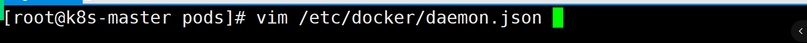

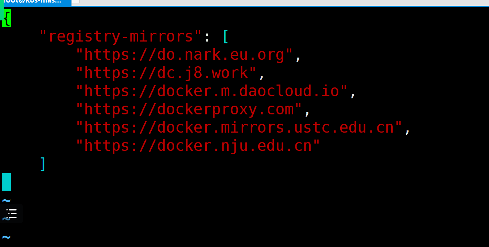

```json
{
    "registry-mirrors": [
        "https://do.nark.eu.org",
        "https://dc.j8.work",
        "https://docker.m.daocloud.io",
        "https://dockerproxy.com",
        "https://docker.mirrors.ustc.edu.cn",
        "https://docker.nju.edu.cn"
    ]
}
```

2.加载启动docker服务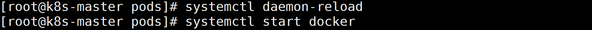

3.拉取常用的镜像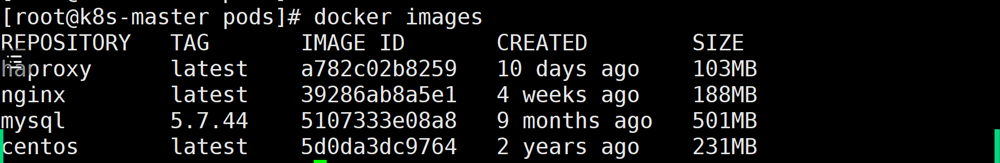

4.使用docker save指令打包镜像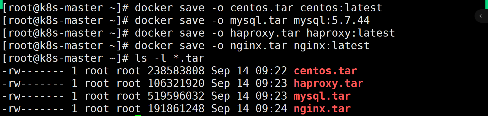

5.使用ctr指令将tar包导入到containerd的镜像中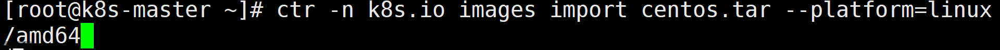

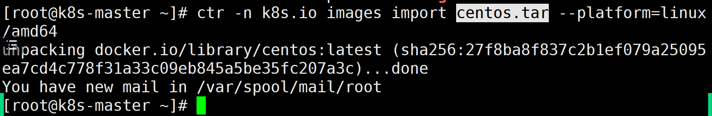

```shell
[root@k8s-master ~]# ctr -n k8s.io images import centos.tar --platform=linux/amd64

[root@k8s-master ~]# ctr -n k8s.io images import mysql.tar --platform=linux/amd64

[root@k8s-master ~]# ctr -n k8s.io images import haproxy.tar --platform=linux/amd64

[root@k8s-master ~]# ctr -n k8s.io images import nginx.tar --platform=linux/amd64
```

6.查看containerd镜像列表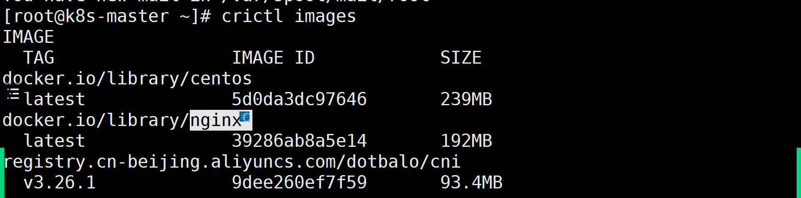

7.在node01和node02节点上引入tar包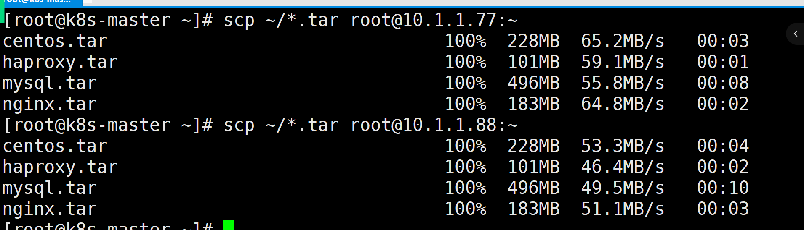

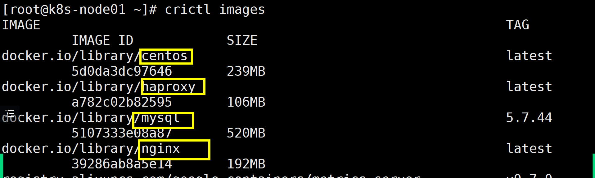

8.使用kubectl run 创建pod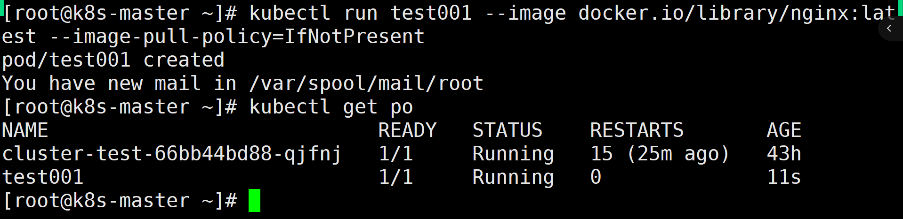

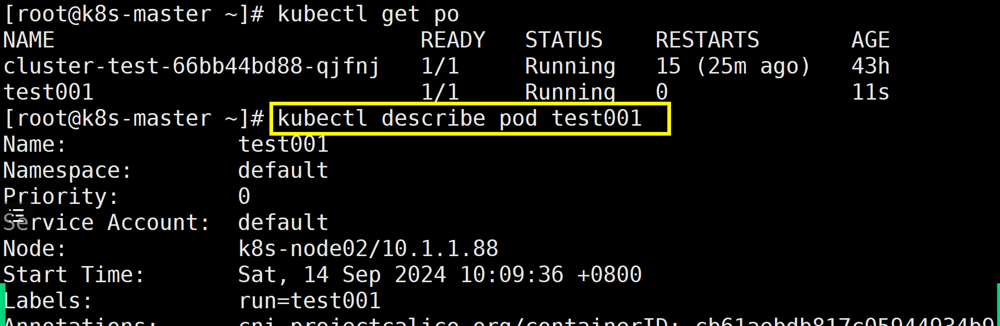

9.使用配置文件创建pod


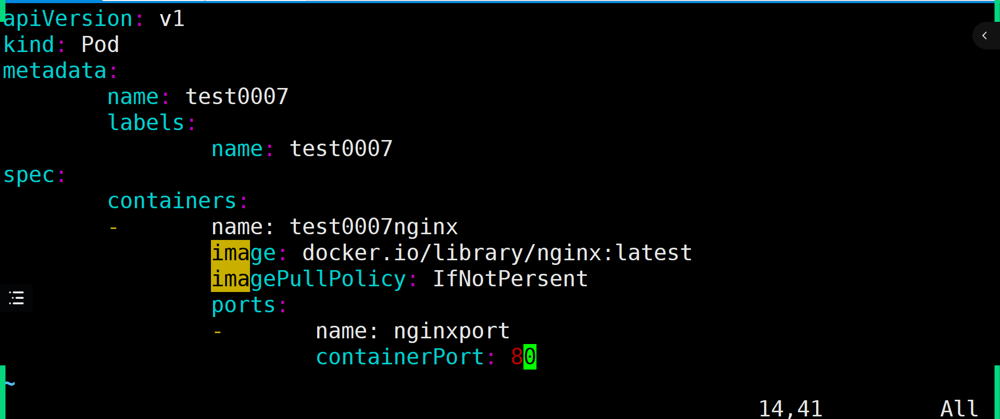

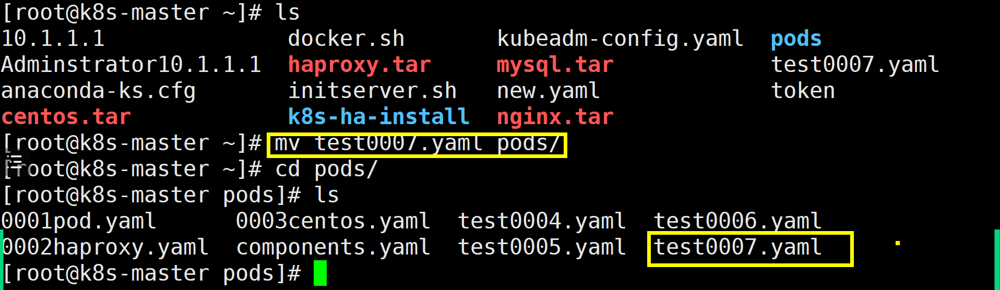

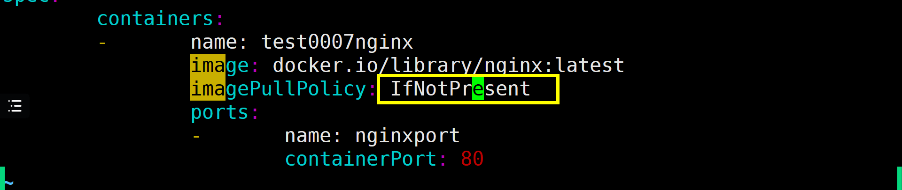


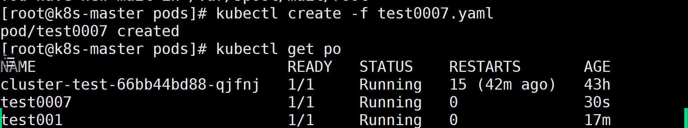

